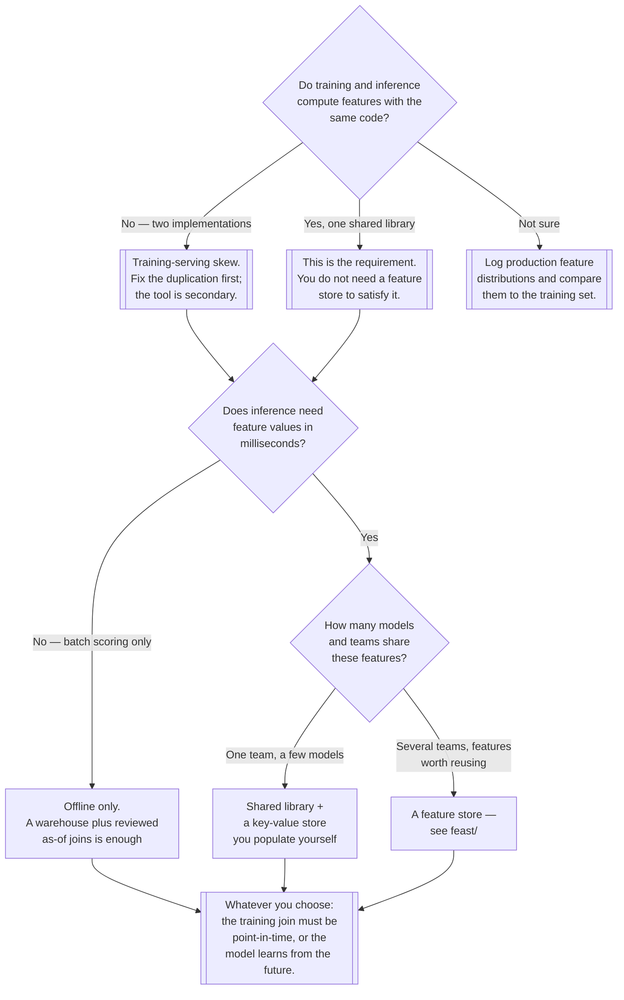

[← MLOps](../README.md)

# Feature store

One definition of a feature, used by training and by inference — and the machinery that makes
that possible across two very different systems.

Tools covered: [`feast`](feast/README.md)

## Contents

1. [The problem this exists to solve](#1-the-problem-this-exists-to-solve)
   1. [What a feature store actually is](#11-what-a-feature-store-actually-is)
2. [Offline store and online store](#2-offline-store-and-online-store)
   1. [Why they are different systems](#21-why-they-are-different-systems)
   2. [Materialisation is the seam](#22-materialisation-is-the-seam)
3. [Point-in-time correctness](#3-point-in-time-correctness)
   1. [The leak, concretely](#31-the-leak-concretely)
   2. [Why it is underestimated](#32-why-it-is-underestimated)
4. [Feature reuse across teams and models](#4-feature-reuse-across-teams-and-models)
5. [The honest counter-argument](#5-the-honest-counter-argument)
6. [Decision tree](#6-decision-tree)
7. [Anti-patterns](#7-anti-patterns)
8. [How this applies to pikakube](#8-how-this-applies-to-pikakube)

---

## 1. The problem this exists to solve

[`../README.md`](../README.md) names **training-serving skew** as the single most common cause of
a model that scored well in evaluation and performs badly in production: features computed by one
piece of code at training time and by a different piece of code at inference time, drifting apart
through a null handled differently, a timezone, a rounding, a category encoded in another order.
Nothing errors. The model is fine; the inputs are not the inputs it was trained on.

That section ends by naming the structural fix — compute features once and read them from the
same place in both paths. **A feature store is that fix, built as infrastructure.** This folder is
where the fix lives.

The reason it needs to be infrastructure rather than a convention is that the two paths have
incompatible requirements. Training wants years of history, read in bulk, latency irrelevant.
Inference wants one entity's current values in single-digit milliseconds. No single system is good
at both, so in practice teams build two — and the moment there are two, the definitions diverge
again, which is the original problem with more steps.

### 1.1 What a feature store actually is

Three things, and it is worth separating them because tools implement them in different
proportions:

| Part | What it holds | What breaks without it |
|---|---|---|
| **Definitions** | what a feature is, what entity it belongs to, where its values come from | the same feature is written twice and means two things |
| **Storage** | the values, historical and current, in two stores | training and serving read from unrelated places |
| **Retrieval** | the API both paths call — a training-set builder and a low-latency lookup | the definition exists and nobody is forced to use it |

The definition layer is the part that actually removes skew. Storage and retrieval are what make
using the definition cheap enough that people do.

## 2. Offline store and online store

The two stores are the defining shape of the category.

| | **Offline store** | **Online store** |
|---|---|---|
| Used by | training, batch scoring, backfills | online inference, on the request path |
| Holds | the full history of feature values, with timestamps | the current value per entity, only |
| Typical system | a warehouse, or Parquet on object storage | Redis or another key-value store |
| Access pattern | scan millions of rows, join on time | one key, one read |
| Latency that matters | minutes is fine | milliseconds, at p99 |
| Cost driver | volume of history retained | memory, and keeping it warm |

### 2.1 Why they are different systems

This is not an implementation accident that a better database would remove. A warehouse answers
"every value this feature has ever had, for these ten million entities, as of these ten million
different timestamps" and cannot do it in five milliseconds. A key-value store answers "the value
for entity 4711, now" in one millisecond and has no notion of history to join against.

**The point of a feature store is that both are driven from the same definition.** The feature is
declared once; the offline store is where its history accumulates and the online store is where
its latest value is served. Two systems, one source of truth about what the number means.

### 2.2 Materialisation is the seam

Getting values from offline to online is a scheduled job, not magic, and it is where the
operational problems live:

- **Freshness is a lag, and the lag is a product decision.** If materialisation runs hourly, the
  model serves features up to an hour stale. That may be correct or catastrophic depending on the
  feature — a 30-day purchase average tolerates it; a "transactions in the last five minutes"
  fraud signal does not.
- **A failed materialisation job does not fail the model.** Serving continues, on old values,
  successfully. This is the same silent-degradation shape as drift, and it needs the same
  treatment: an explicit check, because nothing else will emit one.
- **It is a pipeline, so it belongs with the other pipelines.** See
  [`../../data-engineering/orchestration/`](../../data-engineering/orchestration/README.md).

Streaming ingestion into the online store shortens the lag and adds a second write path to keep
consistent with the offline one. Worth it for genuinely real-time features, and a real increase in
what there is to operate.

## 3. Point-in-time correctness

This is the hard part of the category, and the part people underestimate until it has already
cost them a model.

**A training row must see feature values as they were at the moment of that row's event, not as
they are now.**

### 3.1 The leak, concretely

Take a churn model. Each training row is a customer and a label: did they churn in March? A
feature is `support_tickets_last_30d`. Build the training set with a naive join against the
current feature table and every row gets the value as of today — which, for customers who churned,
includes the tickets they filed while churning.

The model learns that customers with many recent tickets churn. It is right, and it is useless: at
prediction time that information does not exist yet. The offline metric is excellent, the
production performance is not, and the failure looks exactly like the skew in section 1 while
having a completely different cause.

The correct join is **as-of**: for each entity and each event timestamp, take the most recent
feature value whose own timestamp is *at or before* that event. That is a per-row time-travel
join, it is tedious to write correctly, and it is easy to write in a way that is subtly wrong for
the 3% of rows where a feature updated on the same day.

| Naive join | Point-in-time join |
|---|---|
| one value per entity, as of now | one value per entity **per event timestamp** |
| trivial SQL | as-of join, per feature, respecting each feature's own event time |
| model sees the future | model sees what it will see in production |
| offline score too good | offline score matches production |

**Generating this join correctly, from the feature definitions, is the main thing a feature store
buys you on the training side.** The serving side is a cache; this side is the correctness
argument.

### 3.2 Why it is underestimated

Because the symptom is a *better* number. Every other data bug makes a metric worse and someone
investigates. Leakage makes the metric better, and a model that scores 0.97 in testing does not
get audited — it gets deployed and celebrated, and the disappointment arrives weeks later with no
obvious connection to a join written months earlier.

## 4. Feature reuse across teams and models

The second argument, weaker than correctness but the one that compounds.

Without a shared definition layer, `days_since_last_order` gets implemented by every team that
needs it. The implementations disagree — one counts cancelled orders, one uses order date and one
uses ship date, one is in UTC. Each is defensible; together they mean two models trained on "the
same" feature were trained on different things, and no conversation reveals it because everyone is
using the same words.

A feature store makes the definition an addressable object: it has a name, an owner, a source, and
one implementation. New models pick it up rather than rebuilding it, which is the compounding
part — the tenth model is cheaper to build than the first.

This is the same argument the [semantic
layer](../../analytics-engineering/semantic/README.md) makes for metrics, applied to model inputs
instead of dashboards. Both exist because the alternative is the same definition, written many
times, differently.

The caveat: reuse only materialises if there are consumers. One team with three models will define
features once because one person wrote them, not because a registry made them do it.

## 5. The honest counter-argument

**A feature store is real infrastructure, and for most teams it is more machinery than the problem
deserves.**

What adopting one actually costs:

| Cost | Detail |
|---|---|
| Two storage systems to operate | a warehouse or object storage, plus a key-value store on the request path |
| A materialisation pipeline | scheduled, monitored, and silently harmful when it fails |
| A registry to keep current | definitions rot the same way documentation does |
| A new dependency on the request path | the online store is now in the inference blast radius |
| Migration of existing feature code | the value only arrives once both paths actually read from it |

Against that, note what the discipline of section 1 requires and what it does not. **The
requirement is one definition used by both paths.** A shared Python library, imported by the
training job and by the serving service, satisfies it completely — and costs a package, not a
platform. Point-in-time correctness can be had with a carefully written as-of join in the
warehouse, reviewed once.

That is the right answer for one team with a handful of models, and it stays the right answer
longer than vendors suggest. A feature store earns its cost when the shared library stops being
enough: several teams, features worth reusing across models, an online path that a warehouse
cannot serve, and enough point-in-time joins that writing them by hand has become a source of
bugs.

**The failure mode in both directions is real.** Adopting a feature store for three models means
operating a platform instead of shipping models — the same mistake as Kubeflow-for-three-models in
[`../lifecycle/`](../lifecycle/README.md). Refusing one at fifty models across six teams means
paying for it anyway, in duplicated features and leaked training sets, without anything to point
at.

## 6. Decision tree

## 7. Anti-patterns

| Anti-pattern | Why it is bad | What to do instead |
|---|---|---|
| Naive join to build a training set | the row sees feature values from after its own event; the model learns from the future | an as-of join on each feature's own event timestamp |
| Trusting an offline score that looks excellent | leakage is the one bug that makes the metric *better*, so nobody investigates it | be suspicious of a jump; check the join before celebrating |
| Two feature implementations, one per path | this is training-serving skew, restated | one definition, read by both paths |
| Adopting a feature store for three models | two stores and a pipeline to operate, in place of a shared library | a shared library until reuse or latency genuinely forces the change |
| Refusing one at scale | the cost is paid anyway, as duplicated features and leaked training sets | adopt when several teams share features |
| Unmonitored materialisation | the job fails, serving continues on stale values, nothing errors | alert on feature freshness, not just on job exit status |
| Freshness chosen by default | an hourly job under a five-minute fraud signal is a silent correctness bug | pick the lag per feature, deliberately |
| Registry with no owners | definitions rot exactly like documentation, and are trusted longer | an owner per feature, or do not publish it |
| Online store with no capacity plan | it is on the request path; when it degrades, inference degrades | size it, monitor it, and decide the fallback before it happens |
| Treating the store as a data warehouse | it becomes an unmanaged second copy of everything | features derived from a governed source, not raw dumps |

## 8. How this applies to pikakube

**Nothing here is deployed, and the framing matters more than the tool.**

What the repository already has that this depends on: transformation in
[`../../analytics-engineering/transform/`](../../analytics-engineering/transform/README.md), which
is where feature logic would live as SQL; storage in
[`../../data-governance/lakehouse/`](../../data-governance/lakehouse/README.md) for the offline
side; [Redis](../../databases/nosql/key-value/redis/README.md) and its alternatives under
[`../../databases/nosql/key-value/`](../../databases/nosql/key-value/README.md) for the online
side; and orchestration in
[`../../data-engineering/orchestration/`](../../data-engineering/orchestration/README.md) for
materialisation. The components a feature store composes are already documented — what is missing
is the definition and retrieval layer on top of them.

**What the parent README's gap list implies for this folder.** [`../README.md`](../README.md)
records that there is no serving path and no drift monitoring, and that MLflow's registry is the
only deployed capability. In that state a feature store is premature: there is nothing on a
request path to serve features *to*. The order is serving first, then the skew problem becomes
concrete, then this folder becomes worth deploying.

**The part worth acting on now costs nothing.** The requirement of section 1 — one definition used
by both paths — is a code-organisation decision, not a purchase. Any model work starting here
should put feature computation in a shared, importable place from the first commit, and should
build training sets with a point-in-time join. Both are cheap now and expensive to retrofit, for
the same reason experiment tracking is: you cannot fix the training sets you already built.

---

[← MLOps](../README.md)
