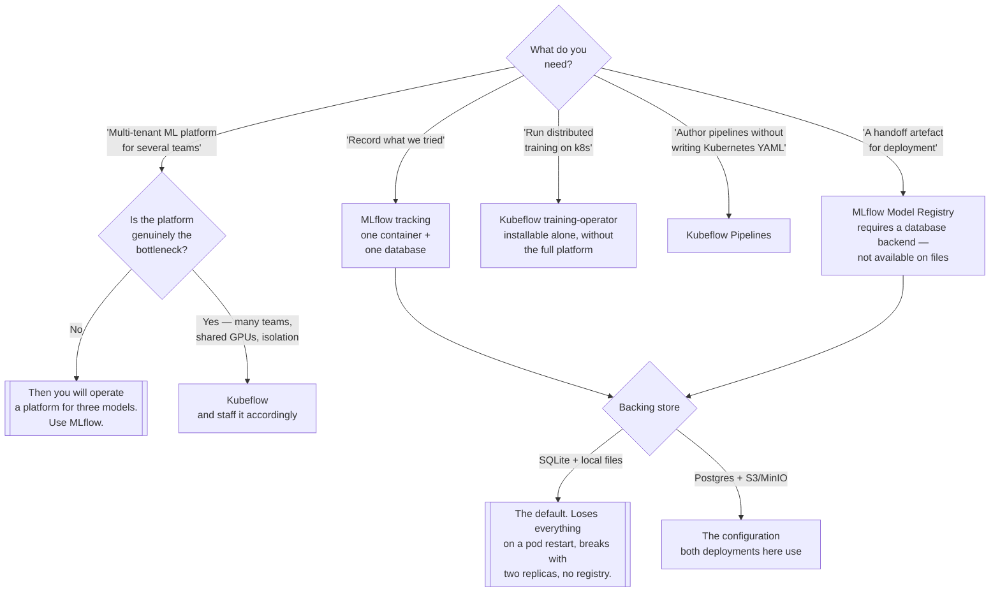

[← MLOps](../README.md)

# Lifecycle

Tracking what was tried, registering what was chosen, and having a record that survives the
person who ran the experiment.

Tools: [`mlflow/`](mlflow/README.md) · [`mlflow2/`](mlflow2/README.md) ·
[`kubeflow/`](kubeflow/README.md)

## Contents

1. [The problem](#1-the-problem)
2. [MLflow's four components](#2-mlflows-four-components)
3. [MLflow vs Kubeflow](#3-mlflow-vs-kubeflow)
4. [The backing-store decision](#4-the-backing-store-decision)
   1. [SQLite vs a real database](#41-sqlite-vs-a-real-database)
   2. [Local files vs object storage](#42-local-files-vs-object-storage)
5. [The two deployments here](#5-the-two-deployments-here)
6. [Decision tree](#6-decision-tree)
7. [Anti-patterns](#7-anti-patterns)
8. [How this applies to pikakube](#8-how-this-applies-to-pikakube)

---

## 1. The problem

Every model that reaches production was preceded by dozens of runs that did not. Without a
system, the record of those runs is a directory of notebooks, a spreadsheet somebody stopped
updating, and a set of filenames like `model_v3_final_REAL.pkl`.

The specific questions this folder answers:

| Question | Component |
|---|---|
| What did we try, and what did each attempt score? | tracking |
| Which run produced the model that is deployed? | tracking + registry |
| Can somebody else re-run this? | projects |
| How is a model handed from research to deployment? | registry |
| Which version is approved, and how do we roll back? | registry |

The reason this is the first capability to build is timing: the cost of adding tracking is
almost zero *before* the experiments happen and infinite *after*. There is no way to
retroactively record a run.

## 2. MLflow's four components

People say "MLflow" and mean different things. It is four loosely coupled pieces, and they are
adopted independently — most teams use one or two and never touch the rest.

| Component | What it does | Reality |
|---|---|---|
| **Tracking** | logs parameters, metrics, tags and artifacts per run, to a server with a UI | the reason MLflow exists; the piece everyone uses |
| **Projects** | a `MLproject` file describing entry points and an environment, so a run is reproducible by command | rarely adopted — most teams already have containers or their own runner |
| **Models** | a packaging format with "flavors" (sklearn, pytorch, pyfunc), so any consumer can load a model uniformly | genuinely useful; `pyfunc` is the lowest common denominator that makes serving generic |
| **Model Registry** | named models, versions, stages, aliases and annotations, on top of the tracking server | the handoff point between experimentation and deployment |

Two things worth being clear about:

**Tracking and the Registry share a server, not a purpose.** Tracking is a log of everything
tried. The Registry is a short list of what was chosen. Conflating them produces a registry with
four hundred versions in it.

**The Model format is what makes serving portable.** A model logged as `pyfunc` can be served by
MLflow, loaded in a batch job, or wrapped by KServe, without the consumer knowing which library
trained it. That is the practical payoff of using the format rather than pickling by hand.

## 3. MLflow vs Kubeflow

This is the real decision in the folder, and it is usually made in the wrong direction.

| | **MLflow** | **Kubeflow** |
|---|---|---|
| What it is | **a library plus a server** | **a platform** |
| Scope | tracking, model format, registry | pipelines, notebooks, training operators, serving, multi-tenancy |
| Install | a container and a database | a large set of Kubernetes components |
| Runs training? | no — you run training however you like | yes, via pipelines and training operators |
| Operates a cluster? | no | yes, that is the point |
| Cost to run | a Deployment, a Postgres, a bucket | a team's attention, ongoing |
| Cost to leave | low — the data is in a database you own | high |

**The honest framing: most teams need MLflow and adopt Kubeflow.** The pitch for Kubeflow is
that it does everything, which is true. What follows is that you are now operating an ML
platform — upgrades, component drift, auth integration, storage, GPU scheduling — in order to
run three models that a tracking server and a CronJob would have handled.

Kubeflow earns its cost when the *platform* is genuinely the constraint: many teams sharing GPUs,
multi-tenant isolation as a requirement, distributed training that needs operators, pipelines
that must be authored by people who will not write Kubernetes YAML. Below that, it is
infrastructure work standing in for ML work.

A middle path worth knowing: Kubeflow's components are separable. The
`training-operator` and Kubeflow Pipelines can be installed on their own alongside MLflow,
without adopting the full platform. That is usually a better trade than the all-in install.

## 4. The backing-store decision

MLflow's server has two stores, and they are configured separately. **The defaults are wrong for
Kubernetes**, and the failure is data loss on a pod restart rather than an error at startup.

| Store | Flag | Default | Why the default fails on Kubernetes |
|---|---|---|---|
| **Backend store** — runs, params, metrics, registry | `--backend-store-uri` | local files, or SQLite if a DB URI is given without a server | a SQLite file on a pod's ephemeral filesystem disappears with the pod; concurrent writers corrupt it |
| **Artifact store** — models, plots, saved files | `--default-artifact-root` | a local directory | same problem, plus clients upload to it directly, so the path has to be reachable from outside the server |

The two decisions:

### 4.1 SQLite vs a real database

SQLite works, and it is what you get by pointing the backend store
at a file. On Kubernetes it does not survive a restart without a volume, it does not survive two
replicas at all, and the registry is not available at all on a file-based store — MLflow requires
a database backend for the Model Registry. Postgres is the answer, and it costs one more
component.

### 4.2 Local files vs object storage

The artifact root should be object storage (S3, or MinIO
in-cluster) for three reasons: artifacts are large and do not belong on a PVC, clients write to
it directly rather than through the server, and it decouples artifact durability from the
server's lifecycle. This is set with an `s3://` URI plus `MLFLOW_S3_ENDPOINT_URL` for a
non-AWS endpoint.

The combination that works, and the one both deployments here use: **Postgres for the backend
store, S3-compatible object storage for artifacts.**

## 5. The two deployments here

There are two MLflow deployments in this folder. They are the same tool at two stages of
maturity, and the difference is instructive.

| | [`mlflow/`](mlflow/README.md) | [`mlflow2/`](mlflow2/README.md) |
|---|---|---|
| Image | `joshsgoldstein/mlflow-server:latest` — third-party, floating tag | `ghcr.io/mlflow/mlflow:v3.3.2` — official, pinned |
| Postgres | a hand-written `Deployment` + `PersistentVolumeClaim` | a [CloudNativePG](../../databases/sql/postgresql/operator/cnpg/README.md) `Cluster` |
| Secrets | a checked-in `Secret` with placeholder base64 values | `external-secrets` with a generated 42-character password |
| Artifacts | MinIO, in-cluster, static access keys | S3, via a ServiceAccount with an IAM role annotation |
| Auth | an `oauth2_proxy` sidecar Deployment, GitHub org/team | none in the manifests |
| Metrics | none | `--expose-prometheus=/metrics`, plus a CNPG `PodMonitor` |
| Layout | split into `deployment/`, `service/`, `pvc/`, `secrets/`, `oauth/` | flat, with `postgres/` alongside |

Both share the same namespace name (`mlflow`), so they are alternatives rather than a pair that
runs side by side.

Read them as before and after: `mlflow/` is the working first pass with the auth story solved and
the operational story not; `mlflow2/` is the rebuild with the operational story solved and the
auth story removed. **Neither is complete on its own** — see section 8.

The manifest folders themselves (`deployment/`, `service/`, `pvc/`, `secrets/`, `oauth/`,
`postgres/`) are deployment artefacts, not tools, and are explained in the two READMEs above
rather than documented separately.

## 6. Decision tree

## 7. Anti-patterns

| Anti-pattern | Why it is bad | What to do instead |
|---|---|---|
| Starting tracking "once the model works" | the runs that mattered are already gone; you cannot log the past | a tracking server before the first experiment |
| SQLite backend store on Kubernetes | ephemeral, single-writer, and the Model Registry does not work on files | Postgres |
| Local-directory artifact root | artifacts vanish with the pod, and clients cannot reach the path | S3 or MinIO |
| Adopting Kubeflow for a handful of models | the platform becomes the project | MLflow, or Kubeflow's components à la carte |
| Treating the registry as a second log | four hundred versions and no signal about which is approved | tracking logs everything, the registry holds what was chosen |
| A floating `:latest` image tag | the server changes under you, and the schema migration comes with it | pin the version, as `mlflow2/` does |
| Running two MLflow replicas against SQLite | corruption, not an error | a database backend, then scale |
| Exposing the MLflow UI without auth | it holds every dataset sample, metric and model you have logged | an auth proxy, as `mlflow/oauth/` attempts |
| Upgrading MLflow without a database backup | the server runs schema migrations on start-up | back up Postgres first; CNPG makes this cheap |
| Registering a model with no link to its run | the handoff artefact has no lineage, defeating the point | log the model from the run, not from a file |

## 8. How this applies to pikakube

**This is the deployed part of `../mlops/`**, and the only part. Two MLflow deployments exist;
Kubeflow is documented and not installed, for the reason recorded in its
[notes](kubeflow/README.md) — the Kustomize-only install is unpleasant and the Helm chart is
still an open issue upstream.

**`mlflow2/` is the current deployment and it is well built.** The official pinned image, a CNPG
Postgres cluster with a `PodMonitor`, a generated password through `external-secrets`, S3
artifacts through an IAM role rather than static keys, and Prometheus metrics exposed. Every one
of those is the correct answer to a specific failure mode in sections 4 and 7.

**The gaps worth naming:**

1. **`mlflow2/` has no authentication.** `mlflow/` solved this with an `oauth2_proxy` sidecar and
   the rebuild dropped it. An MLflow UI holds logged datasets, metrics and model artifacts; it is
   not a thing to leave open. The auth-proxy pattern lives under
   `../../security/2-cluster/identity-access/authentication/auth-proxy/`.
2. **Nothing consumes the registry.** Models can be registered; no pipeline takes a registered
   version and deploys it. The handoff artefact exists and the handoff is still manual.
3. **`mlflow/` and `mlflow2/` both claim the `mlflow` namespace.** They cannot both be applied.
   If `mlflow2/` is the live one, `mlflow/` is history and should be read as such.
4. **The metrics endpoint is exposed but not scraped.** `--expose-prometheus=/metrics` is set on
   the server and there is no `ServiceMonitor` for it — only the Postgres cluster has a
   `PodMonitor`. See [`../../observability/metrics/`](../../observability/metrics/README.md).

---

[← MLOps](../README.md)
