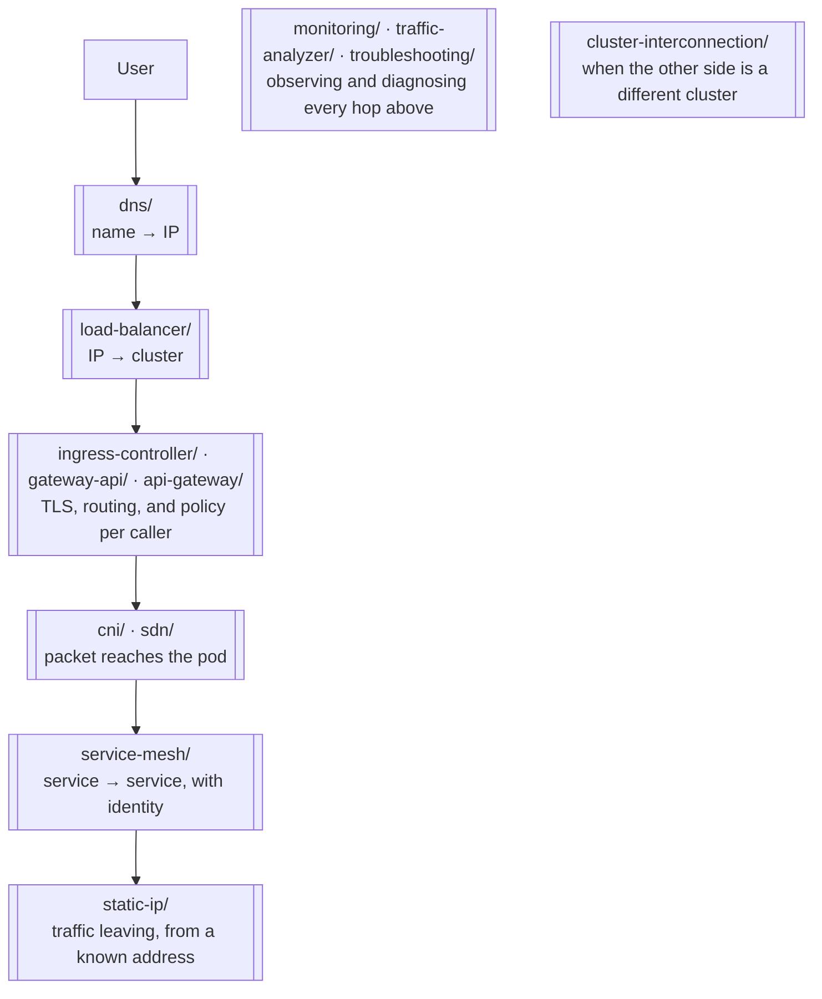

# Network

Networking capabilities for the platform, from the pod dataplane up to API management.

## How this folder is organised

One axis: **capability**. Each subfolder answers a distinct question, and a tool is filed by
**where it shines** — not by everything it is technically able to do.

That last part matters here more than anywhere else in the repository, because these tools
overlap heavily. Cilium does policy, observability and cross-cluster connectivity. Kong does
ingress. Traefik does mesh. Filing by capability would put several of them in four places
at once; filing by where they shine puts each one where you would go looking for it.

Where a tool has a second life worth knowing about, its README says so explicitly.

## The map

| Folder | The question it answers |
|---|---|
| [`cni/`](cni/README.md) | how do pods get an IP and reach each other? |
| [`sdn/`](sdn/README.md) | how do I get a **programmable** network — VPCs, subnets, cross-site meshes? |
| [`dns/`](dns/README.md) | how do names resolve, inside and outside the cluster? |
| [`load-balancer/`](load-balancer/README.md) | how does a `LoadBalancer` Service get an actual IP? |
| [`ingress-controller/`](ingress-controller/README.md) | how does external HTTP get in and reach a Service? |
| [`gateway-api/`](gateway-api/README.md) | the same, through the successor to `Ingress` |
| [`api-gateway/`](api-gateway/README.md) | how do I run APIs as **products** — keys, quotas, consumers, portal? |
| [`service-mesh/`](service-mesh/README.md) | how do services talk to each other with identity, mTLS and traffic policy? |
| [`cluster-interconnection/`](cluster-interconnection/README.md) | how do **separate clusters** reach each other? |
| [`static-ip/`](static-ip/README.md) | what address does traffic **leaving** the cluster come from? |
| [`monitoring/`](monitoring/README.md) | is the network actually working? |
| [`traffic-analyzer/`](traffic-analyzer/README.md) | what is actually on the wire? |
| [`troubleshooting/`](troubleshooting/README.md) | why is *this* connection failing? |

## Grouped by concern

**Foundation — packets move at all**
[`cni/`](cni/README.md) · [`sdn/`](sdn/README.md)

**Naming**
[`dns/`](dns/README.md)

**North-south — traffic entering**
[`load-balancer/`](load-balancer/README.md) · [`ingress-controller/`](ingress-controller/README.md) · [`gateway-api/`](gateway-api/README.md) · [`api-gateway/`](api-gateway/README.md)

**East-west — traffic between services**
[`service-mesh/`](service-mesh/README.md)

**Crossing boundaries**
[`cluster-interconnection/`](cluster-interconnection/README.md) · [`static-ip/`](static-ip/README.md)

**Knowing whether any of it works**
[`monitoring/`](monitoring/README.md) · [`traffic-analyzer/`](traffic-analyzer/README.md) · [`troubleshooting/`](troubleshooting/README.md)

## A request's journey

The folders stack in a fixed order, which is the fastest way to understand how they relate:

Debugging works the same way in reverse: start at the name, not at the packet. That is the
method in [`troubleshooting/`](troubleshooting/README.md).

## The distinction that causes the most confusion

Three folders deal with traffic entering the cluster, and every tool in them can technically
do the others' job:

| Folder | Shines at | Pick it because |
|---|---|---|
| [`ingress-controller/`](ingress-controller/README.md) | HTTP entry via the `Ingress` API | traffic needs to reach your Services with TLS |
| [`gateway-api/`](gateway-api/README.md) | the same, via the Gateway API — `Ingress` is feature-frozen upstream | you are adopting the successor API |
| [`api-gateway/`](api-gateway/README.md) | API management | your APIs have consumers, plans and quotas |

The deciding question is not capability. It is: **does anything outside your team consume
these APIs under terms you have to enforce?** If not, an ingress controller is the whole
answer.

## Related capabilities, filed elsewhere

| Concern | Where |
|---|---|
| Network policies and segmentation | [`security/2-cluster/network-policies/`](../security/2-cluster/network-policies/) — enforced by the CNI, but a security capability |
| Certificates and TLS trust | [`security/2-cluster/certificates/`](../security/2-cluster/certificates/README.md) |
| SSO, OIDC, identity-aware access | [`security/2-cluster/identity-access/`](../security/2-cluster/identity-access/) |
| Routing traffic to LLM providers | [`ai/ai-gateway/`](../ai/ai-gateway/) |
| Multi-cluster **management** and scheduling | [`platform-engineering/kubernetes/managed/multi-cluster/`](../platform-engineering/kubernetes/managed/multi-cluster/) |
| Metrics, logs and traces | [`observability/`](../observability/README.md) |

## The stack in pikakube

| Layer | What is used | Why |
|---|---|---|
| CNI | [kindnet](cni/kindnet/README.md) | Kind's default; Cilium is documented for when networking is the subject |
| DNS — internal | [CoreDNS](dns/coredns/README.md) | ships with the cluster |
| DNS — external | [nip.io](dns/nip.io/README.md) | hostnames with no zone to own |
| Load balancer | none | Kind publishes 80 and 443 to the host via `extraPortMappings` |
| Ingress | [ingress-nginx](ingress-controller/ingress-nginx/README.md) | wired in [`init.sh`](../../init.sh), with a mkcert wildcard certificate |
| Everything else | mapped, not deployed | single local cluster — the rest is catalogued for comparison |

The consequence worth recording: because the `nip.io` zone is not ours, no public CA can
issue for these names, which makes the local cluster a private-CA scenario by construction.
See [certificates](../security/2-cluster/certificates/README.md#3-public-ca-vs-private-ca).
