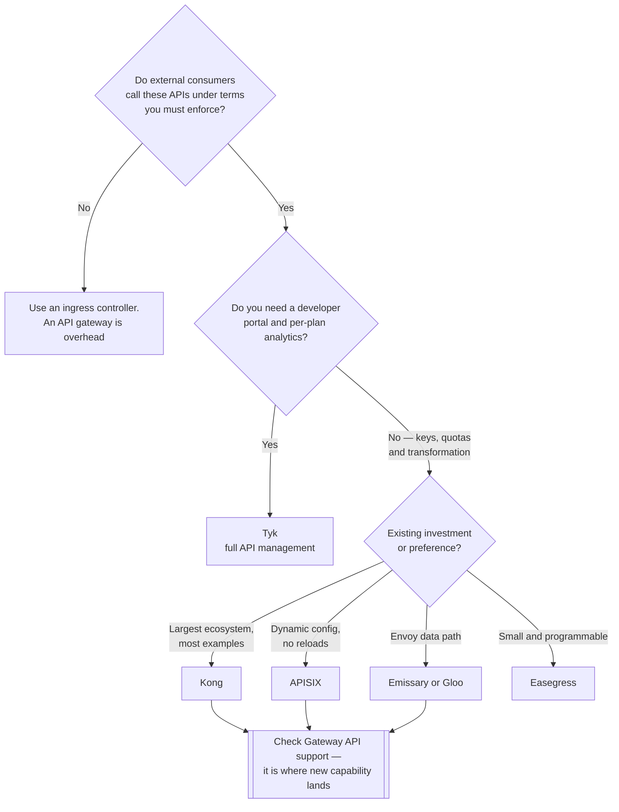

[← Network](../README.md)

# API gateway

Conceptual reference for the `api-gateway/` folder: treating APIs as **products with
consumers**, not just routes.

Tools covered: [`kong`](kong/) · [`tyk`](tyk/) · [`apisix`](apisix/) · [`gloo`](gloo/) ·
[`emissary-ingress`](emissary-ingress/) · [`easegress`](easegress/)

## Contents

1. [Where this folder sits](#1-where-this-folder-sits)
2. [What an API gateway adds](#2-what-an-api-gateway-adds)
3. [The tools in this folder](#3-the-tools-in-this-folder)
4. [Decision tree](#4-decision-tree)
5. [Anti-patterns](#5-anti-patterns)
6. [How this applies to pikakube](#6-how-this-applies-to-pikakube)

---

## 1. Where this folder sits

Every tool here can also do plain ingress. It is filed by **where it shines**, which is the
layer above routing:

| Folder | Shines at | You pick it because |
|---|---|---|
| [`ingress-controller/`](../ingress-controller/README.md) | HTTP entry via `Ingress` | traffic needs to reach your Services with TLS |
| [`gateway-api/`](../gateway-api/README.md) | the same, via the newer Gateway API | you are adopting the successor API |
| **`api-gateway/`** | **API management** | your APIs have consumers, quotas and lifecycles |

The dividing question is not technical capability. It is: **does anything outside your team
consume these APIs under terms you have to enforce?** If yes, you need this layer. If no, an
ingress controller is the whole answer and an API gateway is overhead.

## 2. What an API gateway adds

Beyond routing and TLS:

| Capability | What it means |
|---|---|
| **Consumers and credentials** | API keys, JWT validation, OAuth2 — identity per *caller*, not per user |
| **Rate limiting and quotas** | per consumer, per plan, per route — not one global limit |
| **Transformation** | rewriting request and response bodies and headers, so backends need not change |
| **Versioning** | `/v1` and `/v2` served side by side, with controlled deprecation |
| **Developer portal** | documentation, self-service key issuance, onboarding |
| **Analytics per consumer** | who called what, how often, and whether they exceeded their plan |

The pattern underneath all of it is the same: **policy that varies by caller**. An ingress
controller can rate-limit a route; it cannot express "the free plan gets 100 requests per
minute and the partner plan gets 10,000".

## 3. The tools in this folder

| Tool | Base | Shines when | Detail |
|---|---|---|---|
| **Kong** | NGINX / OpenResty | the most widely adopted option, with a large plugin ecosystem and a Kubernetes controller | [→](kong/) |
| **Tyk** | Go, own proxy | a full API management product — portal, analytics, multi-tenancy — that is genuinely open source at its core | [→](tyk/) |
| **APISIX** | NGINX / OpenResty | dynamic configuration with no reloads, and a strong plugin set; Apache project | [→](apisix/) |
| **Gloo** | Envoy | Envoy-based edge with enterprise features; note that the open-source line continues as [kgateway](../gateway-api/kgateway/) | [→](gloo/) |
| **Emissary-ingress** | Envoy | CNCF project (formerly Ambassador), CRD-driven, Envoy data path | [→](emissary-ingress/) |
| **Easegress** | Go, own proxy | a lighter, programmable traffic orchestrator; a smaller alternative to the above | [→](easegress/) |

## 4. Decision tree

## 5. Anti-patterns

| Anti-pattern | Why it is bad | What to do instead |
|---|---|---|
| Adopting an API gateway to route internal traffic | large operational surface for a job Ingress does | an ingress controller |
| Running an API gateway *and* an ingress controller with unclear ownership | two places terminate TLS and route, and neither is authoritative | decide which owns the edge |
| Using it as a service mesh | it handles north-south; east-west identity is a different problem | [`service-mesh/`](../service-mesh/README.md) |
| Putting business logic in transformation plugins | invisible logic that no test covers and no repository owns | keep it in the service |
| Choosing on feature lists | most of these overlap heavily; operational fit decides | pilot with your actual auth and quota requirements |

## 6. How this applies to pikakube

Not in use — the cluster serves internal tools through
[ingress-nginx](../ingress-controller/ingress-nginx/), which is the correct choice for a
platform with no external API consumers.

Mapped because the moment a data platform exposes anything outward — a metrics API, a
data-product endpoint, a partner integration — the requirements change from routing to
consumers, keys and quotas, and that is a different tool.

---

[← Network](../README.md)
