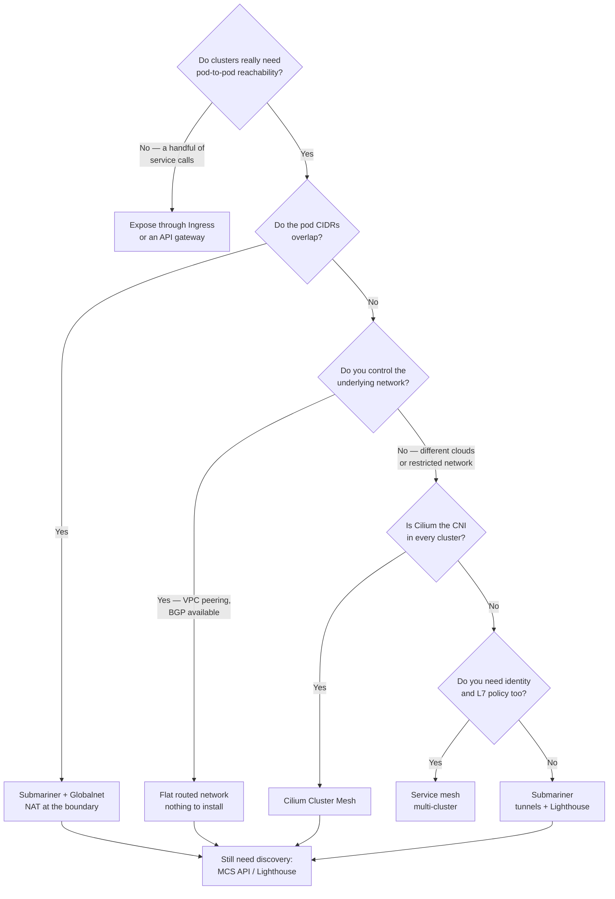

[← Network](../README.md)

# Cluster interconnection

Conceptual reference for the `cluster-interconnection/` folder. Explains how workloads in
separate Kubernetes clusters reach each other, and which approach fits which constraint.

Tools covered: [`submariner`](submariner/) · [`kubeslice`](kubeslice/)

> **Not the same as multi-cluster *management*.** Scheduling workloads across clusters and
> reconciling their state is a different capability — Karmada, KubeStellar, Open Cluster
> Management and Liqo live under
> [`platform-engineering/kubernetes/managed/multi-cluster/`](../../platform-engineering/kubernetes/managed/multi-cluster/).
> This folder is only about **packets and names crossing a cluster boundary**.

## Contents

1. [The problem](#1-the-problem)
   - [Why it does not just work](#why-it-does-not-just-work)
   - [Overlapping CIDRs, the hard case](#overlapping-cidrs-the-hard-case)
2. [The five approaches](#2-the-five-approaches)
3. [Cross-cluster service discovery](#3-cross-cluster-service-discovery)
   - [The MCS API — the standard](#the-mcs-api--the-standard)
   - [Three design decisions that are not obvious](#three-design-decisions-that-are-not-obvious)
   - [Lighthouse — Submariner's implementation](#lighthouse--submariners-implementation)
   - [MCS is not a Submariner feature](#mcs-is-not-a-submariner-feature)
   - [The wider standard: SIG-Multicluster's API family](#the-wider-standard-sig-multiclusters-api-family)
4. [The tools in this folder](#4-the-tools-in-this-folder)
   - [Alternatives mapped elsewhere in the repo](#alternatives-mapped-elsewhere-in-the-repo)
5. [A worked example: migrating between clusters](#5-a-worked-example-migrating-between-clusters)
   - [The situation](#the-situation)
   - [The two options](#the-two-options)
   - [Why it ends well](#why-it-ends-well)
6. [Security: what interconnection actually opens](#6-security-what-interconnection-actually-opens)
   - [What crosses the boundary, and what does not](#what-crosses-the-boundary-and-what-does-not)
   - [Exporting controls the name, not the route](#exporting-controls-the-name-not-the-route)
   - [Globalnet puts a NAT in the path — verify what that means for reachability](#globalnet-puts-a-nat-in-the-path--verify-what-that-means-for-reachability)
   - [The controls that actually help](#the-controls-that-actually-help)
   - [The threat model, before and after](#the-threat-model-before-and-after)
7. [Decision tree](#7-decision-tree)
8. [Anti-patterns](#8-anti-patterns)
9. [How this applies to pikakube](#9-how-this-applies-to-pikakube)
10. [References](#references)

---

## 1. The problem

### Why it does not just work

A pod in cluster A cannot reach a pod in cluster B, and three separate things are missing at
once:

| Missing | Why |
|---|---|
| **A route** | pod CIDRs are private to each cluster and are not advertised anywhere |
| **A name** | each cluster has its own `cluster.local`; CoreDNS in A knows nothing about services in B |
| **An identity** | NetworkPolicy, mTLS and RBAC are all scoped per cluster |

Solving only the first gets packets across with no way to address them. Solving only the
second gives you names that resolve to unreachable addresses. A working solution has to
cover all three.

### Overlapping CIDRs, the hard case

The assumption underneath the simplest approaches is that **pod CIDRs do not overlap**. In
practice they usually do, because every cluster was built from the same template with the
same default `10.244.0.0/16`.

Once they overlap, plain routing is impossible — the same address exists in two places. The
options narrow to:

- renumber one cluster (means rebuilding it; pod CIDR is not mutable)
- translate addresses at the boundary — which is what Submariner's **Globalnet** does, assigning each cluster a non-overlapping global CIDR and NATing between them
- avoid L3 entirely and connect at L7 through a gateway or mesh

Planning non-overlapping CIDRs at cluster creation is the cheapest fix by an enormous
margin, and it is almost always skipped.

---

## 2. The five approaches

| Approach | How it works | Good when | Cost |
|---|---|---|---|
| **Flat network** | non-overlapping CIDRs, routed by the underlay — VPC peering, transit gateway, BGP | you control the network and planned the CIDRs | none at the cluster level; all the work is in the network |
| **Tunnel + gateway** | dedicated gateway nodes build encrypted tunnels between clusters; **Submariner** | clusters sit on networks you do not control, or across clouds | gateway nodes become a bandwidth and failure concern |
| **CNI-native mesh** | the CNI itself federates — **Cilium Cluster Mesh** | already running Cilium everywhere | ties you to one CNI across every cluster |
| **Service mesh multi-cluster** | Istio/Linkerd extend the mesh across clusters, with mTLS and L7 routing | you already run a mesh and want identity plus traffic policy | only covers mesh traffic; sidecar or ambient overhead |
| **Public exposure** | expose the service through Ingress or an API gateway and call it over the internet | few services, clear boundaries, external consumers anyway | not interconnection — it is integration, with auth and latency to match |

The last row is worth taking seriously rather than dismissing. A large share of
"multi-cluster networking" projects exist to avoid an API call that would have been simpler,
more observable and easier to secure.

---

## 3. Cross-cluster service discovery

Connectivity without discovery is not usable. Packets can cross, but nothing can name what
is on the other side.

### The MCS API — the standard

Before it existed, every tool invented its own way to say "this Service should be visible to
other clusters". Istio had one, Submariner had one, Cilium had another. Nothing was
portable.

SIG-Multicluster standardised it as the **Multi-Cluster Services API** (KEP-1645):

| Concept | What it is |
|---|---|
| **ClusterSet** | the group of clusters that have agreed to share services — an administrative and trust boundary, not just a technical one |
| **`ServiceExport`** | created **by you** in the source cluster, in the same namespace and with **exactly the same name** as the Service being shared. It carries essentially no spec — it is a marker meaning "export this" |
| **`ServiceImport`** | created **automatically** by the implementation in every other member cluster, representing the remote Service. You never write one |

Exported services resolve under a parallel domain:

```
<service>.<namespace>.svc.clusterset.local
```

### Three design decisions that are not obvious

**1. Namespace sameness.** The spec assumes that namespaces with the same name in different
clusters **are the same namespace, with the same owners**. That has a direct security
consequence: if team X owns `payments` in cluster A, they had better own `payments` in
cluster B too — otherwise exporting becomes a privilege escalation path.

**2. Same-named services merge.** If clusters A and B both export `api` in namespace `foo`,
the resulting `ServiceImport` carries endpoints from **both**. That gives multi-cluster load
balancing for free, and surprises anyone who did not expect it.

**3. `clusterset.local` is a deliberately separate domain.** Local resolution never changes
behaviour — `cluster.local` keeps meaning exactly what it meant before. Crossing a cluster
boundary is something you **opt into** by using a different name. This is what makes the
migration in [§5](#5-a-worked-example-migrating-between-clusters) tractable: only the callers
you deliberately changed start crossing.

MCS also distinguishes `ClusterSetIP` services, which get a virtual IP like a normal
Service, from `Headless` ones, which return the individual endpoints.

### Lighthouse — Submariner's implementation

Two components:

- a **controller** watching `ServiceExport` objects and syncing service and endpoint metadata to the other clusters
- a **DNS server** answering `*.svc.clusterset.local`, with each member cluster's CoreDNS configured to forward that domain to it

Two properties worth knowing before deploying it:

**There is a broker.** Submariner is not peer-to-peer for metadata. A designated **broker** —
a namespace in one cluster, or a dedicated cluster — acts as the central exchange point.
That is an architectural surprise: discovery depends on a stateful component that has to be
placed, secured and kept available.

**Resolution prefers local endpoints.** Lighthouse returns the local cluster's endpoint when
one exists and only falls back to remote ones otherwise. That is what makes active/active
usable, instead of sending traffic across a region for no reason.

### MCS is not a Submariner feature

It is an upstream standard with several implementations:

| Implementation | Context |
|---|---|
| **Submariner Lighthouse** | the one in this folder |
| **Cilium Cluster Mesh** | if Cilium is already the CNI everywhere |
| **AWS Cloud Map MCS Controller** | EKS-native |
| **KubeSlice** | as part of its slice model |

The practical consequence: write against `ServiceExport` and you can change the underlying
implementation later without touching the application.

### The wider standard: SIG-Multicluster's API family

MCS is **one of four APIs** from SIG-Multicluster, all resting on the same foundation.
Seeing the whole set is what explains where MCS stops and something else begins.

| Concept / API | KEP | The question it answers |
|---|---|---|
| **ClusterSet** | foundational concept | which clusters have agreed to trust each other? |
| **About API** | [KEP-2149](https://github.com/kubernetes/enhancements/tree/master/keps/sig-multicluster/2149-clusterid) | who is this cluster, and which clusterset does it belong to? |
| **ClusterProfile API** | [KEP-4322](https://github.com/kubernetes/enhancements/tree/master/keps/sig-multicluster/4322-cluster-inventory) | what clusters exist, and what state are they in? — inventory and discovery |
| **MCS API** | [KEP-1645](https://github.com/kubernetes/enhancements/tree/master/keps/sig-multicluster/1645-multi-cluster-services-api) | which **services** cross the boundary? |
| **Work API** | — | which **workloads** get deployed where? |

Three things this makes visible:

**ClusterSet is the trust boundary everything else assumes.** The namespace-sameness rule
above is only safe because a ClusterSet is *defined* as an administrative boundary where
that assumption holds. Membership is meant to be a deliberate administrative act — not a
side effect of having built a tunnel.

**The About API is what gives a cluster an identity.** It defines `ClusterProperty`
resources carrying well-known values that identify the cluster and its clusterset. MCS
depends on this to know which cluster an endpoint came from, and to tell "mine" from "a
peer" — which is precisely what makes Lighthouse's local-preference behaviour possible.

**Work API and ClusterProfile belong to the management side.** They are what Open Cluster
Management, Karmada and KubeStellar implement — the capability living under
[`platform-engineering/kubernetes/managed/multi-cluster/`](../../platform-engineering/kubernetes/managed/multi-cluster/).
This is why the split declared at the top of this document is real rather than arbitrary:
the same SIG defines both halves, on a shared foundation, but they answer different
questions. Connectivity and discovery live here; placement and lifecycle live there.

The canonical documentation for all of it is the SIG's own site — see
[References](#references).

---

## 4. The tools in this folder

| Tool | Model | Shines when | Do not use when | Detail |
|---|---|---|---|---|
| **Submariner** | L3 tunnels (IPsec, WireGuard or VXLAN) between gateway nodes, plus Lighthouse for DNS and Globalnet for overlapping CIDRs | connecting clusters across clouds or networks you do not control, **especially with overlapping CIDRs** | a flat routed network already exists — the tunnels add nothing | [→](submariner/) |
| **KubeSlice** | application-level "slices" — namespace-scoped overlay networks spanning clusters, with QoS and isolation per slice | you want tenant or application isolation across clusters, not just raw connectivity | you only need two clusters to talk; it is a heavier model | [→](kubeslice/) |

The difference in one line: **Submariner connects clusters; KubeSlice connects
applications across clusters.** Submariner's unit is the cluster, KubeSlice's is the slice.

### Alternatives mapped elsewhere in the repo

| Alternative | Where | Why consider it |
|---|---|---|
| **Cilium Cluster Mesh** | [`cni/cilium/`](../cni/cilium/) | if Cilium is already the CNI everywhere, this is the lowest-friction option — no extra component |
| **Istio / Linkerd multi-cluster** | [`service-mesh/`](../service-mesh/) | adds identity and L7 policy, not just reachability |
| **Liqo** | [`platform-engineering/.../multi-cluster/liqo/`](../../platform-engineering/kubernetes/managed/multi-cluster/liqo/) | blurs the line — it does networking *and* offloads workloads |
| **API gateway** | [`api-gateway/`](../api-gateway/) | the deliberate L7 answer when clusters should stay independent |

---

## 5. A worked example: migrating between clusters

The most defensible use of Submariner is as **migration scaffolding**, and it is worth
spelling out because it explains why the operational cost is acceptable.

### The situation

A data platform runs on self-managed Kubernetes on-prem: Airflow, Spark, Trino and a Hive
Metastore. The company is migrating to EKS. Nobody migrates all of it in one weekend.

Airflow goes first, because it is the least coupled to storage. Trino and the Metastore stay
behind for roughly three months, because they depend on a data lake that has not moved yet.

The problem surfaces immediately: Airflow DAGs submit queries to
`trino.data.svc.cluster.local`. After the cutover, Airflow is in EKS and Trino is not.

And both clusters use pod CIDR **`10.244.0.0/16`** — both of them, because both were built
from `kubeadm` defaults. VPC peering is off the table before the conversation starts: the
same address exists on both sides.

### The two options

| Option | What it costs |
|---|---|
| Expose Trino publicly | new authentication, TLS, a security review, internet latency, and rewriting the connection string in every DAG |
| **Submariner + Globalnet** | a tunnel between gateway nodes, NAT at the boundary, a `ServiceExport` on the Trino Service — DAGs switch to `trino.data.svc.clusterset.local` |

### Why it ends well

Three months later Trino migrates, the `ServiceExport` is deleted, Submariner is
uninstalled, and nobody remembers it existed.

**That is the point.** Submariner works here because the interconnection is *temporary* and
scoped to one named service. A migration has a defined end date, which bounds both the
operational burden and — more importantly — the security exposure described in
[§6](#6-security-what-interconnection-actually-opens).

The same setup left running permanently, connecting everything to everything, is a different
and much worse decision.

---

## 6. Security: what interconnection actually opens

Short answer to the obvious question: **yes, it expands the blast radius, and meaningfully.**
This is the cost side of the trade and it deserves to be stated plainly rather than buried.

### What crosses the boundary, and what does not

| Crosses | Does **not** cross |
|---|---|
| L3 reachability between pod networks | `NetworkPolicy` — scoped per cluster |
| DNS names, for exported services | RBAC and ServiceAccount identity |
| | Pod Security Standards |
| | Workload identity of any kind |

The consequence is precise: after interconnection, a compromised pod in cluster A can reach
cluster B's pod network — and **cluster B's NetworkPolicies see that traffic as an
anonymous external IP**, not as an identified workload. Every policy written in terms of
`podSelector` or `namespaceSelector` is blind to it.

### Exporting controls the name, not the route

This is the trap. `ServiceExport` governs **discovery** — whether a name resolves. It does
not, by itself, govern **reachability**. In flat mode, once the tunnel is up and routes are
programmed, the whole remote pod CIDR is routable, including services that were never
exported and never intended to be reachable.

An attacker does not need DNS. They need a route, and they have one.

### Globalnet puts a NAT in the path — verify what that means for reachability

Globalnet exists to solve overlapping CIDRs: it assigns each cluster a non-overlapping
global CIDR and translates addresses at the boundary.

Because everything then transits a NAT keyed on assigned global addresses, the reachable
surface is plausibly narrower than in flat mode, where the remote pod CIDR is routed
directly. **This has not been verified against the Submariner documentation and should not
be treated as a security control until it is.** Confirm, for the version you deploy:

- which objects actually receive a global address, and whether that is limited to exported services
- whether anything without a global address remains reachable by another path
- what the assigned global CIDR range is, since NetworkPolicy written against it depends on the answer

Treat this as a question to answer during a proof of concept, not as a mitigation to assume.

### The controls that actually help

| Control | What it buys | Limitation |
|---|---|---|
| **Globalnet** | a NAT boundary — see the caveat above before counting on it | still IP-based, no workload identity, and the exact reachable surface needs verifying |
| **NetworkPolicy on both sides**, written against the remote CIDR | coarse allow-listing of cross-cluster traffic | you can allow a CIDR, never "only the Airflow pods" — the remote workload has no identity locally |
| **Egress policy on the source cluster** | limits which local pods may reach the remote network at all | often the highest-value control, and the most frequently skipped |
| **Service mesh on top** (mTLS with SPIFFE identity) | **identity that does cross the boundary** — the only real fix for the blindness above | requires running a mesh in both clusters |
| **Dedicated, tainted, monitored gateway nodes** | contains and observes the tunnel endpoints | the gateways become high-value targets — root there is the tunnel |
| **A defined end date** | the strongest control available for a migration | only applies if you actually remove it |

### The threat model, before and after

> **Before:** compromising cluster A gets you cluster A, plus whatever A could reach through
> its egress controls.
>
> **After:** compromising cluster A gets you cluster A **and cluster B's pod network**, with
> cluster B unable to distinguish that traffic from any other external source.

That is not an argument against Submariner. It is an argument for using it where the
exposure is bounded — a migration with an end date, or a hybrid link carrying one named
service — and for layering identity on top if the connection is meant to be permanent.

A permanent, unrestricted interconnection between clusters that were separated on purpose
has dissolved the boundary that separation was buying. If the clusters exist in different
security zones, that is the wrong tool: integrate at L7, through a gateway, where
authentication and authorisation still apply.

---

## 7. Decision tree



---

## 8. Anti-patterns

| Anti-pattern | Why it is bad | What to do instead |
|---|---|---|
| Building clusters from a template with identical pod CIDRs | guarantees the overlap problem later, and pod CIDR cannot be changed in place | allocate non-overlapping CIDRs at creation, from a documented plan |
| Interconnecting clusters to avoid an API call | enormous operational surface for something an HTTP call solved | expose the service properly and keep the clusters independent |
| Connectivity without discovery | packets can flow but nothing can address them | MCS API / Lighthouse alongside the connectivity layer |
| Assuming NetworkPolicy applies across clusters | policy is scoped per cluster; a remote pod is just an external IP locally | write policy on both sides, or use a mesh with cross-cluster identity |
| A single gateway node per cluster | it becomes the bandwidth ceiling and a single point of failure | multiple gateway nodes, and monitor them like any other data path |
| Flattening networks for clusters that are supposed to be isolated | dissolves a security boundary that was there on purpose | keep separation and integrate at L7 |

---

## 9. How this applies to pikakube

The repository runs a **single Kind cluster**, so nothing in this folder is in use. It is
mapped for comparison rather than deployed.

Worth recording as the honest note: on a laptop, interconnection is only reproducible with
two Kind clusters and non-overlapping CIDRs, which the current
[`clusters/kind-configs/`](../../../clusters/kind-configs/) does not set up. Submariner
would be the realistic thing to try, because Globalnet also makes it survive the default
CIDR collision that two Kind clusters otherwise have.

The prerequisite for anything here is CIDR planning — see [`cni/`](../cni/) for how pod
CIDRs are allocated in the first place.

---

## References

- [SIG-Multicluster — official site](https://multicluster.sigs.k8s.io/) — canonical documentation for ClusterSet, About, ClusterProfile, MCS and Work
- [kubernetes-sigs/sig-multicluster-site](https://github.com/kubernetes-sigs/sig-multicluster-site) — the repository behind that site
- [KEP-1645 — Multi-Cluster Services API](https://github.com/kubernetes/enhancements/tree/master/keps/sig-multicluster/1645-multi-cluster-services-api)
- [KEP-2149 — ClusterID / About API](https://github.com/kubernetes/enhancements/tree/master/keps/sig-multicluster/2149-clusterid)
- [KEP-4322 — Cluster Inventory / ClusterProfile API](https://github.com/kubernetes/enhancements/tree/master/keps/sig-multicluster/4322-cluster-inventory)
- [Submariner — getting started](https://submariner.io/getting-started/)
- [Submariner — documentation](https://submariner.io/) · [repository](https://github.com/submariner-io/submariner) — check here for Globalnet behaviour before relying on it
- [KubeSlice documentation](https://kubeslice.io/documentation/open-source/)
- [Cilium Cluster Mesh](https://docs.cilium.io/en/stable/network/clustermesh/)

---

[← Network](../README.md)
