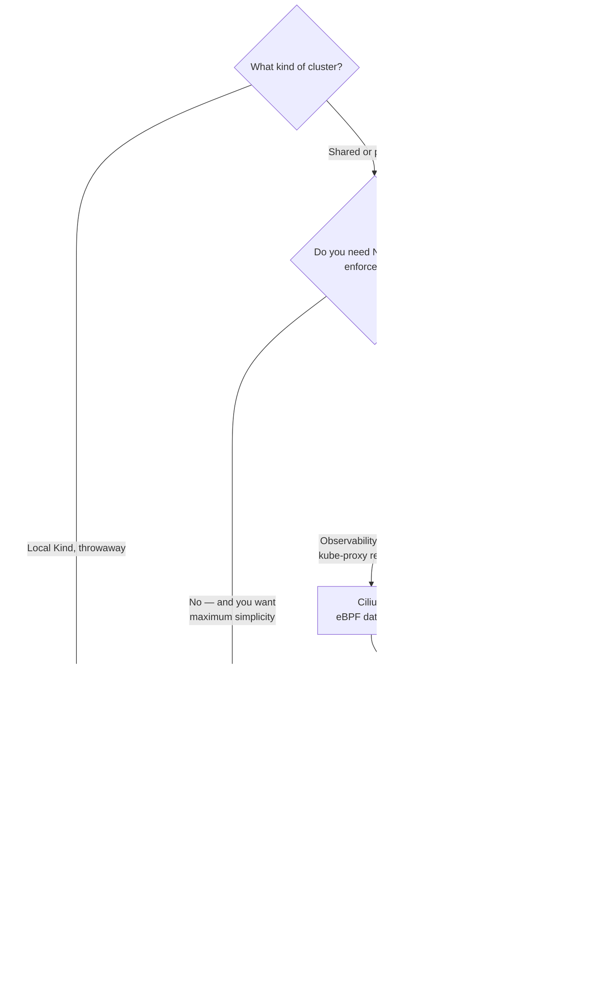

[← Network](../README.md)

# CNI — Container Network Interface

Conceptual reference for the `cni/` folder. Explains what a CNI plugin is responsible for,
how the options differ, and which one to pick.

Tools covered: [`calico`](calico/README.md) · [`cilium`](cilium/README.md) · [`flannel`](flannel/README.md) ·
[`kindnet`](kindnet/README.md) · [`multus`](multus/README.md) · [`weave`](weave/README.md)

The CNI specification itself: <https://github.com/containernetworking/cni>

## Contents

1. [What a CNI plugin is responsible for](#1-what-a-cni-plugin-is-responsible-for)
   - [The Kubernetes network model](#the-kubernetes-network-model)
   - [What happens when a pod starts](#what-happens-when-a-pod-starts)
2. [The axes that actually differentiate them](#2-the-axes-that-actually-differentiate-them)
   - [Overlay vs native routing](#overlay-vs-native-routing)
   - [Dataplane: iptables, IPVS or eBPF](#dataplane-iptables-ipvs-or-ebpf)
   - [NetworkPolicy support is not universal](#networkpolicy-support-is-not-universal)
   - [MTU, the silent killer](#mtu-the-silent-killer)
3. [The tools in this folder](#3-the-tools-in-this-folder)
   - [Multus is not a CNI, it composes them](#multus-is-not-a-cni-it-composes-them)
   - [A note on Weave Net](#a-note-on-weave-net)
4. [Decision tree](#4-decision-tree)
5. [Anti-patterns](#5-anti-patterns)
6. [How this applies to pikakube](#6-how-this-applies-to-pikakube)
7. [References](#references)

---

## 1. What a CNI plugin is responsible for

### The Kubernetes network model

Kubernetes does not implement pod networking. It defines **requirements** and delegates the
implementation to a CNI plugin. The requirements are short and strict:

- every pod gets its own IP address
- **pods reach each other directly, without NAT**
- nodes reach pods, and pods reach nodes, without NAT
- the IP a pod sees for itself is the IP others use to reach it

Almost every difference between plugins is *how* they satisfy this, not *whether* they do.

### What happens when a pod starts

The kubelet asks the container runtime to create the pod sandbox, and the runtime invokes
the CNI plugin. The plugin then does three things:

| Step | What it means |
|---|---|
| **IPAM** | allocate an IP for the pod out of the node's slice of the cluster CIDR |
| **Wire the namespace** | create the interface — usually a `veth` pair with one end in the pod's network namespace |
| **Program the path** | install routes, and whatever the dataplane needs so packets actually reach other nodes |

Everything else — NetworkPolicy, encryption, observability, load balancing — is an extension
that plugins add on top. That is where they diverge.

---

## 2. The axes that actually differentiate them

### Overlay vs native routing

| | Overlay (VXLAN, Geneve, IP-in-IP) | Native routing (BGP or cloud routes) |
|---|---|---|
| How packets travel | encapsulated inside another packet | routed as-is by the underlying network |
| Requires from the network | almost nothing — works anywhere | L2 adjacency or BGP peering, or a cloud that programs routes |
| Performance | encapsulation cost, and **reduced MTU** | full MTU, lower latency |
| Debuggability | the real packet is hidden inside a tunnel | packets look normal in `tcpdump` |
| Typical use | on-prem with a network you do not control, mixed environments | cloud VPCs, or a datacentre where you own the fabric |

This is the first decision, and it is usually made *for* you by the environment rather than
by preference.

### Dataplane: iptables, IPVS or eBPF

| Dataplane | Behaviour |
|---|---|
| **iptables** | the classic. Rules are evaluated linearly, so cost grows with the number of Services. Fine to a point, painful at thousands |
| **IPVS** | hash-table based, scales better than iptables for large Service counts |
| **eBPF** | programs attached in the kernel; can bypass much of the netfilter path and **replace kube-proxy entirely** |

eBPF is the reason Cilium and Calico's eBPF mode exist. The practical gain is not only
throughput — it is that Service resolution stops degrading as the cluster grows.

### NetworkPolicy support is not universal

This is the constraint people discover too late: **`NetworkPolicy` is an API, not an
implementation.** If the CNI does not enforce it, the objects apply cleanly, report no
error, and do absolutely nothing.

**Flannel does not enforce NetworkPolicy.** A cluster on Flannel with NetworkPolicies
committed to Git looks secured and is not.

If network segmentation is a requirement, it constrains the CNI choice before anything else
does.

### MTU, the silent killer

Encapsulation adds overhead — roughly 50 bytes for VXLAN, more with IPsec. If the pod MTU is
left at 1500 over an underlay that is also 1500, large packets fragment or get dropped.

The symptom is distinctive and confusing: **small requests work, large ones hang.** TLS
handshakes complete, then the first big response stalls. `ping` succeeds; `curl` of a large
payload does not.

```bash
# find the largest payload that survives the path, unfragmented
ping -M do -s 1472 <destination>     # 1472 + 28 = 1500
```

Every CNI has an MTU setting. On a cloud with jumbo frames, or a VPN in the path, the
default is frequently wrong.

---

## 3. The tools in this folder

| Tool | Model | Shines when | Do not use when | Detail |
|---|---|---|---|---|
| **Cilium** | eBPF, overlay or native | you want the most capable dataplane — kube-proxy replacement, L7 policy, Hubble observability, Cluster Mesh, encryption | the team has no appetite for eBPF and kernel-version constraints | [→](cilium/README.md) |
| **Calico** | overlay (VXLAN/IPIP) **or** BGP native | mature, flexible, strong policy model including cluster-wide `GlobalNetworkPolicy`; BGP into an existing fabric | you specifically want eBPF-first observability — Cilium goes further | [→](calico/README.md) |
| **Flannel** | overlay only, minimal | you want the simplest thing that satisfies the network model and nothing more | **you need NetworkPolicy** — it does not enforce it | [→](flannel/README.md) |
| **kindnet** | minimal, Kind's default | local Kind clusters where networking is not the subject under test | any shared or production cluster | [→](kindnet/README.md) |
| **Multus** | **meta-plugin** | pods need more than one interface — SR-IOV, storage networks, telco workloads | you are looking for a primary CNI; it is not one | [→](multus/README.md) |
| **Weave Net** | overlay | historical reference only | new deployments — see below | [→](weave/README.md) |

### Multus is not a CNI, it composes them

Multus attaches **additional** interfaces to a pod alongside the primary CNI. The pod keeps
its normal cluster network, and gains a second (or third) interface on a different network —
an SR-IOV VF, a macvlan onto a storage VLAN, a dedicated management network.

So it is never "Multus *or* Cilium". It is "Cilium as primary, Multus for the extra
interfaces". Common in telco, NFV, and anywhere a workload must sit on two networks at once.

### A note on Weave Net

Weaveworks ceased operations in 2024 and the original project is no longer maintained by
the company. A community fork exists, but for new clusters this is **historical reference,
not a candidate**. It is mapped here because plenty of existing clusters still run it and
migrations away from it are a real task.

---

## 4. Decision tree



---

## 5. Anti-patterns

| Anti-pattern | Why it is bad | What to do instead |
|---|---|---|
| Writing NetworkPolicies on Flannel | they apply without error and enforce nothing — a false sense of segmentation | pick a CNI that enforces policy, or drop the pretence |
| Swapping the CNI on a live cluster | pod IPs and routing change under running workloads; there is no in-place migration path | build a new cluster and migrate workloads |
| Leaving MTU at the default over a tunnel or VPN | large payloads hang while small ones work — one of the hardest symptoms to attribute | set the CNI MTU explicitly, and test with `ping -M do` |
| Running two primary CNIs | they fight over the pod namespace and IPAM | one primary; use Multus for extra interfaces |
| Picking a CNI by benchmark alone | policy model, observability and operational maturity dominate in practice | decide on requirements first, performance second |
| Treating Multus as a CNI choice | it has no dataplane of its own | it is an add-on to a primary CNI |

---

## 6. How this applies to pikakube

The cluster is Kind, so **kindnet** is what comes up by default — it satisfies the network
model and nothing more, which is correct for a laptop cluster.

**Cilium** is the one documented in depth, because it is the interesting case: eBPF
dataplane, kube-proxy replacement, and Hubble for flow visibility. The install notes for
Kind — including the WSL kernel version caveat, which is a real blocker and not obvious —
live in [`cilium/README.md`](cilium/README.md).

The rest are mapped for comparison rather than run: Calico as the BGP-capable alternative,
Flannel as the minimal baseline, Multus for the multi-interface case, and Weave as
historical context.

Related capabilities that depend on this choice:

- [`network-policies`](../../security/2-cluster/network-policies/) — only enforced if the CNI implements it
- [`service-mesh`](../service-mesh/README.md) — overlaps with Cilium at L7; decide which layer owns mTLS
- [`traffic-analyzer`](../traffic-analyzer/README.md) and [`troubleshooting`](../troubleshooting/README.md) — where flow inspection actually happens

---

## References

- [CNI specification](https://github.com/containernetworking/cni/blob/main/SPEC.md)
- [Kubernetes — cluster networking](https://kubernetes.io/docs/concepts/cluster-administration/networking/)
- [Kubernetes — network policies](https://kubernetes.io/docs/concepts/services-networking/network-policies/)
- [Cilium documentation](https://docs.cilium.io/)
- [Calico documentation](https://docs.tigera.io/calico/latest/about/)

---

[← Network](../README.md)
