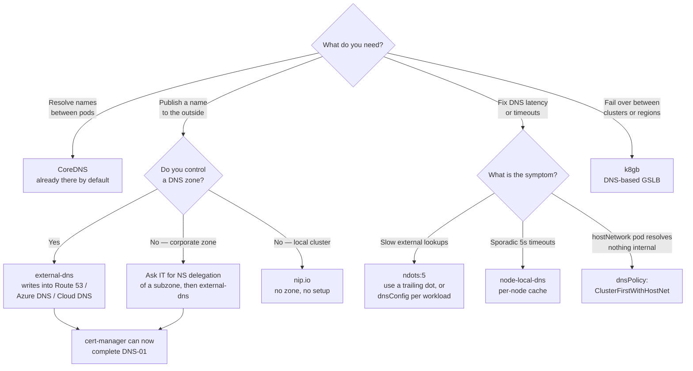

[← Network](../README.md)

# DNS

Conceptual reference for the `dns/` folder. Explains how name resolution works, how
Kubernetes does it internally, how it is organised inside a company, and which tool in this
folder solves which problem.

Tools covered: [`coredns`](coredns/) · [`external-dns`](external-dns/) ·
[`node-local-dns`](node-local-dns/) · [`nip.io`](nip.io/) — plus
[`k8gb`](../load-balancer/k8gb/) for DNS-based global failover.

Certificates depend heavily on DNS but are a separate capability — see
[`security/2-cluster/certificates/`](../../security/2-cluster/certificates/README.md).

## Contents

1. [Fundamentals](#1-fundamentals)
   - [What DNS actually does](#what-dns-actually-does)
   - [Record types worth knowing](#record-types-worth-knowing)
   - [How a name gets resolved](#how-a-name-gets-resolved)
   - [TTL and caching — the part that bites during migrations](#ttl-and-caching--the-part-that-bites-during-migrations)
   - [Zones, delegation and authority](#zones-delegation-and-authority)
2. [DNS inside Kubernetes](#2-dns-inside-kubernetes)
   - [CoreDNS and the cluster domain](#coredns-and-the-cluster-domain)
   - [What a pod's resolv.conf looks like](#what-a-pods-resolvconf-looks-like)
   - [The ndots:5 trap](#the-ndots5-trap)
   - [dnsPolicy and dnsConfig](#dnspolicy-and-dnsconfig)
   - [Headless services and StatefulSets](#headless-services-and-statefulsets)
3. [DNS outside the cluster](#3-dns-outside-the-cluster)
   - [Authoritative vs recursive](#authoritative-vs-recursive)
   - [external-dns: the bridge](#external-dns-the-bridge)
4. [The tools in this folder](#4-the-tools-in-this-folder)
   - [How they combine](#how-they-combine)
5. [Managed DNS in the cloud](#5-managed-dns-in-the-cloud)
   - [Private zones: split-horizon done by the provider](#private-zones-split-horizon-done-by-the-provider)
   - [Self-hosted authoritative servers](#self-hosted-authoritative-servers)
6. [Choosing where your names live](#6-choosing-where-your-names-live)
   - [The two questions people merge into one](#the-two-questions-people-merge-into-one)
   - [The options](#the-options)
   - [When nip.io is the right answer](#when-nipio-is-the-right-answer)
   - [When you need a real zone plus external-dns](#when-you-need-a-real-zone-plus-external-dns)
   - [Managed cloud zone vs self-hosted authoritative](#managed-cloud-zone-vs-self-hosted-authoritative)
   - [The hybrid pattern, which is what most platforms actually run](#the-hybrid-pattern-which-is-what-most-platforms-actually-run)
7. [In a corporate environment](#7-in-a-corporate-environment)
   - [Zone delegation, mechanically](#zone-delegation-mechanically)
   - [Split-horizon](#split-horizon)
   - [Conditional forwarding and the VPN problem](#conditional-forwarding-and-the-vpn-problem)
   - [Naming conventions](#naming-conventions)
   - [Who owns what](#who-owns-what)
8. [Decision tree](#8-decision-tree)
9. [Anti-patterns](#9-anti-patterns)
10. [How this applies to pikakube](#10-how-this-applies-to-pikakube)
11. [References](#references)

---

## 1. Fundamentals

### What DNS actually does

DNS maps **names to values**. Everyone remembers "names to IPs", but that is only the most
common record type — DNS also carries mail routing, service ports, text used for
verification, and pointers to other zones.

Two properties drive almost every operational surprise:

- **It is a distributed database with caching at every hop.** A change is never instant.
- **It is not a routing system.** Resolving a name tells you nothing about reachability. A name resolving correctly and the connection still failing is normal and expected.

### Record types worth knowing

| Record | Maps a name to | Where it shows up |
|---|---|---|
| **A** | an IPv4 address | the common case |
| **AAAA** | an IPv6 address | dual-stack clusters |
| **CNAME** | another **name** | pointing at a load balancer's own hostname |
| **TXT** | arbitrary text | `_acme-challenge` for DNS-01, SPF, DKIM, DMARC, external-dns ownership records |
| **NS** | the nameservers for a subzone | **delegation** — the mechanism behind handing a subdomain to a team |
| **SOA** | zone authority and timers | one per zone |
| **SRV** | a service, its port and priority | Kubernetes headless services |
| **MX** | mail servers | email |
| **PTR** | an IP back to a name | reverse lookups, logging |

Two CNAME rules cause real incidents:

- a CNAME **cannot coexist** with any other record at the same name
- a CNAME **cannot sit at the zone apex** (`example.com` itself) — which is why providers invented non-standard workarounds such as ALIAS or Route 53 alias records

### How a name gets resolved

```
application
   → stub resolver (/etc/resolv.conf)
      → recursive resolver (corporate, cloud, or 8.8.8.8)
         → root nameservers        "who handles .com?"
            → TLD nameservers      "who handles example.com?"
               → authoritative     "what is api.example.com?"
```

The **recursive resolver** does the walking and caches the result. The **authoritative
server** holds the truth for a zone. Almost every DNS tool is one of these two things, and
confusing them is the most common conceptual error — see
[§3](#3-dns-outside-the-cluster).

### TTL and caching — the part that bites during migrations

Every record carries a TTL. Resolvers cache for that long and will not ask again, no matter
what you changed.

Consequence: **lower the TTL before a migration, not during it.** If a record sits at
86400 (24h) and you cut over, some clients keep the old answer for a full day.

The standard sequence:

1. a day or more ahead, drop the TTL to 60s and wait for the old TTL to fully expire
2. perform the cutover
3. once stable, raise the TTL again

Skipping step 1 is what produces "some users still hit the old cluster" during a migration.

### Zones, delegation and authority

A **zone** is a slice of the namespace that one set of nameservers is authoritative for.
`example.com` is a zone; `k8s.example.com` can be its own zone.

**Delegation** is how the split happens: the parent zone publishes `NS` records saying
"anything under `k8s.example.com` is answered by *these* servers". From that moment the
parent no longer knows or cares what exists below.

This is the single most useful DNS concept for a platform team, because it converts *"open
a ticket for every hostname"* into *"we own the subzone"* — see
[§7](#7-in-a-corporate-environment).

---

## 2. DNS inside Kubernetes

### CoreDNS and the cluster domain

**CoreDNS** is the cluster's resolver. It runs as a Deployment in `kube-system`, fronted by
a Service (historically named `kube-dns`), and every pod's `/etc/resolv.conf` points at that
ClusterIP.

It answers the internal namespace, by default `cluster.local`:

| Name | Resolves to |
|---|---|
| `<service>.<namespace>.svc.cluster.local` | the Service ClusterIP |
| `<service>.<namespace>` | same — the search list completes it |
| `<pod-ip-with-dashes>.<namespace>.pod.cluster.local` | the pod IP |

Anything it is not authoritative for gets forwarded upstream, to whatever the node's
resolver is.

CoreDNS is **not** an alternative to Route 53. It is a resolver for the cluster's internal
namespace; Route 53 is an authoritative server for a public zone. Different layers — see
[§3](#3-dns-outside-the-cluster).

### What a pod's resolv.conf looks like

```
nameserver 10.96.0.10
search my-namespace.svc.cluster.local svc.cluster.local cluster.local
options ndots:5
```

The `search` list is what allows `curl http://my-service` to work from inside a pod. The
`ndots:5` line is what makes external lookups expensive.

### The ndots:5 trap

`ndots:5` means: **any name containing fewer than 5 dots is treated as relative first** —
every entry in the search list is appended and tried, in order, before the name is tried as
written.

So `api.example.com` (2 dots) produces four lookups:

```
api.example.com.my-namespace.svc.cluster.local   → NXDOMAIN
api.example.com.svc.cluster.local                → NXDOMAIN
api.example.com.cluster.local                    → NXDOMAIN
api.example.com                                  → finally answered
```

And since most stubs query A and AAAA in parallel, that is **eight packets to resolve one
external hostname** — on every call, from every pod. It shows up as unexplained latency on
outbound calls and as surprising CoreDNS load.

Two fixes:

```bash
# 1. a trailing dot makes the name absolute — the search list is skipped entirely
curl https://api.example.com./v1/health
```

```yaml
# 2. lower ndots for workloads that mostly talk to the outside world
spec:
  dnsConfig:
    options:
      - name: ndots
        value: "2"
```

Lowering `ndots` globally is tempting and risky: values below 2 break `<service>.<namespace>`
short-name resolution. Set it per workload, on the pods that actually make external calls.

### dnsPolicy and dnsConfig

| `dnsPolicy` | Behaviour |
|---|---|
| `ClusterFirst` | **default** — cluster DNS first, forwarding upstream for everything else |
| `ClusterFirstWithHostNet` | what `hostNetwork: true` pods need in order to still reach cluster DNS |
| `Default` | inherit the node's `/etc/resolv.conf` — no cluster names resolve |
| `None` | resolve nothing automatically; everything comes from `dnsConfig` |

The classic bug: a pod with `hostNetwork: true` and no `dnsPolicy` silently gets the node's
resolver and cannot resolve any `*.svc.cluster.local` name. The fix is
`dnsPolicy: ClusterFirstWithHostNet`.

### Headless services and StatefulSets

A Service with `clusterIP: None` is **headless**: instead of one ClusterIP, DNS returns an A
record per ready pod, plus SRV records for named ports. Clients then load-balance
themselves.

StatefulSets build on this to give each pod a stable name:

```
<pod-name>.<service>.<namespace>.svc.cluster.local
kafka-0.kafka-headless.data.svc.cluster.local
```

This is why Kafka, Cassandra, CockroachDB and most clustered databases require a headless
service — peer discovery depends on each member having a name that survives rescheduling.

---

## 3. DNS outside the cluster

### Authoritative vs recursive

The distinction that clears up most confusion:

| | Authoritative | Recursive (resolver) |
|---|---|---|
| Holds the truth for a zone | **yes** | no |
| Asks other servers | no | **yes** |
| Caches | no | **yes** |
| Examples | Route 53, Azure DNS, Cloud DNS, PowerDNS, BIND | CoreDNS forwarding upstream, corporate resolvers, 8.8.8.8 |

CoreDNS is authoritative for `cluster.local` and recursive for everything else. Route 53 is
authoritative and never recursive. They are not substitutes for one another.

### external-dns: the bridge

Nothing in Kubernetes publishes to the outside world on its own. **external-dns** closes
that gap: it watches `Ingress`, `Service` and `HTTPRoute` objects and **writes records into
your authoritative provider** — Route 53, Azure DNS, Cloud DNS, Cloudflare, PowerDNS and
others.

```yaml
metadata:
  annotations:
    external-dns.alpha.kubernetes.io/hostname: airflow.k8s.example.com
```

So external-dns does not replace Route 53 — it **automates** it. That is the actual
relationship between the two, and it is what makes a delegated subzone valuable: once the
zone is yours, adding a hostname stops being a ticket and becomes an annotation.

It also writes a TXT **ownership record** alongside each entry, so that it only ever
modifies records it created. Losing that TXT registry is how external-dns ends up refusing
to manage a record it actually owns.

---

## 4. The tools in this folder

| Tool | Role | Shines when | Do not use when | Detail |
|---|---|---|---|---|
| **CoreDNS** | cluster resolver | always — it is the cluster's DNS, and its plugin chain also handles rewriting, forwarding and stub zones | expecting it to be a public authoritative server | [→](coredns/) |
| **external-dns** | publishes records to an external provider | Ingress/Service hostnames must exist in real DNS | there is no zone you control, or records are managed by another team | [→](external-dns/) |
| **node-local-dns** | per-node DNS cache (DaemonSet) | high query volume, CoreDNS under load, or intermittent 5s timeouts | small clusters, where it is added complexity | [→](node-local-dns/) |
| **nip.io** | wildcard DNS for any IP, no setup | local and ephemeral clusters | anything real — it depends on a third-party service | [→](nip.io/) |
| **k8gb** | DNS-based global load balancing and failover | multi-cluster, cross-region failover driven by health | a single cluster | [→](../load-balancer/k8gb/) |

### How they combine

- **CoreDNS + node-local-dns** — the cache sits on each node and answers locally, cutting CoreDNS load and conntrack pressure. The known Linux UDP conntrack race that shows up as sporadic 5-second DNS timeouts is the usual reason to add it.
- **CoreDNS + external-dns** — internal names resolved in-cluster, external names published outward. Two directions, no overlap.
- **external-dns + cert-manager** — the pair that makes ingress self-service: one publishes the hostname, the other issues the certificate for it, both triggered by the same Ingress object.
- **k8gb on top of external-dns** — per-cluster records published normally, with k8gb steering which cluster answers.

---

## 5. Managed DNS in the cloud

| Cloud | Service | Notes |
|---|---|---|
| AWS | **Route 53** | public and private hosted zones; alias records solve the CNAME-at-apex problem; supported by external-dns and by cert-manager DNS-01 |
| Azure | **Azure DNS** | public zones and Private DNS Zones, the latter linked to VNets |
| GCP | **Cloud DNS** | public and private zones, private ones scoped to VPCs |

All three are authoritative servers. None of them resolves anything for your pods — that is
CoreDNS's job.

### Private zones: split-horizon done by the provider

Every provider offers **private zones**: a zone that only resolves from inside a VPC/VNet.
The same name can exist in both a public and a private zone with different answers, which is
split-horizon implemented for you instead of by hand.

Typical layout:

- `example.com` public zone → customer-facing records
- `int.example.com` private zone → internal services, resolvable only from inside the network

### Self-hosted authoritative servers

There *is* an on-prem equivalent to Route 53 — it is simply less common in Kubernetes shops:

| Server | Notes |
|---|---|
| **PowerDNS** | database-backed, good API, supported by external-dns |
| **BIND** | the reference implementation; ubiquitous, dated ergonomics |
| **Knot DNS** | modern, high performance |
| **CoreDNS** | can be authoritative through the `file` or `etcd` plugins |

Worth knowing for air-gapped or fully on-prem environments, where no cloud zone is reachable.

---

## 6. Choosing where your names live

### The two questions people merge into one

> **1. Where does the zone live?** — nip.io, a cloud zone, a self-hosted server, or a
> subzone delegated by IT.
>
> **2. Who writes the records into it?** — nobody, external-dns, or a human with a ticket.

nip.io answers the first question by having **no zone at all**, which makes the second moot.
external-dns only ever answers the second — it is **not** an alternative to a DNS provider,
it is automation layered on top of one. Comparing "nip.io vs external-dns" is comparing a
zone to a robot that edits zones.

### The options

| Option | Who owns the zone | Who creates records | Cost | Fits |
|---|---|---|---|---|
| **nip.io / sslip.io** | nobody — a public service answers by pattern | nothing to create | free | local clusters, demos, ephemeral CI |
| **`/etc/hosts` or `.test`** | nobody | manual, per machine | free | one developer, one or two names |
| **Cloud managed zone** (Route 53, Azure DNS, Cloud DNS) | you | **external-dns** | cents per month plus queries | anything real running in a cloud |
| **Corporate delegated subzone** | you, delegated by IT | **external-dns** | already paid for | company environments |
| **Self-hosted authoritative** (PowerDNS, BIND, Knot, CoreDNS) | you, and you operate it | external-dns via the PowerDNS or RFC2136 providers | operational effort | on-prem, air-gapped |

### When nip.io is the right answer

- the cluster is local, ephemeral, or a demo
- no publicly trusted certificate is needed — which is already the case, see [certificates §3](../../security/2-cluster/certificates/README.md#3-public-ca-vs-private-ca)
- zero setup and zero cost matter more than control
- every subdomain must work immediately, with no DNS step per service

Its limits, stated plainly:

| Limit | Consequence |
|---|---|
| You do not own the zone | **DNS-01 is impossible** — no public CA can ever issue for these names |
| It is a free third-party service | outages and rate limiting are outside your control, and it sits in your resolution path |
| Some resolvers reject it | DNS rebinding protection drops answers pointing at private IPs — the classic "works at home, fails on the office VPN" |
| Names are opaque but visible | the hostnames you resolve are visible to the operator |

### When you need a real zone plus external-dns

Any of the following makes nip.io the wrong tool:

- a publicly trusted certificate is required — you must control the zone to pass DNS-01
- more than one person or machine has to resolve the name
- the name must survive an IP change
- availability, audit or compliance are in scope

At that point the pairing is always the same: **a zone you control + external-dns writing
into it**, which is what turns a new hostname from a ticket into an annotation.

### Managed cloud zone vs self-hosted authoritative

| Situation | Use | Why |
|---|---|---|
| The cluster already runs in a cloud | **managed zone** | first-class external-dns and cert-manager providers, IAM already in place, cost is negligible |
| The company already runs DNS | **delegated subzone** | do not build a parallel DNS estate next to the one IT operates |
| On-prem or air-gapped | **self-hosted** (PowerDNS with the external-dns provider, or RFC2136) | no cloud zone is reachable |
| Portability is a real requirement | **managed, single provider** | zone data moves easily; delegation and cached NS records do not |

### The hybrid pattern, which is what most platforms actually run

1. **Local and dev clusters → nip.io.** Nothing to operate, nothing to pay, no zone to manage.
2. **Shared and production clusters → delegated subzone + external-dns.** Hostnames appear from Ingress annotations.
3. **Certificates follow the same split** — a private CA locally, DNS-01 against the real zone everywhere else.

Same shape as certificates: the cheap option covers the local loop, the real option covers
everything shared, and the two never need to be the same thing.

---

## 7. In a corporate environment

### Zone delegation, mechanically

The company owns `company.com` and IT runs that zone. You do **not** want to file a ticket
per hostname. You want a **delegated subzone**:

1. the platform team creates a zone for `k8s.company.com` in its own Route 53 / Azure DNS
2. that zone reports a set of nameservers
3. IT adds `NS` records in `company.com` pointing `k8s.company.com` at those nameservers
4. from then on, every record below is yours

One ticket, once. After that external-dns writes records automatically, and cert-manager can
complete DNS-01 challenges without a human — which is what makes certificate automation
possible at all.

### Split-horizon

The same name deliberately resolves differently depending on where you ask:

| Asking from | `app.company.com` answers |
|---|---|
| inside the corporate network / VPN | a private IP |
| the public internet | nothing, or a public front door |

Implemented either with cloud private zones ([§5](#5-managed-dns-in-the-cloud)) or with
separate internal and external authoritative servers.

The consequence for certificates: HTTP-01 cannot validate an internal-only name, because the
CA cannot reach it. **DNS-01 still works**, as long as the zone is publicly resolvable — the
TXT record is checked publicly even when the A record is private. This is why DNS-01 is
effectively the default in corporate environments.

### Conditional forwarding and the VPN problem

Corporate resolvers usually **conditionally forward**: "anything ending in `company.internal`
goes to server 10.0.0.53, everything else to the public resolver".

This produces the most reported DNS symptom in any company:

> *"It works on the VPN and fails off the VPN."*

Almost always the VPN client is what installs the conditional forwarding rule. Off VPN, the
name has no path to the internal resolver. It is not a certificate problem, not a firewall
problem, and no amount of retrying fixes it.

The same applies inside the cluster: pods forward upstream to the node's resolver, so if the
node cannot resolve an internal corporate name, neither can any pod. CoreDNS can be given an
explicit stub zone for those domains rather than relying on the node.

### Naming conventions

How to split subdomains by area, environment and audience — including the wildcard and
delegation constraints that the layout imposes — is documented once, in
[certificates §8](../../security/2-cluster/certificates/README.md#naming-convention-how-to-split-subdomains).

The short version: labels run most-specific to most-general, every boundary you may want to
delegate or wildcard must be a real dot rather than a hyphen, and a wildcard certificate
covers exactly one label.

### Who owns what

| Item | Typical owner |
|---|---|
| Domain registration and renewal | IT / Corporate Infrastructure |
| Root zone `company.com` | IT |
| **Delegated subzone** `k8s.company.com` | **Platform team — negotiate this** |
| Records inside the subzone | automated, via external-dns |
| Internal resolvers and conditional forwarding | IT / Networking |
| Cluster DNS (CoreDNS) | Platform team |

---

## 8. Decision tree



---

## 9. Anti-patterns

| Anti-pattern | Why it is bad | What to do instead |
|---|---|---|
| Cutting over with a 24h TTL still set | resolvers keep the old answer for a full day | drop the TTL a day ahead, migrate, then raise it |
| A ticket to IT per hostname | does not scale, and blocks DNS-01 automation | negotiate an `NS` delegation for a subzone |
| Lowering `ndots` below 2 cluster-wide | breaks `<service>.<namespace>` short names | set `dnsConfig` per workload, or use a trailing dot |
| `hostNetwork: true` without `dnsPolicy` | the pod silently loses all cluster name resolution | `dnsPolicy: ClusterFirstWithHostNet` |
| Hardcoding a ClusterIP to skip DNS | the IP changes when the Service is recreated | use the DNS name; that is what it is for |
| Relying on nip.io for anything real | a third-party dependency in your resolution path | a zone you control |
| Assuming a resolving name means a reachable service | DNS says nothing about routing, policy or health | check NetworkPolicy, routing and readiness separately |
| Deleting external-dns TXT registry records | it loses ownership and refuses to manage its own records | leave the TXT records alone |

---

## 10. How this applies to pikakube

The cluster is local (Kind), so most of the external side does not apply — and that is
itself the design decision worth recording.

| Layer | What is used | Why |
|---|---|---|
| Cluster resolution | **CoreDNS**, shipped with Kind | nothing to configure; `svc.cluster.local` works out of the box |
| External naming | **nip.io** | `airflow.127.0.0.1.nip.io` resolves without a zone, a registrar or `/etc/hosts` |
| Publishing records | **not needed** | there is no zone to publish into — nip.io answers by construction |
| Caching | **not needed** | query volume does not justify node-local-dns on a laptop |
| Global failover | **not applicable** | single cluster |

The consequence for certificates: because the `nip.io` zone is not yours, DNS-01 is
impossible and HTTP-01 cannot reach `127.0.0.1` from the internet. A local cluster is
therefore always a private-CA scenario — see
[certificates §3](../../security/2-cluster/certificates/README.md#3-public-ca-vs-private-ca).

What would change in a real environment: a delegated subzone, external-dns publishing from
Ingress annotations, and cert-manager completing DNS-01 against that zone. The cluster-side
piece — CoreDNS — stays exactly the same.

---

## References

- [Kubernetes — DNS for Services and Pods](https://kubernetes.io/docs/concepts/services-networking/dns-pod-service/)
- [Kubernetes — Customizing DNS](https://kubernetes.io/docs/tasks/administer-cluster/dns-custom-nameservers/)
- [CoreDNS plugins](https://coredns.io/plugins/)
- [external-dns — supported providers](https://kubernetes-sigs.github.io/external-dns/latest/)
- [Racy conntrack and DNS lookup timeouts](https://www.weave.works/blog/racy-conntrack-and-dns-lookup-timeouts)
- [RFC 1034 / 1035 — DNS concepts and specification](https://datatracker.ietf.org/doc/html/rfc1034)

---

[← Network](../README.md)
