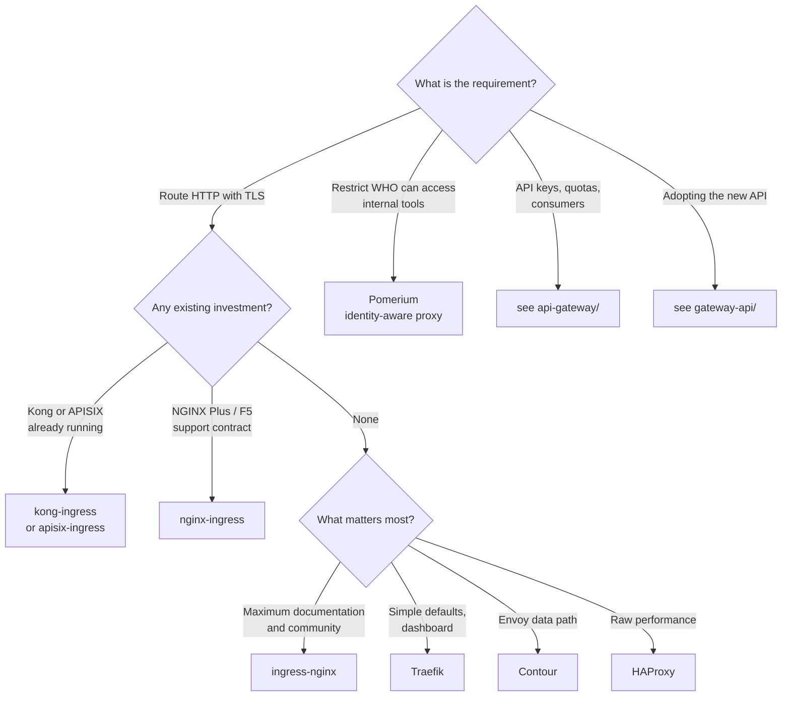

[← Network](../README.md)

# Ingress controller

Conceptual reference for the `ingress-controller/` folder: **getting external HTTP traffic
into the cluster and routing it to Services**.

Tools covered: [`ingress-nginx`](ingress-nginx/README.md) · [`nginx-ingress`](nginx-ingress/README.md) ·
[`traefik`](traefik/README.md) · [`contour`](contour/README.md) · [`haproxy`](haproxy/README.md) ·
[`kong-ingress`](kong-ingress/README.md) · [`apisix-ingress`](apisix-ingress/README.md) ·
[`ingate`](ingate/README.md) · [`pomerium`](pomerium/README.md)

## Contents

1. [Where this folder sits](#1-where-this-folder-sits)
2. [What an ingress controller actually does](#2-what-an-ingress-controller-actually-does)
3. [The tools in this folder](#3-the-tools-in-this-folder)
4. [Decision tree](#4-decision-tree)
5. [Anti-patterns](#5-anti-patterns)
6. [How this applies to pikakube](#6-how-this-applies-to-pikakube)

---

## 1. Where this folder sits

Three folders in this repository deal with traffic entering the cluster. They are separated
by **where each tool shines**, not by what it is technically capable of — most of these
tools can do more than one job.

| Folder | Shines at | Pick one because |
|---|---|---|
| **`ingress-controller/`** | HTTP entry and routing, configured through the `Ingress` API | you need traffic to reach your Services with TLS |
| [`gateway-api/`](../gateway-api/README.md) | the same job, configured through the **Gateway API** — the successor to Ingress | you are adopting the newer, role-oriented API |
| [`api-gateway/`](../api-gateway/README.md) | **API management** — keys, quotas, consumers, portal, transformation | your APIs are products with consumers, not just routes |

## 2. What an ingress controller actually does

`Ingress` is only an object. Something has to read it and act, and that is the controller:

- **terminates TLS**, usually from a Secret produced by [cert-manager](../../security/2-cluster/certificates/README.md)
- **routes by host and path** to the right Service
- runs a proxy — NGINX, Envoy, HAProxy or Traefik — as the actual data path

One `LoadBalancer` IP fronts the controller, and the controller fans out to every hostname
in the cluster. Giving each application its own `LoadBalancer` Service instead is the common
mistake — see [`load-balancer/`](../load-balancer/README.md).

### The annotation problem

`Ingress` expresses very little: host, path, backend, TLS. Everything real — rate limiting,
auth, timeouts, rewrites, CORS — lives in **vendor-specific annotations**.

That is why Ingress manifests do not port between controllers, and it is the reason the
Gateway API exists. `Ingress` is now feature-frozen upstream: it still works and is not
going away, but new capability lands in the Gateway API instead.

## 3. The tools in this folder

| Tool | Proxy | Shines when | Detail |
|---|---|---|---|
| **ingress-nginx** | NGINX | **the default** — Kubernetes community project, the most documented and most deployed | [→](ingress-nginx/README.md) |
| **nginx-ingress** | NGINX | you want F5/NGINX Inc's version, with commercial support and NGINX Plus features | [→](nginx-ingress/README.md) |
| **Traefik** | Traefik | automatic service discovery, a good dashboard, and simple defaults | [→](traefik/README.md) |
| **Contour** | Envoy | you want Envoy's data path with a cleaner CRD (`HTTPProxy`) than raw Envoy config | [→](contour/README.md) |
| **HAProxy** | HAProxy | raw L4/L7 performance, or existing HAProxy expertise | [→](haproxy/README.md) |
| **kong-ingress** | Kong | you already run [Kong](../api-gateway/kong/README.md) and want it to consume Ingress objects | [→](kong-ingress/README.md) |
| **apisix-ingress** | APISIX | same, for [APISIX](../api-gateway/apisix/README.md) | [→](apisix-ingress/README.md) |
| **ingate** | — | a Kubernetes SIG effort worth watching; still early | [→](ingate/README.md) |
| **Pomerium** | Envoy | **identity-aware proxy** — chosen for access control, not routing | [→](pomerium/README.md) |

> **`ingress-nginx` and `nginx-ingress` are different projects.** The first is the Kubernetes
> community controller (`kubernetes/ingress-nginx`), the second is F5/NGINX Inc's
> (`nginx/kubernetes-ingress`). Different codebases, different annotations, and manifests do
> not transfer between them. Confusing the two is a classic and expensive mistake.

## 4. Decision tree

## 5. Anti-patterns

| Anti-pattern | Why it is bad | What to do instead |
|---|---|---|
| A `LoadBalancer` Service per application | burns addresses and skips HTTP routing | one LoadBalancer IP for the controller |
| Assuming annotations port between controllers | they are vendor-specific; migration means rewriting every Ingress | plan for it, or adopt the Gateway API |
| Confusing `ingress-nginx` with `nginx-ingress` | different projects with different annotations | check which one is installed before writing manifests |
| Running two controllers without `IngressClass` | both claim the same Ingress and fight | set `ingressClassName` explicitly |
| Using an ingress controller for API management | rate limiting via annotations does not scale to consumers and quotas | [`api-gateway/`](../api-gateway/README.md) |

## 6. How this applies to pikakube

**ingress-nginx** is the one wired in: [`init.sh`](../../../init.sh) creates the namespace
and applies the mkcert TLS Secret before Flux reconciles it, and Kind publishes ports 80 and
443 straight to the host through `extraPortMappings`, so no load balancer is needed.

Hostnames come from [nip.io](../dns/nip.io/README.md), and the certificate is the mkcert wildcard —
see [certificates](../../security/2-cluster/certificates/README.md#11-how-this-applies-to-pikakube).

---

[← Network](../README.md)
