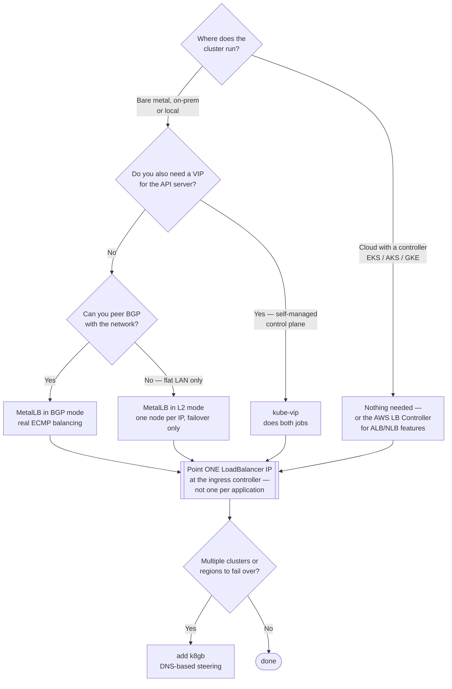

[← Network](../README.md)

# Load balancer

Conceptual reference for the `load-balancer/` folder. About one thing: **how a Service of
type `LoadBalancer` gets an actual IP address.**

Tools covered: [`metallb`](metallb/) · [`kube-vip`](kube-vip/) · [`openelb`](openelb/) ·
[`aws-load-balancer-controller`](aws-load-balancer-controller/) · [`k8gb`](k8gb/)

## Contents

1. [The problem: `<pending>` forever](#1-the-problem-pending-forever)
2. [How an IP actually gets assigned](#2-how-an-ip-actually-gets-assigned)
3. [Load balancer vs Ingress vs Gateway](#3-load-balancer-vs-ingress-vs-gateway)
4. [The tools in this folder](#4-the-tools-in-this-folder)
5. [Global load balancing is a different problem](#5-global-load-balancing-is-a-different-problem)
6. [Decision tree](#6-decision-tree)
7. [Anti-patterns](#7-anti-patterns)
8. [How this applies to pikakube](#8-how-this-applies-to-pikakube)
9. [References](#references)

---

## 1. The problem: `<pending>` forever

Create a `Service` of type `LoadBalancer` on a bare-metal or local cluster and the external
IP sits at `<pending>` indefinitely.

That is not a bug. **Kubernetes does not implement load balancers.** It defines the Service
type and expects a *cloud controller* to notice, provision something outside the cluster,
and write the address back. On EKS, AKS and GKE that controller exists. On bare metal,
on-prem or Kind, nothing is listening — so nothing happens, forever.

Everything in this folder exists to be that missing controller.

## 2. How an IP actually gets assigned

Two mechanisms, and the difference decides which tool fits:

| Mechanism | How it works | Requires |
|---|---|---|
| **L2 / ARP** | one node claims the IP and answers ARP for it; on failure another node takes over | nothing from the network — works on a flat LAN |
| **BGP** | nodes peer with the network's routers and advertise the IP | routers you can peer with, and a network team that agrees |

L2 is trivial to set up and has a real limitation: **all traffic for a given IP enters
through one node**. That node is the bandwidth ceiling and the failure point — failover
works, but it is failover, not balancing.

BGP spreads traffic across nodes properly via ECMP, and costs a conversation with whoever
runs the network.

## 3. Load balancer vs Ingress vs Gateway

These get confused constantly, and they stack rather than compete:

| Layer | What it does | Where it lives |
|---|---|---|
| **LoadBalancer Service** | gets an external **IP** to the cluster, L4 | this folder |
| **Ingress controller** | routes **HTTP** by host and path, terminates TLS | [`ingress-controller/`](../ingress-controller/) |
| **Gateway API** | the successor to Ingress, richer and role-oriented | [`gateway-api/`](../gateway-api/) |

The normal on-prem chain is: **MetalLB gives the ingress controller an IP → the ingress
controller routes HTTP to Services**. One LoadBalancer IP serves every hostname in the
cluster. Giving each application its own `LoadBalancer` Service is the common mistake — it
burns addresses and skips the layer that does routing.

## 4. The tools in this folder

| Tool | Mechanism | Shines when | Do not use when | Detail |
|---|---|---|---|---|
| **MetalLB** | L2 (ARP) or BGP | the default answer for bare metal and on-prem — mature, widely used, both modes | you are on a cloud that already has a controller | [→](metallb/) |
| **kube-vip** | L2 or BGP, plus **control-plane VIP** | you also need a virtual IP for the **API server** on a self-managed cluster — it does both jobs | you only need Service IPs; MetalLB is the more common choice | [→](kube-vip/) |
| **OpenELB** | L2, BGP or VIP | you want an alternative to MetalLB, particularly in the KubeSphere ecosystem | no specific reason to differ from MetalLB | [→](openelb/) |
| **AWS Load Balancer Controller** | provisions **real AWS** NLB/ALB | running on EKS — it turns Ingress into an ALB and LoadBalancer Services into NLBs | anywhere that is not AWS | [→](aws-load-balancer-controller/) |
| **k8gb** | **DNS-based**, across clusters | failover and traffic steering between clusters or regions | single cluster — see below | [→](k8gb/) |

## 5. Global load balancing is a different problem

**k8gb** sits in this folder but answers a different question. The others hand out an IP
*inside* one cluster. k8gb decides **which cluster a user reaches at all**, by manipulating
DNS answers based on health.

That makes it complementary rather than alternative: each cluster still needs MetalLB or a
cloud controller for its own ingress IP, and k8gb steers between those clusters.

It is also the DNS-based cousin of the tools in
[`cluster-interconnection/`](../cluster-interconnection/README.md) — but where those connect
clusters to each other, k8gb only routes *users* to the healthy one. No tunnels, no shared
pod network.

## 6. Decision tree

## 7. Anti-patterns

| Anti-pattern | Why it is bad | What to do instead |
|---|---|---|
| A `LoadBalancer` Service per application | burns IPs and skips HTTP routing entirely | one LoadBalancer IP for the ingress controller |
| MetalLB L2 with an address pool overlapping DHCP | address conflicts that appear intermittently and look like network faults | reserve the range outside the DHCP scope |
| Expecting L2 mode to balance traffic | all traffic for an IP enters through a single node — it is failover, not balancing | BGP mode if throughput matters |
| Using `externalIPs` instead of a controller | no failover, no IPAM, and nothing manages the address | a proper controller |
| Assuming `type: LoadBalancer` works everywhere | it stays `<pending>` with no controller present | install one, or use NodePort deliberately |

## 8. How this applies to pikakube

Kind has no cloud controller, so `type: LoadBalancer` would hang at `<pending>`. The repo
maps **MetalLB** and **kube-vip** for this, and both need the same input: the subnet Kind's
Docker network uses, so the address pool sits inside it. That command is recorded in
[`metallb/README.md`](metallb/README.md) and [`kube-vip/README.md`](kube-vip/README.md).

In practice the cluster reaches services through Kind's `extraPortMappings` (80 and 443
published straight to the host, see [`clusters/kind-configs/`](../../../clusters/kind-configs/)),
which is simpler than a load balancer for a laptop. MetalLB is the piece you would need on
real bare metal, and is mapped for that reason.

**k8gb** is not applicable — one cluster.

## References

- [MetalLB — concepts](https://metallb.io/concepts/)
- [kube-vip — architecture](https://kube-vip.io/docs/architecture/)
- [AWS Load Balancer Controller](https://kubernetes-sigs.github.io/aws-load-balancer-controller/)
- [k8gb](https://www.k8gb.io/)

---

[← Network](../README.md)
