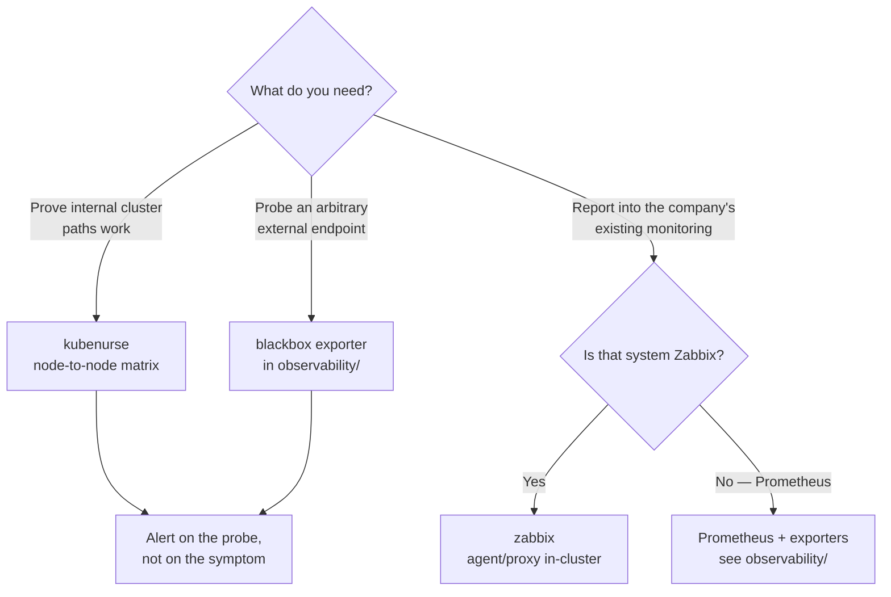

[← Network](../README.md)

# Network monitoring

Conceptual reference for the `monitoring/` folder. About one narrow question: **is the
network actually working?**

Tools covered: [`kubenurse`](kubenurse/README.md) · [`zabbix`](zabbix/README.md)

> **Not the same as observability.** Metrics, logs, traces and their pipelines live under
> [`observability/`](../../observability/README.md). This folder is specifically about **probing
> network reachability** — generating traffic to find out whether paths work.

## Contents

1. [Passive monitoring is not enough](#1-passive-monitoring-is-not-enough)
2. [What synthetic probing gives you](#2-what-synthetic-probing-gives-you)
3. [The tools in this folder](#3-the-tools-in-this-folder)
4. [Decision tree](#4-decision-tree)
5. [Anti-patterns](#5-anti-patterns)
6. [How this applies to pikakube](#6-how-this-applies-to-pikakube)
7. [References](#references)

---

## 1. Passive monitoring is not enough

Most monitoring is **passive**: scrape what already exists — CPU, memory, interface
counters, request rates. It describes the traffic that happened.

The gap is precise and it matters: **passive monitoring cannot see a path nobody used.**

A cluster can look perfectly healthy — every node Ready, every pod Running, no alerts — while
pod-to-pod traffic between two specific nodes is silently broken. A dropped VXLAN tunnel, an
MTU mismatch on one node, a security group edited last week. Nothing fires, because nothing
tried, and the workloads that would have tried were scheduled elsewhere.

You find out when a pod lands on the wrong node at 3am.

## 2. What synthetic probing gives you

**Active** or **synthetic** monitoring inverts it: generate traffic on purpose, on a
schedule, and measure whether it works. You stop waiting for a user to discover the broken
path.

For a cluster the paths worth probing continuously are:

| Path | What breaks it |
|---|---|
| node → node (every combination) | CNI tunnels, MTU, firewall or security group changes |
| pod → API server | control plane reachability, certificate expiry |
| pod → DNS | CoreDNS health, the conntrack race, `ndots` behaviour |
| pod → ingress → back into the cluster | the full external round trip, TLS included |

Probing every node **against every other node** is the part that matters, because it turns a
vague "the network is flaky" into a specific matrix: this node cannot reach that node, and
only that pair.

The same idea appears elsewhere in the repo at different granularity — the blackbox exporter
under [`observability/`](../../observability/README.md) probes arbitrary endpoints, and
[`kubenurse`](kubenurse/README.md) specialises it to the cluster's own internal paths.

## 3. The tools in this folder

| Tool | Model | Shines when | Do not use when | Detail |
|---|---|---|---|---|
| **kubenurse** | DaemonSet; every node probes every other node plus API server, DNS and ingress, exposing Prometheus metrics | you want continuous proof that the cluster network works, node by node | a single-node or throwaway cluster — there are no paths to compare | [→](kubenurse/README.md) |
| **Zabbix** | general infrastructure monitoring platform, not Kubernetes-native | the company already runs Zabbix for the network and hardware estate, and the cluster must report into it | Prometheus is already the standard — adding a second monitoring stack is the cost, not the benefit | [→](zabbix/README.md) |

The two are not really alternatives. kubenurse answers *"do the cluster's internal paths
work?"* and feeds Prometheus. Zabbix answers *"how does this cluster look to the
organisation's existing monitoring?"* and is chosen for organisational reasons more than
technical ones.

## 4. Decision tree

## 5. Anti-patterns

| Anti-pattern | Why it is bad | What to do instead |
|---|---|---|
| Relying only on passive metrics | a path nobody used looks identical to a path that works | probe the paths deliberately |
| Probing only from one node | you learn that *that* node is fine, nothing more | node-to-node, every combination |
| Alerting on every individual probe failure | one transient drop pages someone at 3am | alert on sustained failure of a *pair*, over a window |
| Running Zabbix alongside Prometheus without a reason | two monitoring stacks, two sets of alerts, two on-call surfaces | pick the one the organisation actually uses |
| Treating a probe failure as a network fault | probes also fail on DNS, policy and certificates | use it as a signal, then walk [`troubleshooting/`](../troubleshooting/README.md) |

## 6. How this applies to pikakube

A single-node-ish Kind cluster has almost no node-to-node matrix to measure, so kubenurse
here is **mapped for the pattern, not for the signal**. Its value appears at the scale where
you have enough nodes for one pair to break independently of the others.

The conceptual link worth keeping: this folder produces the *signal* that something is
wrong, and [`troubleshooting/`](../troubleshooting/README.md) is the method for finding out
*what*. One tells you to look; the other tells you where.

## References

- [kubenurse — what it probes](https://github.com/postfinance/kubenurse)
- [Prometheus blackbox exporter](https://github.com/prometheus/blackbox_exporter)
- [Zabbix Helm chart](https://github.com/zabbix-community/helm-zabbix)

---

[← Network](../README.md)
