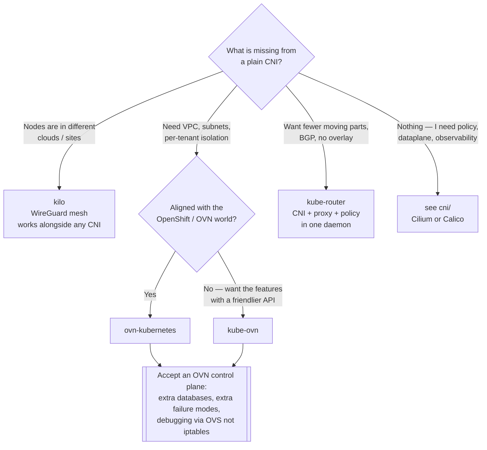

[← Network](../README.md)

# SDN — Software-Defined Networking

Conceptual reference for the `sdn/` folder: networking that goes **beyond what the CNI
specification requires**, with programmable L2/L3 constructs.

Tools covered: [`kube-ovn`](kube-ovn/) · [`ovn-kubernetes`](ovn-kubernetes/) ·
[`kube-router`](kube-router/) · [`kilo`](kilo/)

## Contents

1. [Where this folder ends and cni/ begins](#1-where-this-folder-ends-and-cni-begins)
2. [What SDN adds](#2-what-sdn-adds)
3. [The tools in this folder](#3-the-tools-in-this-folder)
4. [Decision tree](#4-decision-tree)
5. [Anti-patterns](#5-anti-patterns)
6. [How this applies to pikakube](#6-how-this-applies-to-pikakube)
7. [References](#references)

---

## 1. Where this folder ends and cni/ begins

The boundary needs stating, because it is genuinely blurry: **three of the four tools here
are themselves CNIs.**

The split used in this repository:

| Folder | Question it answers |
|---|---|
| [`cni/`](../cni/) | which plugin satisfies the Kubernetes network model — pod IPs, no NAT, policy? |
| **`sdn/`** | which plugin gives me a **programmable network** on top of that — VPCs, real subnets, ACLs, cross-site meshes? |

A cluster picks **one** primary CNI. If that choice is driven by needing cloud-style network
constructs or a cross-location overlay, the candidate is in this folder. If it is driven by
policy enforcement, dataplane and observability, it is in [`cni/`](../cni/).

Kilo is the exception: it is not a CNI at all, it is a WireGuard mesh that works *alongside*
one.

## 2. What SDN adds

The CNI spec demands very little — every pod gets an IP and can reach every other pod. A
flat network satisfies it completely.

SDN tooling adds the constructs that a flat network cannot express:

| Construct | Why it matters |
|---|---|
| **VPC and subnet** | real isolated address spaces, not one flat pod CIDR — the basis of hard multi-tenancy |
| **ACLs beyond NetworkPolicy** | stateful rules, ordering, explicit deny, rules that survive namespace deletion |
| **QoS and rate limiting** | per-pod or per-subnet bandwidth control |
| **Static and predictable IPs** | workloads that legacy systems or firewalls address by IP |
| **Underlay integration** | pods addressable directly on a physical VLAN, not behind an overlay |
| **Cross-site meshes** | one cluster spanning clouds, regions or edge sites |

The cost is uniform across all of them: **more moving parts**. OVN/OVS in particular brings
its own control plane, its own databases and its own failure modes, and debugging shifts
from `iptables`/`tcpdump` to OVS commands most teams have never used.

## 3. The tools in this folder

| Tool | What it is | Shines when | Do not use when | Detail |
|---|---|---|---|---|
| **kube-ovn** | CNI built on OVN/OVS, bringing VPC, subnet, QoS, ACL and static IPs | you need **cloud-VPC semantics inside Kubernetes** — hard multi-tenancy, real subnets, per-tenant address space | a general-purpose cluster; the operational surface is large and unjustified | [→](kube-ovn/) |
| **ovn-kubernetes** | the upstream OVN-based CNI, the one behind OpenShift | you want the OVN substrate with the opinions of a large distribution, or you are aligning with OpenShift | you are not committed to the OVN ecosystem | [→](ovn-kubernetes/) |
| **kube-router** | one daemon doing CNI + service proxy (IPVS, replacing kube-proxy) + NetworkPolicy, using **BGP** | you want a small, single-component stack with BGP and no overlay | you need the richer constructs above — it is deliberately lean | [→](kube-router/) |
| **kilo** | **WireGuard mesh** across locations — not a CNI | one cluster spanning clouds, regions or edge sites over untrusted networks | all nodes sit on one trusted network; the encryption and mesh buy nothing | [→](kilo/) |

### The three-way distinction worth remembering

- **kube-ovn / ovn-kubernetes** — richer network model, at the cost of an OVN control plane
- **kube-router** — leaner than a normal CNI, collapsing three components into one daemon
- **kilo** — orthogonal: it connects *nodes* across locations, whatever the CNI is

## 4. Decision tree

## 5. Anti-patterns

| Anti-pattern | Why it is bad | What to do instead |
|---|---|---|
| Adopting OVN for a general-purpose cluster | you inherit a control plane and a debugging skillset for constructs you never use | Cilium or Calico from [`cni/`](../cni/) |
| Running two primary CNIs | they fight over IPAM and the pod namespace | one primary; Multus for extra interfaces |
| Choosing kilo when all nodes share a trusted network | encryption and mesh overhead for nothing | plain CNI |
| Expecting kilo to provide pod networking | it meshes nodes; it is not a CNI | pair it with one |
| Treating "SDN" as automatically better | more constructs means more to operate and more to break | start from the constraint, not the category |

## 6. How this applies to pikakube

Nothing here is in use — the cluster is Kind with [kindnet](../cni/kindnet/), and none of
these constructs apply on a laptop.

They are mapped for the on-prem case, which is where they actually matter: **kube-ovn** when
a self-managed cluster needs tenant subnets that a flat pod CIDR cannot express, and
**kilo** when nodes are spread across sites and there is no private link between them.

Both belong to the on-premise concern rather than the managed-cloud one — the cloud already
supplies VPCs and private connectivity, which is precisely what these tools reimplement.

## References

- [kube-ovn documentation](https://kubeovn.github.io/docs/stable/en/)
- [ovn-kubernetes](https://github.com/ovn-kubernetes/ovn-kubernetes)
- [kube-router](https://www.kube-router.io/)
- [kilo — topology](https://kilo.squat.ai/docs/topology)

---

[← Network](../README.md)
