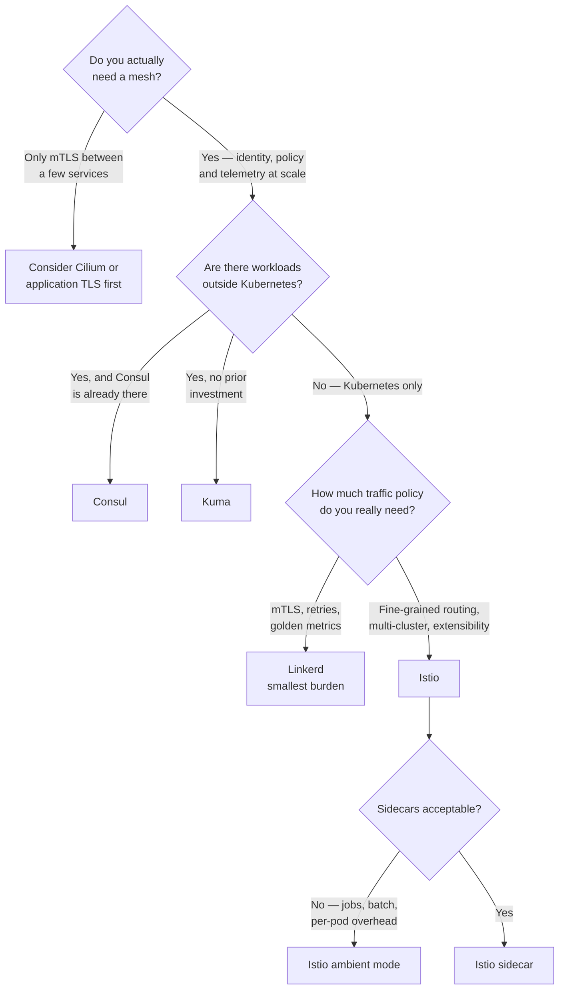

[← Network](../README.md)

# Service mesh

Conceptual reference for the `service-mesh/` folder: moving **identity, encryption,
retries and traffic policy out of application code** and into the platform.

Tools covered: [`istio`](istio/) · [`linkerd`](linkerd/) · [`kuma`](kuma/) ·
[`consul`](consul/) · [`traefik`](traefik/)

## Contents

1. [What a mesh actually does](#1-what-a-mesh-actually-does)
2. [Sidecar vs ambient — the change that matters](#2-sidecar-vs-ambient--the-change-that-matters)
3. [The overlap with CNI, ingress and gateway](#3-the-overlap-with-cni-ingress-and-gateway)
4. [The tools in this folder](#4-the-tools-in-this-folder)
5. [Decision tree](#5-decision-tree)
6. [The cost, stated honestly](#6-the-cost-stated-honestly)
7. [Anti-patterns](#7-anti-patterns)
8. [How this applies to pikakube](#8-how-this-applies-to-pikakube)
9. [References](#references)

---

## 1. What a mesh actually does

Every service eventually needs the same handful of things: retries, timeouts, TLS between
services, knowing *who* is calling, and being able to shift traffic gradually during a
release.

Without a mesh each of those is implemented in application code, differently in every
language, and updated by asking every team to ship a new library version.

A mesh moves them into a proxy next to the workload:

| Capability | What it gives you |
|---|---|
| **mTLS everywhere** | encrypted service-to-service traffic, with certificates issued and rotated automatically |
| **Workload identity** | policy expressed as "service A may call service B", not "this IP may reach that IP" |
| **Traffic management** | retries, timeouts, circuit breaking, and canary or weighted routing |
| **L7 telemetry** | request rate, latency and error rate between every pair of services, with no instrumentation |

The identity point is the one that matters most and gets underrated. `NetworkPolicy` works
on IPs and labels; a mesh works on cryptographic workload identity, which is the only thing
that survives a shared network — including [across clusters](../cluster-interconnection/README.md#6-security-what-interconnection-actually-opens).

## 2. Sidecar vs ambient — the change that matters

Historically a mesh meant a **sidecar**: a proxy container injected into every pod. It
works, and it costs — memory and CPU per pod, startup ordering problems, and an upgrade that
touches every workload.

**Ambient mode** (Istio) and similar designs split this: a per-node component handles L4 and
mTLS, and an L7 proxy is added only where L7 features are actually needed.

| | Sidecar | Ambient |
|---|---|---|
| Overhead | per pod | per node, plus per-namespace L7 where needed |
| Upgrades | restart every pod | restart infrastructure components |
| Workload awareness | injection changes the pod spec | no change to the pod |
| Maturity | very well understood | newer |

This matters for a specific, painful class of workload — **jobs and short-lived pods**. A
sidecar that keeps running after the main container exits leaves a Job that never completes,
which is why sidecar meshes need explicit exclusions for batch workloads. See
[linkerd](linkerd/) for a concrete instance of this with Airflow.

## 3. The overlap with CNI, ingress and gateway

Four folders can all claim to do "traffic", so the boundaries:

| Layer | Concern | Folder |
|---|---|---|
| Pod networking and L3/L4 policy | can these pods reach each other? | [`cni/`](../cni/README.md) |
| North-south HTTP into the cluster | how do external clients reach a service? | [`ingress-controller/`](../ingress-controller/) · [`gateway-api/`](../gateway-api/) |
| **East-west between services** | identity, mTLS, retries, canaries | **this folder** |
| API management, rate limiting, keys | who is allowed to call this API, and how often? | [`api-gateway/`](../api-gateway/) |

Two genuine overlaps worth knowing:

- **Cilium** does L7 policy and mTLS-adjacent features at the CNI layer. If it is already the CNI, part of what a mesh sells is already present — decide deliberately which layer owns mTLS rather than running both
- **Gateway API** is becoming the configuration surface for meshes too (GAMMA), so the line between "ingress" and "mesh" is blurring by design

## 4. The tools in this folder

| Tool | Model | Shines when | Do not use when | Detail |
|---|---|---|---|---|
| **Istio** | Envoy sidecars, or **ambient** | you need the full feature set — fine-grained traffic policy, multi-cluster, extensibility — and can absorb the complexity | a small cluster where the feature list exceeds the requirement | [→](istio/) |
| **Linkerd** | purpose-built lightweight Rust proxy | you want mTLS, retries and golden metrics with the **smallest possible operational burden** | you need Istio-level traffic manipulation or its extension ecosystem | [→](linkerd/) |
| **Kuma** | Envoy-based, control plane built for **VMs and Kubernetes together** | the estate is not entirely Kubernetes | everything already runs in the cluster | [→](kuma/) |
| **Consul** | HashiCorp service mesh plus service discovery and KV | already invested in Consul or the HashiCorp stack, especially with mixed VM and Kubernetes workloads | starting fresh with only Kubernetes | [→](consul/) |
| **Traefik Mesh** | lightweight, non-invasive | historical reference — see the note in its README | new deployments | [→](traefik/) |

Companion tooling: **Kiali** provides the service graph and configuration validation for
Istio — see [`istio/kiali/`](istio/kiali/).

## 5. Decision tree

## 6. The cost, stated honestly

A mesh is one of the largest additions you can make to a platform. Before adopting one:

- **every request now traverses extra proxies** — latency, and a new failure mode between two services that used to talk directly
- **debugging changes shape.** A 503 may come from the application, the sidecar, the control plane or a misapplied policy, and telling them apart is a skill the team has to build
- **upgrades are cluster-wide events**, especially with sidecars
- **it will not fix an architecture problem.** Retries and circuit breakers make a fragile system fail more politely, not less often

The honest test: if the answer to *"why a mesh?"* is *"mTLS between three services"*,
application TLS or the CNI is cheaper. A mesh earns its place at the scale where writing
policy per service pair, by hand, has stopped being possible.

## 7. Anti-patterns

| Anti-pattern | Why it is bad | What to do instead |
|---|---|---|
| Adopting a mesh for two or three services | enormous operational surface for a problem TLS solves | application TLS, or CNI-level features |
| Injecting sidecars into Jobs and CronJobs | the pod never completes, because the proxy keeps running | exclude batch workloads explicitly — see [linkerd](linkerd/) |
| Running a mesh and CNI L7 policy without deciding ownership | two systems enforcing overlapping rules, and neither is authoritative | pick which layer owns mTLS and policy |
| Expecting a mesh to fix cascading failures | retries can amplify an overload rather than absorb it | fix capacity and timeouts; use the mesh to observe |
| Mesh-wide `PERMISSIVE` mTLS left on permanently | it accepts plaintext, so you get the complexity without the guarantee | migrate to strict, and verify |

## 8. How this applies to pikakube

Not in use. The repo maps the field and documents one concrete integration:
[Linkerd with cert-manager](../../security/2-cluster/certificates/cert-manager/README.md),
using a `selfSigned` ClusterIssuer to bootstrap the mesh CA — a good illustration of the
mesh depending on the certificate capability rather than replacing it.

Also worth recording: **Cilium is the CNI documented in depth here**, and it overlaps with
what a mesh provides. On a real cluster that decision — mesh, CNI, or both — should be made
explicitly rather than by installing whichever came first.

## References

- [Istio — architecture](https://istio.io/latest/docs/ops/deployment/architecture/)
- [Istio — ambient mode](https://istio.io/latest/docs/ambient/overview/)
- [Linkerd — architecture](https://linkerd.io/2-edge/reference/architecture/)
- [Kuma](https://kuma.io/docs/)
- [Gateway API GAMMA — mesh configuration](https://gateway-api.sigs.k8s.io/mesh/)

---

[← Network](../README.md)
