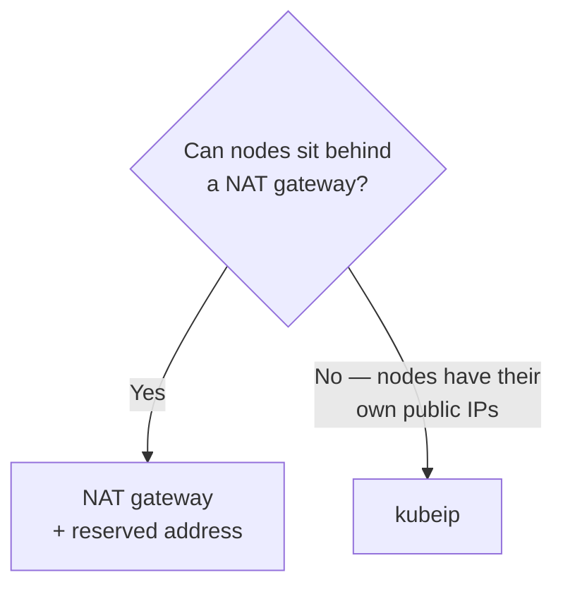

[← Network](../README.md)

# Static IP

Conceptual reference for the `static-ip/` folder: making the address a cluster uses to reach
the outside world **predictable**.

Tools covered: [`kube-ip`](kube-ip/)

## Contents

1. [The problem: the other side needs an allow-list](#1-the-problem-the-other-side-needs-an-allow-list)
2. [Ingress IP vs egress IP](#2-ingress-ip-vs-egress-ip)
3. [The tools in this folder](#3-the-tools-in-this-folder)
4. [Decision tree](#4-decision-tree)
5. [Anti-patterns](#5-anti-patterns)
6. [How this applies to pikakube](#6-how-this-applies-to-pikakube)

---

## 1. The problem: the other side needs an allow-list

Kubernetes treats addresses as disposable. Nodes are replaced, scaled and reprovisioned, and
each new one gets whatever IP the cloud hands out.

That collides with a very common requirement: **a partner, a bank, a legacy system or a
managed database asks for the list of IPs your traffic will come from**, and then blocks
everything else. If the egress address changes every time a node is recycled, the
integration breaks and nobody notices until a payment fails.

The requirement is external and non-negotiable. The cluster has to produce a stable address.

## 2. Ingress IP vs egress IP

Two different directions, frequently confused:

| Direction | Question | Where it is solved |
|---|---|---|
| **Ingress** — traffic coming in | what address do clients connect to? | [`load-balancer/`](../load-balancer/README.md), plus [`dns/`](../dns/README.md) for the name |
| **Egress** — traffic going out | what address do we appear to come from? | **this folder** |

This folder is about the second. It is the one that shows up as a firewall allow-list
request, and the one people discover late.

```bash
# what address does the cluster currently egress from?
curl ifconfig.me
```

The cloud-native answer is usually a **NAT gateway with a reserved address**, so all egress
leaves through one stable IP. The tools here are for the cases where that is not available
or not granular enough.

## 3. The tools in this folder

| Tool | What it does | Detail |
|---|---|---|
| **kubeip** | assigns reserved static IPs to nodes as they join, so the set of addresses the cluster uses stays within a known, allow-listable pool | [→](kube-ip/) |

## 4. Decision tree



NAT gateway is the default: managed, covers all egress at once, nothing to run. kubeip is
for the case where the nodes themselves are the addresses being allow-listed.

## 5. Anti-patterns

| Anti-pattern | Why it is bad | What to do instead |
|---|---|---|
| Sending a partner the current node IPs | they change on the next scale-up or node replacement | a reserved pool, or a NAT gateway with a fixed address |
| Discovering the requirement at go-live | reserved addresses and firewall changes take time on both sides | ask about IP allow-listing during design |
| Assuming the ingress IP is also the egress IP | they are usually different addresses entirely | check with `curl ifconfig.me` from inside a pod |
| Pinning IPs when a NAT gateway would do | more moving parts for a problem the cloud already solves | use the managed option unless it genuinely does not fit |

## 6. How this applies to pikakube

Not applicable — a Kind cluster egresses through the laptop's own connection, and there is
no partner allow-listing anything.

It is mapped because it is a **real-world constraint that arrives from outside engineering**,
usually as a compliance or partner requirement, and it is easier to design for than to
retrofit.

---

[← Network](../README.md)
