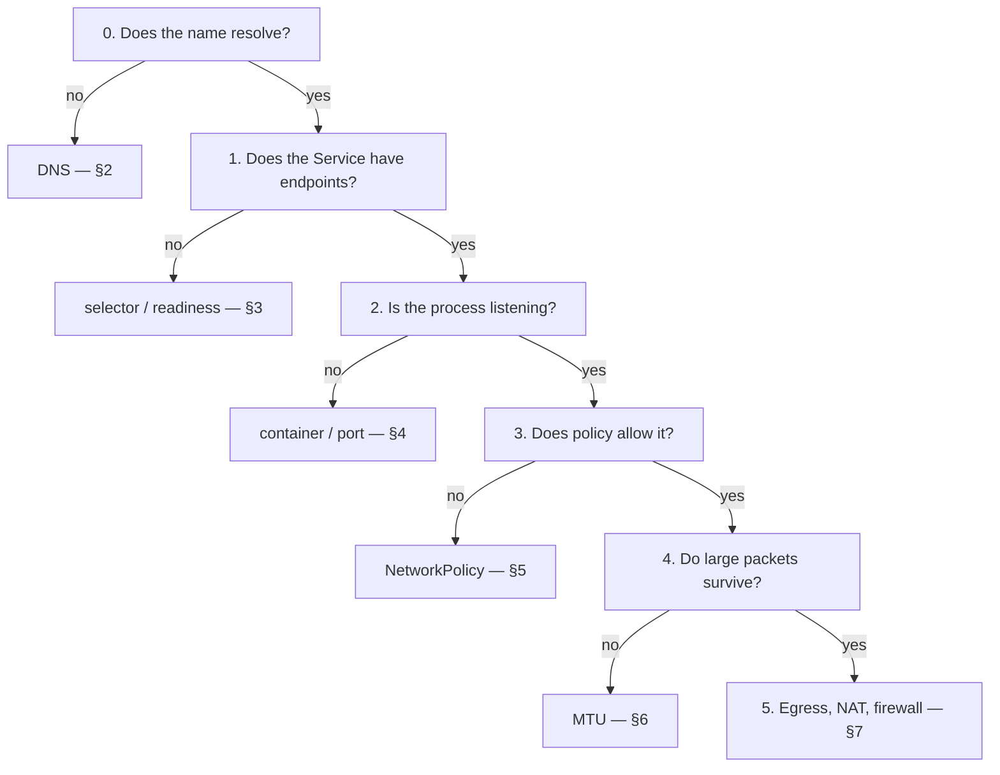

[← Network](../README.md)

# Network troubleshooting

Conceptual reference for the `troubleshooting/` folder. Less a tool catalogue than a
**method**: how to narrow down a Kubernetes network problem without guessing.

Tools covered: [`netshoot`](netshoot/README.md)

## Contents

1. [The method](#1-the-method)
2. [Layer 0 — is it DNS?](#2-layer-0--is-it-dns)
3. [Layer 1 — does the Service have endpoints?](#3-layer-1--does-the-service-have-endpoints)
4. [Layer 2 — is anything listening?](#4-layer-2--is-anything-listening)
5. [Layer 3 — is policy blocking it?](#5-layer-3--is-policy-blocking-it)
6. [Layer 4 — path and MTU](#6-layer-4--path-and-mtu)
7. [Layer 5 — leaving the cluster](#7-layer-5--leaving-the-cluster)
8. [How to get a shell in the right place](#8-how-to-get-a-shell-in-the-right-place)
9. [Symptom index](#9-symptom-index)
10. [Anti-patterns](#10-anti-patterns)
11. [References](#references)

---

## 1. The method

Network debugging goes wrong when it starts in the middle. The reliable order is to walk
**up** from name resolution, confirming each layer before moving on:



Each layer has one cheap test. Run them in order and the problem is usually found in under
five minutes — the time is lost by skipping straight to `tcpdump`.

---

## 2. Layer 0 — is it DNS?

It is usually DNS.

```bash
nslookup my-service
nslookup my-service.my-namespace.svc.cluster.local
dig +search my-service          # shows which search-list entry actually answered
```

What the results mean:

| Result | Likely cause |
|---|---|
| NXDOMAIN for the short name, works for the FQDN | wrong namespace, or relying on a search suffix that does not apply |
| Resolves but slowly | the `ndots:5` search-list expansion — see [`../dns/`](../dns/README.md#the-ndots5-trap) |
| Intermittent ~5s timeouts | the classic conntrack race on UDP — a per-node cache fixes it, see [`../dns/node-local-dns/`](../dns/node-local-dns/README.md) |
| Nothing resolves at all, from any pod | CoreDNS itself — check pods in `kube-system` |

```bash
kubectl -n kube-system get pods -l k8s-app=kube-dns
kubectl -n kube-system logs -l k8s-app=kube-dns --tail=50
```

---

## 3. Layer 1 — does the Service have endpoints?

A Service with no endpoints resolves perfectly and connects to nothing. This is the second
most common cause and the fastest to check:

```bash
kubectl get endpointslices -l kubernetes.io/service-name=<service>
kubectl describe svc <service>
```

Empty means one of:

- the **selector does not match** any pod labels — compare them literally, character by character
- pods exist but are **not Ready**, so they are excluded from endpoints
- the pods are in a different namespace than the Service

```bash
# what the Service is looking for, versus what actually exists
kubectl get svc <service> -o jsonpath='{.spec.selector}{"\n"}'
kubectl get pods --show-labels
```

---

## 4. Layer 2 — is anything listening?

Endpoints exist, so the pod is Ready — but readiness only proves the probe passed, which is
not always the same as the port being served.

```bash
# from inside the target pod's network namespace
ss -lntp
netstat -lntp
```

The frequent mismatch: the application binds to `127.0.0.1` instead of `0.0.0.0`, so it
answers locally and refuses everything from outside the pod. Also check that
`containerPort` and the Service `targetPort` agree.

---

## 5. Layer 3 — is policy blocking it?

```bash
kubectl get networkpolicy -A
```

Two things to know before spending time here:

- **A namespace with any NetworkPolicy selecting a pod becomes default-deny for that direction.** Adding one ingress policy silently blocks everything else that was previously allowed.
- **If the CNI does not enforce NetworkPolicy, none of this matters** — the objects exist and do nothing. Flannel is the common case; see [`../cni/`](../cni/README.md#networkpolicy-support-is-not-universal).

Egress rules are the usual surprise: a default-deny egress policy also blocks DNS, because
DNS is egress to `kube-system`. Every deny-all-egress policy needs an explicit allow for
UDP/TCP 53.

---

## 6. Layer 4 — path and MTU

The signature is distinctive: **small requests succeed, large ones hang.** TLS handshakes
complete and then the first large response stalls forever.

```bash
# largest payload that crosses the path without fragmenting
ping -M do -s 1472 <destination>     # 1472 + 28 = 1500

# does a large transfer complete, or stall midway?
curl -o /dev/null -w '%{size_download}\n' http://<service>/large-endpoint
```

Cause and fix live with the CNI — see [`../cni/`](../cni/README.md#mtu-the-silent-killer).

---

## 7. Layer 5 — leaving the cluster

```bash
# basic reachability and port checks
nc -vz <host> <port>
telnet <host> <port>

# which public IP does the cluster egress from?
# (this is the address a partner firewall must allow-list)
curl ifconfig.me

# is it TLS, or the connection itself?
curl -vI https://<host>
openssl s_client -connect <host>:443 -servername <host> </dev/null
```

If `nc -vz` succeeds but the application fails, the problem is above the network — TLS
trust, authentication, or the application itself. See
[`certificates/`](../../security/2-cluster/certificates/README.md) for the trust side,
which produces the classic "works in the browser, fails in the app".

---

## 8. How to get a shell in the right place

[**netshoot**](netshoot/README.md) is a container image with the tools already installed — `dig`,
`nslookup`, `tcpdump`, `ss`, `netstat`, `curl`, `nc`, `iperf`, `traceroute`. It exists so
you never install diagnostics inside a running application container.

There are three ways to use it, and picking the right one matters more than the commands:

```bash
# 1. Inside an EXISTING pod's network namespace — the one you usually want.
#    Ephemeral container: same netns, same policies, same resolv.conf as the real workload.
kubectl debug -it <pod> --image=nicolaka/netshoot --target=<container>

# 2. A standalone throwaway pod — for testing from a namespace generally.
kubectl run tmp-shell --rm -it --image=nicolaka/netshoot -- /bin/bash

# 3. On a NODE — for host networking, routes and the CNI dataplane.
kubectl debug node/<node> -it --image=nicolaka/netshoot
```

Option 1 is the important one. Debugging from a *different* pod answers a different
question: it shares neither the target's DNS configuration nor the NetworkPolicies that
select it. "It works from my debug pod" therefore proves very little.

---

## 9. Symptom index

| Symptom | Start at | Most likely cause |
|---|---|---|
| `no such host` / NXDOMAIN | [§2](#2-layer-0--is-it-dns) | wrong FQDN or namespace |
| Connection refused | [§4](#4-layer-2--is-anything-listening) | bound to `127.0.0.1`, or wrong `targetPort` |
| Connection times out | [§5](#5-layer-3--is-policy-blocking-it) | NetworkPolicy, or no endpoints |
| Resolves, but connects to nothing | [§3](#3-layer-1--does-the-service-have-endpoints) | selector mismatch or pods not Ready |
| Small requests fine, large ones hang | [§6](#6-layer-4--path-and-mtu) | MTU over a tunnel |
| Intermittent 5s latency | [§2](#2-layer-0--is-it-dns) | DNS conntrack race |
| Slow external calls from every pod | [§2](#2-layer-0--is-it-dns) | `ndots:5` search expansion |
| Works on VPN, fails off VPN | [§2](#2-layer-0--is-it-dns) | conditional forwarding, see [`../dns/`](../dns/README.md#conditional-forwarding-and-the-vpn-problem) |
| Works in the browser, fails in the app | [§7](#7-layer-5--leaving-the-cluster) | incomplete certificate chain |
| hostNetwork pod resolves nothing internal | [§2](#2-layer-0--is-it-dns) | missing `dnsPolicy: ClusterFirstWithHostNet` |

---

## 10. Anti-patterns

| Anti-pattern | Why it is bad | What to do instead |
|---|---|---|
| Installing `curl` and `dig` inside the application container | mutates a running workload and pollutes the image | `kubectl debug` with netshoot |
| Debugging from a different pod than the affected one | different DNS config and different policies apply | ephemeral container targeting the real pod |
| Starting with `tcpdump` | expensive and usually unnecessary — the answer is almost always in layers 0–2 | walk the layers in order |
| Concluding "the network is broken" from one failed `curl` | it also fails on DNS, policy, readiness and TLS | isolate the layer before naming a cause |
| Hardcoding a pod IP to work around DNS | it changes on every reschedule | fix the resolution problem |
| Leaving debug pods running | they accumulate and hold resources | `--rm`, or ephemeral containers, which vanish with the pod |

---

## References

- [Kubernetes — debug services](https://kubernetes.io/docs/tasks/debug/debug-application/debug-service/)
- [Kubernetes — ephemeral containers](https://kubernetes.io/docs/concepts/workloads/pods/ephemeral-containers/)
- [netshoot — included tools](https://github.com/nicolaka/netshoot)
- [DNS in this repo](../dns/README.md) · [CNI in this repo](../cni/README.md) · [Certificates](../../security/2-cluster/certificates/README.md)

---

[← Network](../README.md)
