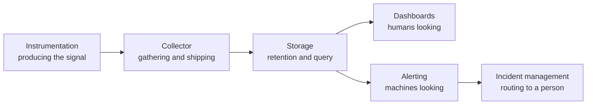

# Observability

Knowing what the platform is doing, and why — from raw signals through to someone being
woken up.

## How this folder is organised

One axis: **capability**. Each subfolder answers a distinct question, and a tool is filed by
**where it shines**, not by everything it can do.

That rule matters more here than almost anywhere else, because this ecosystem is full of
tools that claim the whole stack. Grafana renders dashboards, but also stores logs, traces
and profiles. SigNoz replaces the entire signal pipeline. Coroot generates metrics, traces
and a service map from eBPF alone.

Filing by full capability would put a dozen tools in six folders each. Filing by where they
shine puts each one where you would go looking for it — and where a tool has a second life
worth knowing about, its README says so.

## The map

| Folder | The question it answers |
|---|---|
| [`metrics/`](metrics/README.md) | what are the numbers, and where are they stored? |
| [`logs/`](logs/README.md) | what did the system write down? |
| [`tracing/`](tracing/README.md) | where did this request go, and what took so long? |
| [`profiling/`](profiling/README.md) | which code is burning the CPU and memory? |
| [`events/`](events/README.md) | what did Kubernetes itself say happened? |
| [`dashboards/`](dashboards/README.md) | how do people look at any of this? |
| [`alerting/`](alerting/README.md) | what wakes someone up, and how is the noise controlled? |
| [`incident-management/`](incident-management/README.md) | who gets woken up, and how is the incident run? |
| [`troubleshooting/`](troubleshooting/README.md) | what is wrong, and can a machine narrow it down first? |
| [`network/`](network/README.md) | what is happening at the network layer specifically? |
| [`frontend/`](frontend/README.md) | what is the experience in the user's browser? |
| [`platforms/`](platforms/README.md) | tools that cover the whole stack in one product |

## The three signals, and the two that get forgotten

The classic model is **metrics, logs and traces**. Each answers a different question and
none substitutes for another:

| Signal | Good at | Bad at |
|---|---|---|
| **Metrics** | cheap, aggregated, long retention — "how many, how fast, how often" | explaining any individual case |
| **Logs** | detail about one specific occurrence | cost and volume at scale |
| **Traces** | causality across services — where the latency actually went | anything not instrumented |

Two more matter in practice and are routinely left out:

- **[Profiling](profiling/README.md)** — the fourth signal. Traces show *which service* is slow; profiles show *which function*. Without it, a trace ends at "the service is slow" and the next step is guesswork.
- **[Events](events/README.md)** — Kubernetes' own account of what it did. `OOMKilled`, `FailedScheduling`, `BackOff`. They expire in an hour by default, which means the explanation for last night's incident is usually already gone.

## The pipeline

Every signal follows the same shape, which is why the subfolders repeat it:

`metrics/`, `logs/` and `tracing/` each contain `collector/` and `storage/` for exactly this
reason. Confusing the two layers is the most common structural mistake — Prometheus is
storage, the OpenTelemetry Collector is a collector, and Grafana is neither.

## Signals versus platforms

Two ways to build this:

| Approach | What it means | Trade |
|---|---|---|
| **Best of breed** | Prometheus, Loki, Tempo, Pyroscope, Grafana — each layer chosen separately | control, portability, and more to operate |
| **[Platform](platforms/README.md)** | SigNoz, Coroot, Datadog and similar — one product covering the whole stack | far less to run, at the cost of lock-in and less control |

Neither is wrong. What is wrong is drifting into both without deciding, which is how
organisations end up paying for a platform *and* operating the components it replaced.

## Related capabilities, filed elsewhere

| Concern | Where |
|---|---|
| Cost visibility and FinOps | [`finops/`](../finops/README.md) |
| Security posture, runtime security, SIEM | [`security/`](../security/README.md) |
| Cluster audit logs | [`security/2-cluster/audit/`](../security/2-cluster/audit/README.md) |
| Network reachability probing | [`network/monitoring/`](../network/monitoring/README.md) |
| Diagnosing a specific broken connection | [`network/troubleshooting/`](../network/troubleshooting/README.md) |
| SLOs and error budgets | [`site-reliability-engineering/`](../site-reliability-engineering/README.md) |

## The stack in pikakube

| Layer | What is used |
|---|---|
| Metrics | [Prometheus](metrics/storage/prometheus/README.md) via kube-prometheus-stack |
| Dashboards | [Grafana](dashboards/grafana/README.md) via the operator |
| Alerting | [Alertmanager](alerting/alertmanager/README.md) |
| Everything else | mapped for comparison, not deployed |

The rest of this folder is a catalogue of the alternatives, with the reasoning for each
recorded next to it.
