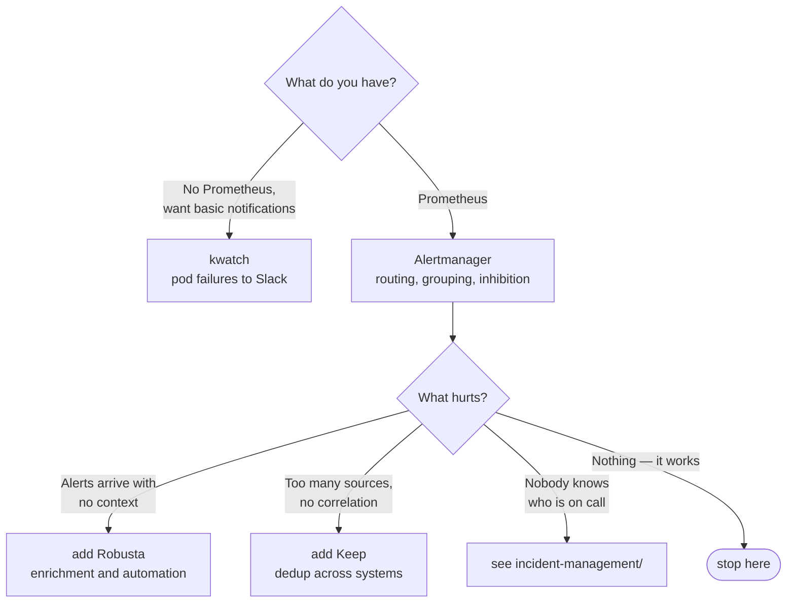

[← Observability](../README.md)

# Alerting

Where observability turns into action — and where most platforms accumulate their worst
technical debt.

Tools covered: [`alertmanager`](alertmanager/) · [`robusta`](robusta/) ·
[`keep`](keep/) · [`kwatch`](kwatch/)

## Contents

1. [The real problem is noise](#1-the-real-problem-is-noise)
2. [Four separate jobs](#2-four-separate-jobs)
3. [Alertmanager's model](#3-alertmanagers-model)
4. [The tools in this folder](#4-the-tools-in-this-folder)
5. [Decision tree](#5-decision-tree)
6. [Anti-patterns](#6-anti-patterns)
7. [How this applies to pikakube](#7-how-this-applies-to-pikakube)

---

## 1. The real problem is noise

Getting an alert to fire is easy. The hard part is that **an alert nobody acts on is worse
than no alert at all** — it trains people to ignore the channel, and the one that mattered
arrives in the same stream as the eighty that did not.

Two rules do most of the work:

**Alert on symptoms, not causes.** "Checkout error rate above 2%" is actionable. "CPU above
80%" is not — it may be perfectly healthy, and if it is causing a problem, the symptom alert
already fired.

**Every alert must have an action.** If the answer to "what do I do about this?" is "look at
it and probably nothing", it is a dashboard, not an alert.

The consequence for a data platform: alert on **freshness, completeness and pipeline
failure** — the things a consumer notices — rather than on pod restarts, which are usually
Kubernetes doing its job.

## 2. Four separate jobs

These get merged and should not be:

| Job | What it means | Where it lives |
|---|---|---|
| **Generation** | evaluating a rule and deciding an alert is firing | Prometheus rules, not this folder |
| **Routing** | grouping, deduplicating, silencing, and deciding where it goes | [Alertmanager](alertmanager/) |
| **Enrichment** | attaching the logs, graphs and recent changes that explain it | [Robusta](robusta/) |
| **Correlation** | collapsing many alerts from many sources into one incident | [Keep](keep/) |

Alertmanager does **not** generate alerts. Prometheus evaluates the rules and pushes firing
alerts to it. This trips people up constantly when an alert never arrives — the rule may not
be loaded at all.

Routing to a **person** — schedules, escalation, acknowledgement — is a further step, in
[`incident-management/`](../incident-management/README.md).

## 3. Alertmanager's model

Three mechanisms, and the difference between them is worth knowing precisely:

| Mechanism | What it does |
|---|---|
| **Grouping** | many alerts of the same kind arrive as one notification — 40 pods down in one namespace is one message, not 40 |
| **Inhibition** | a firing alert suppresses others — if the whole cluster is unreachable, do not also page about every service in it |
| **Silencing** | a human mutes matching alerts for a window — planned maintenance |

Inhibition is the most underused and the most valuable: it is what stops one root cause from
producing a wall of notifications.

## 4. The tools in this folder

| Tool | Role | Shines when | Do not use when | Detail |
|---|---|---|---|---|
| **Alertmanager** | routing | you already run Prometheus — it is the standard and integrates with everything | there is no Prometheus and you only want pod-crash notifications | [→](alertmanager/) |
| **Robusta** | enrichment and automation | alerts arrive without context and every page starts with ten minutes of digging | alert volume is low enough that context is easy to gather manually | [→](robusta/) |
| **Keep** | correlation across sources | alerts come from many systems and nobody can tell which are the same incident | Prometheus is the only source — Alertmanager's grouping already covers it | [→](keep/) |
| **kwatch** | simple event notifications | you want "tell me in Slack when a pod crash-loops" with no Prometheus at all | you already have Prometheus and Alertmanager | [→](kwatch/) |

## 5. Decision tree

## 6. Anti-patterns

| Anti-pattern | Why it is bad | What to do instead |
|---|---|---|
| Alerting on causes rather than symptoms | high CPU is often healthy; the page teaches people to ignore alerts | alert on what a user would notice |
| An alert with no runbook | the person woken up has to rediscover the response every time | link a runbook, or delete the alert |
| No inhibition rules | one root cause produces fifty notifications and the real signal is buried | inhibit dependents when the parent fires |
| Routing everything to one channel | severity stops meaning anything | route by severity and owner |
| Alerting on every pod restart | Kubernetes restarting a pod is normal operation | alert on crash-loops and on symptoms |
| Silences that never expire | the alert is effectively deleted, but nobody knows | always set an expiry |

## 7. How this applies to pikakube

**Alertmanager** ships with kube-prometheus-stack and is the one deployed. The rest are
mapped.

Worth recording for a real platform: the piece most often missing is not another tool, it is
**inhibition rules and runbook links** on the alerts that already exist.

---

[← Observability](../README.md)
