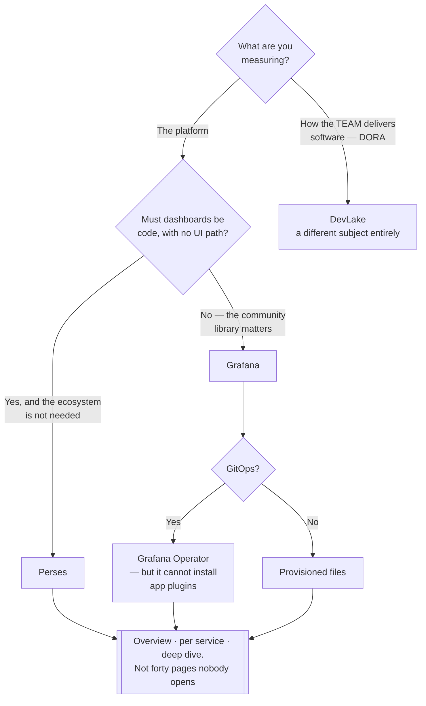

[← Observability](../README.md)

# Dashboards

How people actually look at stored signals.

Tools covered: [`grafana`](grafana/) · [`perses`](perses/) · [`devlake`](devlake/)

## Contents

1. [What a dashboard is for — and is not](#1-what-a-dashboard-is-for--and-is-not)
2. [Dashboards as code](#2-dashboards-as-code)
3. [The tools in this folder](#3-the-tools-in-this-folder)
4. [Decision tree](#4-decision-tree)
5. [Anti-patterns](#5-anti-patterns)
6. [How this applies to pikakube](#6-how-this-applies-to-pikakube)

---

## 1. What a dashboard is for — and is not

A dashboard is for **exploration and situational awareness**: understanding a system during
an incident, or noticing a trend nobody had a rule for.

It is **not** a detection mechanism. Nobody is watching at three in the morning. Anything
that must be noticed reliably has to be an [alert](../alerting/README.md).

That distinction decides how many you should have. A dashboard exists to answer a question
someone actually asks. Three good ones beat forty that nobody opens — and forty is what
accumulates by default, because building one is easier than deleting one.

The shape that works in practice:

| Level | Audience | Content |
|---|---|---|
| **Overview** | anyone on call | is the platform healthy? A handful of signals, no detail |
| **Per service** | the owning team | golden signals for that service — rate, errors, duration, saturation |
| **Deep dive** | whoever is debugging | everything, and expected to be messy |

## 2. Dashboards as code

A dashboard clicked together in a UI exists in one place, has no history, no review, and
disappears when the pod is recreated without persistence.

Two ways out:

- **provisioning** — dashboards defined as files or ConfigMaps and loaded at startup
- **CRDs** — a `GrafanaDashboard` object reconciled by an operator, which is GitOps for dashboards

The second is what makes dashboards reviewable and reproducible, and it is the reason the
[Grafana Operator](grafana/grafana-operator/) exists rather than plain Grafana.

## 3. The tools in this folder

| Tool | Role | Shines when | Do not use when | Detail |
|---|---|---|---|---|
| **Grafana** | the default visualisation layer | always, effectively — datasource-agnostic, with an enormous library of community dashboards | you want a lighter, Kubernetes-native, code-first tool | [→](grafana/) |
| **Perses** | CNCF dashboards-as-code | dashboards should be **entirely** declarative, versioned and lightweight from the start | you depend on Grafana's ecosystem and plugin library | [→](perses/) |
| **DevLake** | software delivery metrics | you want **DORA metrics** — lead time, deploy frequency, change failure rate — from Git, CI and issue trackers | you are looking for infrastructure dashboards; this measures the engineering process, not the platform | [→](devlake/) |

> **DevLake is a different kind of thing.** It is here because it produces dashboards, but
> what it measures is how the team delivers software, not how the cluster behaves. Worth
> knowing so it is not mistaken for an infrastructure tool.

## 4. Decision tree

## 5. Anti-patterns

| Anti-pattern | Why it is bad | What to do instead |
|---|---|---|
| Treating dashboards as monitoring | nobody is watching at 3am | alerts detect, dashboards explain |
| Dashboards clicked together in the UI | no history, no review, lost on pod recreation | CRDs or provisioning |
| Importing every community dashboard | most reference metrics you do not have and panels nobody reads | import, then delete what is not used |
| One dashboard with ninety panels | nothing is findable during an incident | overview, per service, deep dive |
| No overview dashboard | every incident starts by picking among forty | one page that answers "is it healthy?" |

## 6. How this applies to pikakube

**Grafana via the [operator](grafana/grafana-operator/)** is what is deployed — dashboards
and datasources as CRDs, reconciled by Flux, so they live in Git like everything else.

One real limitation is recorded there: the operator **cannot install app plugins**, which
constrains what can be provisioned declaratively.

---

[← Observability](../README.md)
