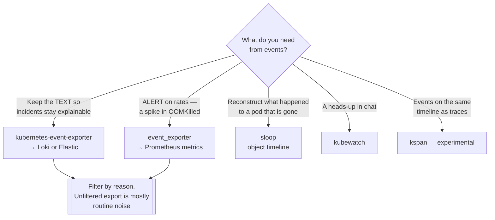

[← Observability](../README.md)

# Events

Kubernetes' own account of what it did — and the signal most platforms throw away by
accident.

Tools covered: [`kubernetes-event-exporter`](kubernetes-event-exporter/README.md) ·
[`event-exporter`](event-exporter/README.md) · [`kube-events`](kube-events/README.md) ·
[`kubewatch`](kubewatch/README.md) · [`sloop`](sloop/README.md) · [`kspan`](kspan/README.md)

## Contents

1. [Why events matter](#1-why-events-matter)
2. [The one-hour problem](#2-the-one-hour-problem)
3. [The tools in this folder](#3-the-tools-in-this-folder)
4. [Decision tree](#4-decision-tree)
5. [Anti-patterns](#5-anti-patterns)
6. [How this applies to pikakube](#6-how-this-applies-to-pikakube)

---

## 1. Why events matter

Metrics say a pod restarted. Events say **why**: `OOMKilled`, `FailedScheduling`,
`ImagePullBackOff`, `FailedMount`, `Preempted`, `NodeNotReady`.

That is a different class of information — the control plane's own narration of its
decisions. Nothing else in this folder reconstructs it. A metric shows the restart count went
up; only the event says the container was killed for exceeding its memory limit, which is the
sentence that ends the investigation.

For a data platform this is where most incident explanations live: a Spark executor
`OOMKilled`, an Airflow worker `Evicted`, a pod stuck `FailedScheduling` because no node
matched a taint.

## 2. The one-hour problem

**Kubernetes events expire, by default after one hour.** They live in etcd with a TTL, and
`kubectl get events` after the fact returns nothing.

The consequence is specific and painful: the explanation for last night's incident is
routinely gone before anyone looks. Not hard to find — *gone*.

Every tool in this folder exists because of that single fact. They export events somewhere
durable, so the answer still exists in the morning.

## 3. The tools in this folder

| Tool | Role | Shines when | Detail |
|---|---|---|---|
| **kubernetes-event-exporter** | exports events to sinks — Elasticsearch, Loki, webhooks, chat | **the default choice**; actively maintained, with flexible routing and filtering | [→](kubernetes-event-exporter/README.md) |
| **event-exporter** | exposes events as Prometheus metrics | you want to alert on event *rates* rather than store the text | [→](event-exporter/README.md) |
| **kube-events** | event rules and notifications | you want rule-based handling rather than raw export | [→](kube-events/README.md) |
| **kubewatch** | pushes cluster changes to chat | simple notification, not retention | [→](kubewatch/README.md) |
| **sloop** | records and visualises event history over time | reconstructing **what happened to a pod that no longer exists** | [→](sloop/README.md) |
| **kspan** | turns events into OpenTelemetry spans | you want events on the same timeline as traces | [→](kspan/README.md) |

Two of these are doing something different from the rest:

- **sloop** is a time machine — it answers "what happened to that pod yesterday", which is precisely what the one-hour TTL destroys
- **kspan** is a translation layer, putting cluster events into the tracing timeline so an application slowdown and a node eviction appear together

## 4. Decision tree

## 5. Anti-patterns

| Anti-pattern | Why it is bad | What to do instead |
|---|---|---|
| Assuming events are still there | they expired an hour after the incident | export them somewhere durable |
| Exporting every event without filtering | volume is enormous and mostly routine | filter by type and reason |
| Alerting on individual events | most are normal operation | alert on rates, or on specific reasons like `OOMKilled` |
| Using events as an audit trail | they are best-effort and can be dropped under load | [audit logs](../../security/2-cluster/audit/README.md) are the audit trail |

## 6. How this applies to pikakube

Nothing here is deployed. It is worth flagging as a **real gap rather than a deliberate
omission**: the cluster produces events, they expire in an hour, and no incident more than
sixty minutes old can be explained from them.

On any cluster people depend on, exporting events into the log store is one of the
highest-value, lowest-effort additions available.

---

[← Observability](../README.md)
