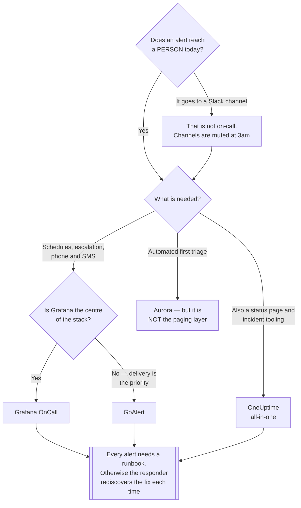

[← Observability](../README.md)

# Incident management

Getting the alert to a **person**, and running what happens next.

Tools covered: [`oncall`](oncall/README.md) · [`goalert`](goalert/README.md) · [`oneuptime`](oneuptime/README.md) ·
[`aurora`](aurora/README.md)

## Contents

1. [Where alerting ends and this begins](#1-where-alerting-ends-and-this-begins)
2. [What these tools actually provide](#2-what-these-tools-actually-provide)
3. [The tools in this folder](#3-the-tools-in-this-folder)
4. [Decision tree](#4-decision-tree)
5. [Anti-patterns](#5-anti-patterns)
6. [How this applies to pikakube](#6-how-this-applies-to-pikakube)

---

## 1. Where alerting ends and this begins

[Alertmanager](../alerting/alertmanager/README.md) routes an alert to a **destination** — a Slack
channel, a webhook, an email address.

It has no idea who is awake, whether anyone acknowledged it, or what to do when the first
person does not answer. A channel is not a person, and "someone will see it" is not an
escalation policy.

That is the gap this folder fills:

| Question | Where |
|---|---|
| Should this fire at all? | [`alerting/`](../alerting/README.md) |
| **Who is on call right now?** | here |
| **What if they do not answer?** | here |
| What happened, and what do we change? | post-mortems — [`site-reliability-engineering/`](../../site-reliability-engineering/README.md) |

## 2. What these tools actually provide

| Capability | Why it matters |
|---|---|
| **Schedules and rotations** | a name, not a channel — including who covers holidays |
| **Escalation policies** | no acknowledgement in N minutes, escalate to the next person |
| **Acknowledgement** | someone has explicitly taken it, so nobody else duplicates the work |
| **Multi-channel delivery** | push, SMS and phone — because Slack notifications are muted at 3am |
| **Incident timeline** | what fired, who responded, what was done — the raw material for a post-mortem |
| **Status pages** | telling users, without every one of them asking |

The phone call is not a detail. An alert that only reaches a muted Slack channel is a
dashboard with extra steps.

## 3. The tools in this folder

| Tool | Role | Shines when | Do not use when | Detail |
|---|---|---|---|---|
| **Grafana OnCall** | schedules, escalation, acknowledgement | Grafana is already the centre of gravity — it integrates directly with Alertmanager and Grafana alerts | you want a fully independent tool | [→](oncall/README.md) |
| **GoAlert** | on-call scheduling with strong notification delivery | phone and SMS escalation matters and the deployment should stay self-contained | you want an all-in-one platform | [→](goalert/README.md) |
| **OneUptime** | all-in-one — status page, monitoring, on-call, incidents | you want a single product covering status pages and incidents rather than assembling them | you already have monitoring and only need on-call | [→](oneuptime/README.md) |
| **Aurora** | AI-assisted incident response | experimenting with automated triage as a first responder | you need reliable paging — this is not the paging layer | [→](aurora/README.md) |

## 4. Decision tree

## 5. Anti-patterns

| Anti-pattern | Why it is bad | What to do instead |
|---|---|---|
| A Slack channel as the on-call rotation | nobody is specifically responsible, and notifications are muted overnight | a named person and a real notification channel |
| No escalation policy | the first responder is asleep and the alert sits unacknowledged | escalate after a defined interval |
| Paging without a runbook | the responder rediscovers the fix each time | link the runbook from the alert |
| No acknowledgement step | three people investigate the same thing and nobody knows | require acknowledgement |
| On-call without post-mortems | the same incident recurs indefinitely | feed the timeline into a post-mortem |
| Everyone on call for everything | alert fatigue and no ownership | route by service to its owning team |

## 6. How this applies to pikakube

Not deployed — a laptop cluster has no on-call.

The concept still belongs in the repository, because the most common failure in real
platforms is not a missing tool: it is having **Alertmanager routing to a channel and calling
that on-call**. The gap between "the alert fired" and "a human is awake and working on it" is
exactly what this folder covers.

---

[← Observability](../README.md)
