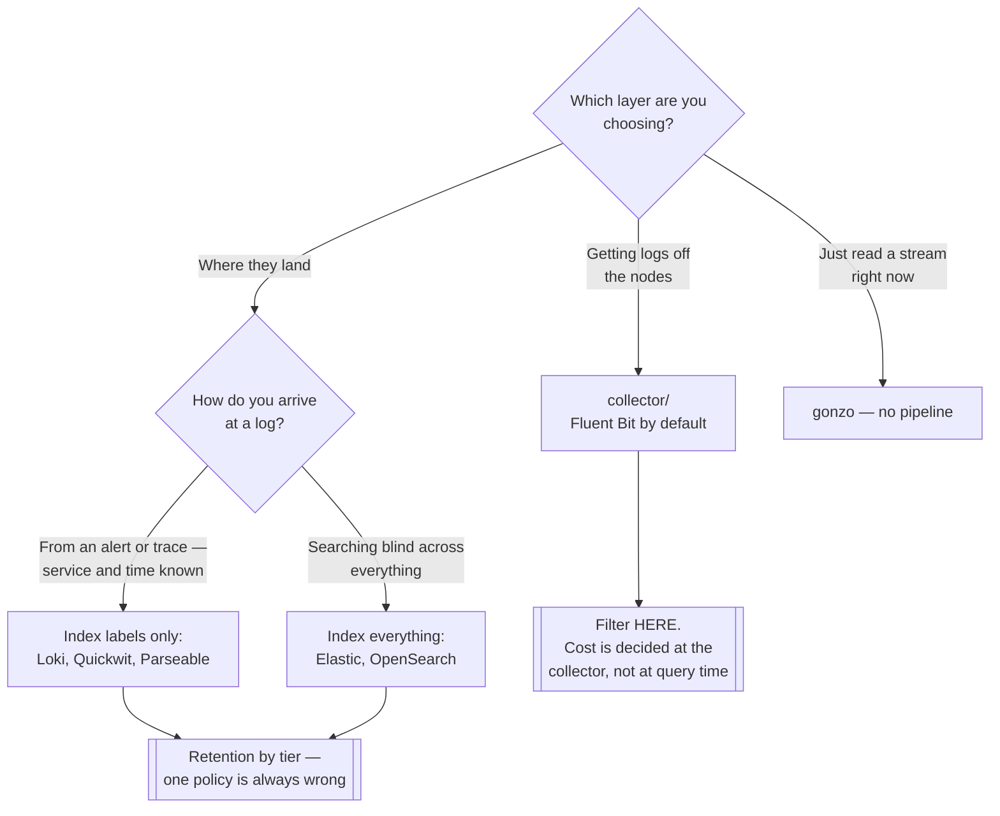

[← Observability](../README.md)

# Logs

What the system wrote down — the most detailed signal, and the most expensive one.

Subfolders: [`collector/`](collector/README.md) · [`storage/`](storage/README.md)

## Contents

1. [Collector and storage are different jobs](#1-collector-and-storage-are-different-jobs)
2. [The two storage philosophies](#2-the-two-storage-philosophies)
3. [Cost is the design constraint](#3-cost-is-the-design-constraint)
4. [Structured logging](#4-structured-logging)
5. [Reading logs locally](#5-reading-logs-locally)
6. [Decision tree](#6-decision-tree)
7. [Anti-patterns](#7-anti-patterns)
8. [How this applies to pikakube](#8-how-this-applies-to-pikakube)

---

## 1. Collector and storage are different jobs

The most common structural confusion in this folder, so it is worth stating first:

| Layer | Job | Folder |
|---|---|---|
| **Collector** | read logs off every node, parse, enrich with Kubernetes metadata, filter, ship | [`collector/`](collector/README.md) |
| **Storage** | index, retain, and answer queries | [`storage/`](storage/README.md) |

Fluent Bit is a collector. Loki is storage. They are not alternatives to one another, and a
working setup needs one of each.

The collector is where the leverage is: **filtering and sampling happen there**, before
anything is paid for. A decision to drop health-check logs at the collector costs nothing;
the same decision at query time costs the full storage bill.

## 2. The two storage philosophies

Every log store in this folder sits on one side of a single trade:

| | Index everything | Index only labels |
|---|---|---|
| Examples | Elasticsearch, OpenSearch, Solr | Loki, Quickwit, Parseable |
| Query | fast full-text search across all content | fast on labels, then a scan over the matching stream |
| Storage cost | high — the index is often larger than the data | low — the payload is compressed in object storage |
| Operational weight | significant — shards, replicas, heap tuning | modest |
| Best for | "find this error message anywhere in the last 90 days" | "show me this pod's logs around 02:14" |

Choosing between them is choosing which question you actually ask. In Kubernetes the second
one dominates: you almost always know the service and the time window, because an alert or a
trace brought you there.

That is why Loki became the default in this ecosystem — not because it is a better database,
but because it matches how logs are really consulted.

## 3. Cost is the design constraint

Logs are the signal that ruins observability budgets. Metrics are aggregated and cheap;
traces can be sampled; logs are per-event, verbose, and grow with traffic.

The levers, in order of effect:

1. **Filter at the collector.** Health checks, readiness probes and debug output from a chatty library are usually most of the volume, and none of it is ever read.
2. **Retention by tier.** Application logs for 30 days, audit for a year, debug for three days. One retention policy for everything is always wrong in one direction.
3. **Object storage.** Loki, Quickwit and Parseable put the payload in S3-compatible storage, which changes the cost curve entirely.
4. **Structured logs.** Cheaper to parse, cheaper to filter, and they remove the need for regex-based extraction later.

## 4. Structured logging

A log line that is a sentence has to be parsed by a regular expression that someone maintains
and that breaks when the message wording changes.

A log line that is JSON has fields. Filtering by `level`, `trace_id` or `tenant` becomes a
query rather than a pattern match, and — the part that matters most — including a
**`trace_id`** links the log to the [trace](../tracing/README.md) that produced it.

That single field is what turns three separate signals into one investigation.

## 5. Reading logs locally

Not everything needs a pipeline. [**Gonzo**](https://github.com/control-theory/gonzo) is a
terminal log analyser — a TUI that parses, filters and charts a log stream you pipe into it.

Useful for the case the rest of this folder does not cover: a log file or a `kubectl logs`
stream you want to explore **right now**, without shipping it anywhere.

```bash
kubectl logs -f deploy/my-app | gonzo
```

## 6. Decision tree



## 7. Anti-patterns

| Anti-pattern | Why it is bad | What to do instead |
|---|---|---|
| Shipping everything and filtering at query time | you pay to store what you never read | filter at the collector |
| One retention policy for all logs | either audit is lost too early, or debug is kept for a year | retention by tier |
| Unstructured logs | fragile regex parsing that breaks on a wording change | structured JSON |
| No `trace_id` in logs | traces and logs stay separate universes | propagate it and log it |
| Elasticsearch by default | large operational cost for search you may never use | decide from how you actually query |
| Logs as metrics | counting log lines to derive a rate is expensive and fragile | emit a metric |
| Ignoring Kubernetes events | they expire in an hour and explain most incidents | [`events/`](../events/README.md) |

## 8. How this applies to pikakube

Nothing here is deployed. Both layers are mapped, with the collector and storage split kept
explicit so the two choices stay independent.

The realistic pairing for this repository is **Fluent Bit or Vector shipping into Loki**,
with [events](../events/README.md) exported into the same store — which is the piece that
would actually make incidents explainable after the fact.

---

[← Observability](../README.md)
