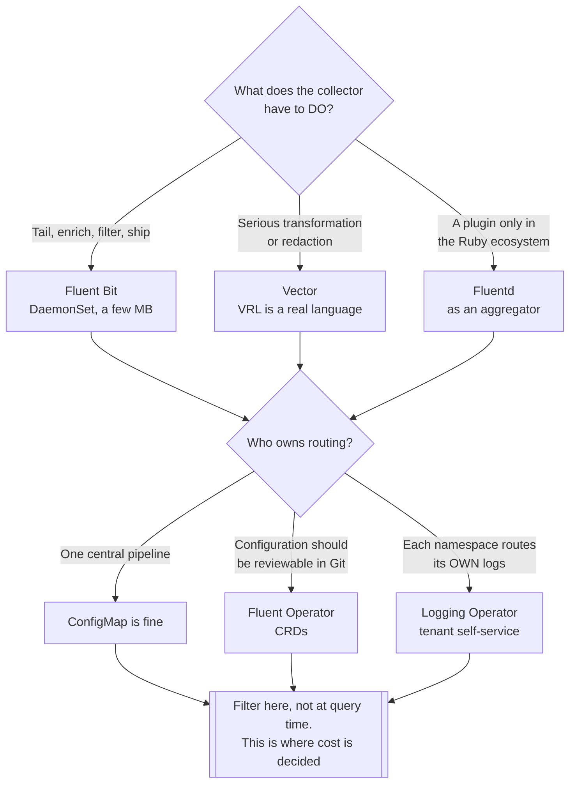

[← Logs](../README.md)

# Log collectors

Reading logs off every node, enriching them, filtering them, and shipping them somewhere.

Tools covered: [`fluent/`](fluent/README.md) (Fluent Bit, Fluentd, Fluent Operator) ·
[`vector/`](vector/README.md) · [`logstash/`](logstash/README.md) · [`logging-operator/`](logging-operator/README.md)

## Contents

1. [What a collector actually does](#1-what-a-collector-actually-does)
2. [The tools](#2-the-tools)
3. [Decision tree](#3-decision-tree)
4. [The pattern worth knowing](#4-the-pattern-worth-knowing)
5. [Anti-patterns](#5-anti-patterns)
6. [How this applies to pikakube](#6-how-this-applies-to-pikakube)

---

## 1. What a collector actually does

More than moving bytes. In Kubernetes the collector is where logs become useful:

| Step | Why it matters |
|---|---|
| **Tail** | read container log files from every node, following rotation |
| **Parse** | JSON, logfmt, or a regex for the unstructured ones |
| **Enrich** | attach pod, namespace, labels and node — without this a log line has no owner |
| **Filter** | drop what will never be read, **before** it costs anything |
| **Route** | different destinations for different logs — audit somewhere durable, debug somewhere cheap |
| **Buffer** | survive the storage backend being briefly unavailable |

The enrichment step is the one people underestimate. A raw container log line has no idea
which pod or namespace it came from; the collector adds that from the Kubernetes API, and it
is what makes the logs queryable at all.

## 2. The tools

| Tool | Model | Shines when | Do not use when | Detail |
|---|---|---|---|---|
| **Fluent Bit** | C, very small footprint | **the default** — DaemonSet on every node, minimal memory, CNCF | you need heavy transformation in the collector | [→](fluent/fluent-bit/README.md) |
| **Vector** | Rust, high throughput | transformation matters — VRL is a genuine programming model, not a config dialect | you want the most widely deployed option | [→](vector/README.md) |
| **Fluentd** | Ruby, plugin-rich | you need a plugin that only exists here | greenfield — Fluent Bit is lighter and covers most cases | [→](fluent/fluentd/README.md) |
| **Fluent Operator** | operator for the Fluent family | you want collector configuration as CRDs rather than ConfigMaps | a single static configuration is enough | [→](fluent/fluent-operator/README.md) |
| **Logging Operator** | Kubernetes-native logging pipelines | routing should be declared per namespace, by the teams that own them | one central pipeline is fine | [→](logging-operator/README.md) |
| **Logstash** | JVM, part of the Elastic stack | you run Elasticsearch and want the matching component | resource footprint matters — it is the heaviest here | [→](logstash/README.md) |

## 3. Decision tree

Logstash is deliberately absent from the tree: it runs on the JVM, and as a DaemonSet that
cost is multiplied by every node. If it must be in the picture, it belongs behind Fluent Bit
as an aggregator.

## 4. The pattern worth knowing

**Agent plus aggregator.** A light collector on every node forwards to a smaller number of
aggregators that do the expensive work — parsing, transformation, routing — before writing to
storage.

It keeps per-node overhead low, concentrates the complicated configuration in one place, and
gives you a buffer that survives the backend going away. Fluent Bit as the agent with Fluentd
or Vector as the aggregator is the classic arrangement.

## 5. Anti-patterns

| Anti-pattern | Why it is bad | What to do instead |
|---|---|---|
| Filtering at the storage layer | you already paid to store and index it | filter at the collector |
| Heavy transformation on every node | multiplies CPU cost by node count | agent plus aggregator |
| No buffering | the backend hiccups and logs are lost silently | configure buffers and check the drop metrics |
| Not monitoring the collector | it stops and nobody notices until logs are needed | alert on collector health and drop rate |
| Logstash as the DaemonSet | a JVM per node, for a job Fluent Bit does in a few MB | Fluent Bit as the agent |
| Shipping credentials in logs | they reach storage, backups and possibly a SaaS | redact at the collector, where [Vector](vector/README.md) is strongest |

## 6. How this applies to pikakube

Nothing deployed. **Fluent Bit** is the realistic choice — a Kind cluster has no room for a
JVM per node, and the requirement is tail, enrich and ship.

Two decisions matter more than the tool, and both are made here rather than at storage:

- **what gets filtered.** Health checks and readiness probes are most of the volume and none of the value
- **whether [Kubernetes events](../../events/README.md) come through the same path.** Fluent Bit can collect them, which would close the one-hour expiry gap without another component — at the cost of less flexible routing than a dedicated exporter

---

[← Logs](../README.md)
