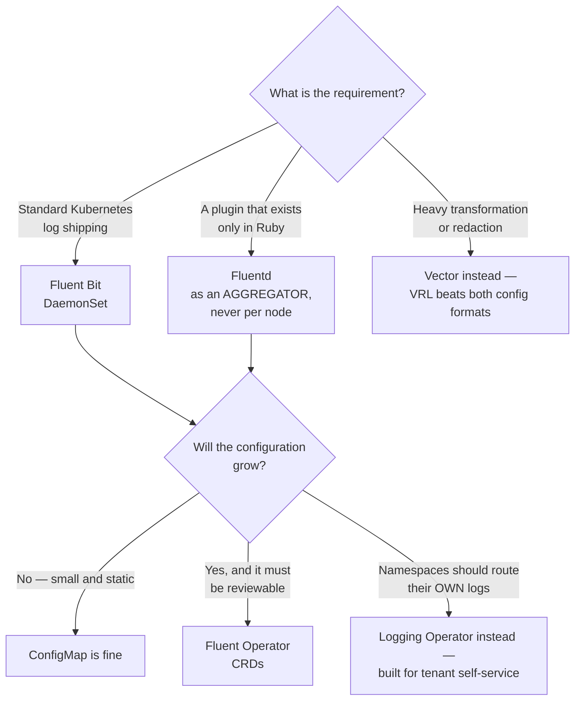

[← Log collectors](../README.md)

# Fluent family

Three related projects that are frequently confused with one another.

Tools covered: [`fluent-bit`](fluent-bit/README.md) · [`fluentd`](fluentd/README.md) ·
[`fluent-operator`](fluent-operator/README.md)

## Contents

1. [Which is which](#1-which-is-which)
2. [Decision tree](#2-decision-tree)
3. [The pattern that uses two of them](#3-the-pattern-that-uses-two-of-them)
4. [Why the operator matters](#4-why-the-operator-matters)
5. [How this applies to pikakube](#5-how-this-applies-to-pikakube)

---

## 1. Which is which

| Project | What it is | Footprint |
|---|---|---|
| **Fluent Bit** | log processor and forwarder written in C | very small — a few MB of memory |
| **Fluentd** | log collector written in Ruby, with a very large plugin ecosystem | heavier — tens to hundreds of MB |
| **Fluent Operator** | Kubernetes operator that manages both, with configuration as CRDs | the control plane, not a collector |

They are not versions of each other. Fluent Bit was created as a lightweight sibling for
constrained environments and has since become capable enough to be the default choice on its
own.

## 2. Decision tree

Deciding between the two operators is a question about **who owns routing**, not about which
manages Fluent better: Fluent Operator manages the stack, the Logging Operator delegates to
namespace owners.

## 3. The pattern that uses two of them

**Agent plus aggregator**: Fluent Bit on every node doing the cheap work — tail, parse,
enrich, filter — forwarding to a small number of Fluentd or Vector instances that handle
expensive transformation and routing before writing to storage.

Per-node overhead stays minimal, the complicated configuration lives in one place, and the
aggregator provides a buffer that survives the backend being briefly unavailable.

## 4. Why the operator matters

Collector configuration is usually a large ConfigMap of parser and filter rules — the kind of
thing that is edited in place, drifts, and is impossible to review.

Fluent Operator turns it into CRDs: `ClusterInput`, `ClusterFilter`, `ClusterOutput` and their
namespaced equivalents. Configuration becomes reviewable, and teams can own routing for their
own namespace without editing a shared file.

## 5. How this applies to pikakube

Nothing deployed. **Fluent Bit alone** is the right shape here — one cluster, one destination,
and no aggregator tier to justify.

The decision that would actually matter is the operator: this repository is GitOps-first, and a
collector configured through a mutable ConfigMap is the one component that would sit outside
that model. Fluent Operator resolves it, at the cost of CRDs to manage for a configuration that
may never grow past a few filters.

Worth deciding **before** the ConfigMap reaches 500 lines, not after.

---

[← Log collectors](../README.md)
