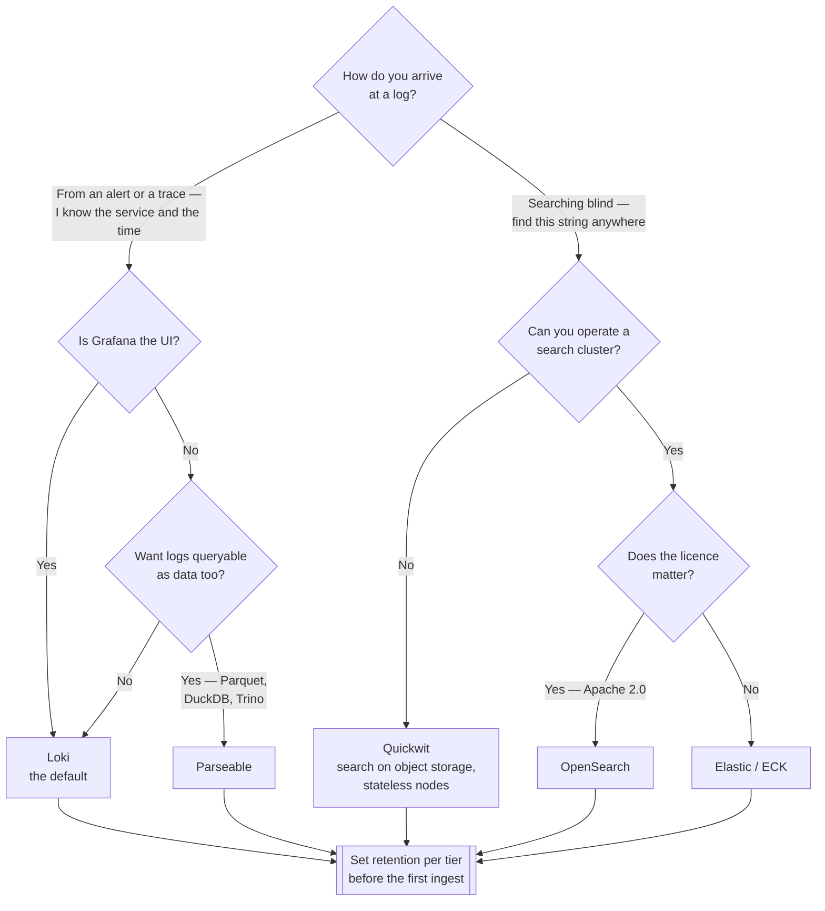

[← Logs](../README.md)

# Log storage

Where logs land, how long they stay, and how they are queried.

Tools covered: [`loki`](loki/) · [`elastic-operator`](elastic-operator/) ·
[`opensearch`](opensearch/) · [`quickwit`](quickwit/) · [`parseable`](parseable/) ·
[`solr`](solr/)

## Contents

1. [The one decision that matters](#1-the-one-decision-that-matters)
2. [The tools](#2-the-tools)
3. [Decision tree](#3-decision-tree)
4. [Retention, by tier](#4-retention-by-tier)
5. [Anti-patterns](#5-anti-patterns)
6. [How this applies to pikakube](#6-how-this-applies-to-pikakube)

---

## 1. The one decision that matters

Everything here sits on one side of a single trade — **what gets indexed**:

| | Index everything | Index only labels |
|---|---|---|
| Tools | Elasticsearch, OpenSearch, Solr | Loki, Quickwit, Parseable |
| Strength | full-text search across all content, fast | cheap storage, simple operation |
| Weakness | the index is often larger than the data; shards, replicas and heap to tune | full-text search means scanning the matching streams |
| Natural question | "find this error anywhere in 90 days" | "show me this pod's logs around 02:14" |

In Kubernetes the second question dominates. An alert or a trace already told you which
service and when — you are narrowing, not searching. That is why Loki became the default
here: not a better database, a better match for how logs are actually consulted.

The first model earns its cost when logs are a **product** rather than a debugging aid —
security investigation, compliance search, analytics over log content.

## 2. The tools

| Tool | Model | Shines when | Do not use when | Detail |
|---|---|---|---|---|
| **Loki** | label index, chunks in object storage | **the default** — Grafana-native, cheap, and matches Kubernetes debugging | you need real full-text search at scale | [→](loki/) |
| **Elastic (ECK)** | full index | full-text search is genuinely required, and you can operate it | you want low operational weight | [→](elastic-operator/) |
| **OpenSearch** | full index | same capability, Apache-licensed fork | the licensing question does not apply to you | [→](opensearch/) |
| **Quickwit** | search on object storage | full-text search **without** running a cluster of stateful nodes | you need the Elastic ecosystem's tooling | [→](quickwit/) |
| **Parseable** | Parquet on object storage | very low footprint, and logs you may want to analyse like data | rich search features are the requirement | [→](parseable/) |
| **Solr** | full index | it is already in the organisation | choosing fresh for logs — the others fit this use better | [→](solr/) |

**Quickwit is the interesting middle.** It offers full-text search with object storage as the
backend, which historically forced a choice between search quality and storage cost. Worth
evaluating when Loki's search is not enough but Elasticsearch is too much to run.

## 3. Decision tree

## 4. Retention, by tier

A single retention setting is always wrong in one direction — either audit data is deleted too
early, or debug output is kept for a year.

| Class | Typical | Why |
|---|---|---|
| Debug | 3–7 days | volume is enormous and value decays within hours |
| Application | 14–30 days | covers incident investigation and the following review |
| Audit and security | 1 year or more | usually a compliance requirement, not a choice |

Retention decides the storage bill more than the tool does. It is worth setting deliberately
before the first ingest, because raising it later is easy and lowering it never happens.

## 5. Anti-patterns

| Anti-pattern | Why it is bad | What to do instead |
|---|---|---|
| Elasticsearch because it is familiar | large operational cost for search that may never be used | choose from how you query |
| High-cardinality Loki labels | a label per pod name or request ID destroys performance — this is the classic Loki mistake | labels for streams, not for identity |
| One retention policy | audit lost early, or debug kept forever | tier it |
| No object storage | local disks mean capacity planning and no cheap long tail | S3-compatible backend |
| Storage without a lifecycle policy | old chunks accumulate and nothing removes them | expiry on the bucket as well as in the tool |

## 6. How this applies to pikakube

Nothing deployed. **Loki** is the realistic choice — Grafana is already the UI, the cluster is
small, and every question here starts from a service and a time window rather than a search.

Two things would have to be decided before it is real, and neither is the tool:

- **object storage.** On Kind that means [MinIO](loki/minio/), which becomes a component to operate rather than a service that already exists
- **label discipline.** Loki's design collapses under high-cardinality labels, and the mistake is easy to make on day one and painful to undo later

Quickwit is the one worth revisiting if search ever stops being enough — it is the option that
does not force the usual choice between search quality and storage cost.

---

[← Logs](../README.md)
