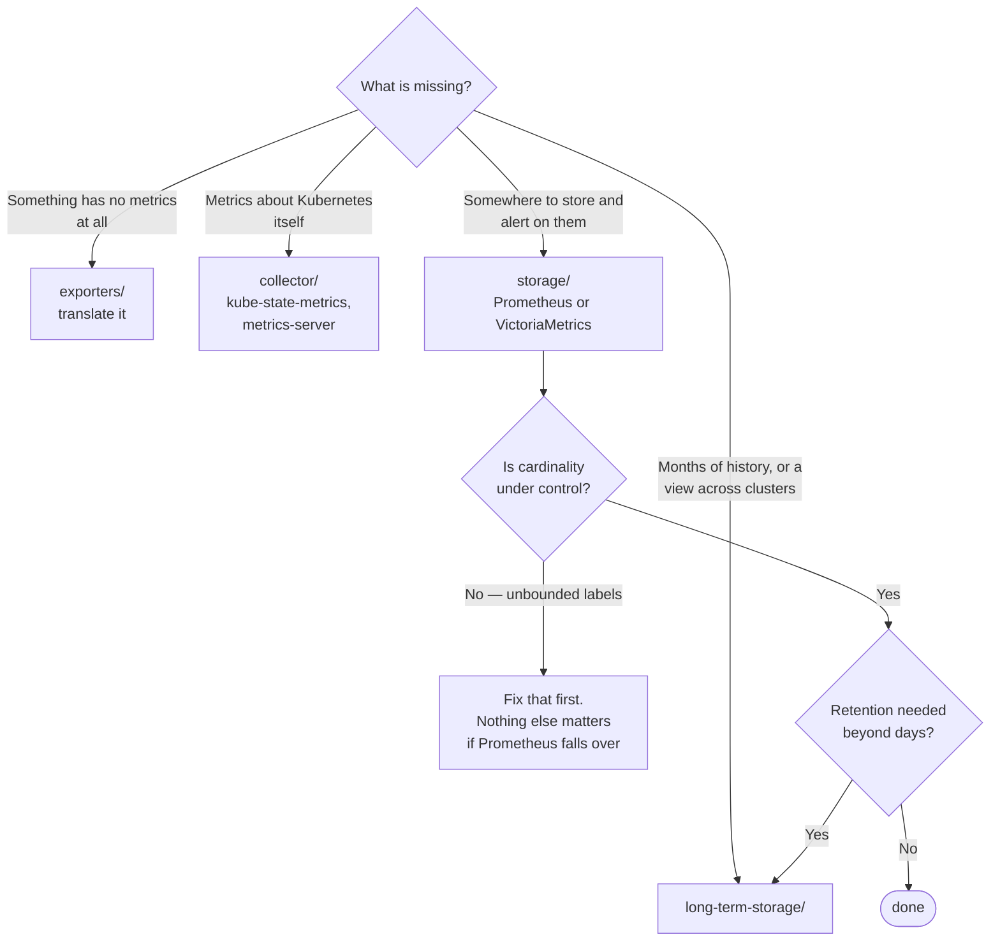

[← Observability](../README.md)

# Metrics

Numbers over time — the cheapest signal, and the one everything else is built on.

Subfolders: [`collector/`](collector/README.md) · [`exporters/`](exporters/README.md) ·
[`storage/`](storage/README.md) · [`long-term-storage/`](long-term-storage/README.md)

## Contents

1. [Why metrics come first](#1-why-metrics-come-first)
2. [The four layers](#2-the-four-layers)
3. [Cardinality is the whole game](#3-cardinality-is-the-whole-game)
4. [Pull versus push](#4-pull-versus-push)
5. [Retention, and what Prometheus will not do](#5-retention-and-what-prometheus-will-not-do)
6. [Decision tree](#6-decision-tree)
7. [Anti-patterns](#7-anti-patterns)
8. [How this applies to pikakube](#8-how-this-applies-to-pikakube)

---

## 1. Why metrics come first

Metrics are aggregated at the source, so cost is bounded by the number of series rather than
by traffic. A counter incremented a million times is still one number.

That property is why alerting is built on them: they are cheap enough to keep for a long time,
fast enough to evaluate every fifteen seconds, and stable enough to define an SLO against.

Logs and traces explain individual cases; metrics tell you there is a case to explain.

## 2. The four layers

| Layer | Job | Folder |
|---|---|---|
| **Exporters** | translate something that has no metrics into metrics — a database, a cloud API, a device | [`exporters/`](exporters/README.md) |
| **Collector** | produce metrics about Kubernetes itself, and serve them to consumers | [`collector/`](collector/README.md) |
| **Storage** | scrape, store, evaluate rules, answer PromQL | [`storage/`](storage/README.md) |
| **Long-term storage** | keep months or years cheaply, and query across clusters | [`long-term-storage/`](long-term-storage/README.md) |

The split between the last two is the one that surprises people: Prometheus is deliberately
**not** a long-term store. It keeps a local window and is designed to be paired with something
else for anything beyond it.

## 3. Cardinality is the whole game

A time series is a metric name plus its label values. Every distinct combination is a
**separate series**, stored and indexed independently.

```
http_requests_total{method="GET", status="200", endpoint="/api/users"}
```

Three labels with 5, 10 and 20 values is 1,000 series. Add `user_id` and it is however many
users you have — multiplied by everything else.

**This is how Prometheus deployments die.** Not gradually: memory grows with the number of
active series, and one deploy that adds a label with unbounded values can take the instance
down.

Rules that prevent it:

| Rule | Why |
|---|---|
| No unbounded label values | user ID, request ID, trace ID, full URL path, email — these belong in logs and traces |
| Bound the values you do use | `endpoint` as a route template (`/api/users/{id}`), never the raw path |
| Watch series count as a metric | it is a leading indicator; alert on growth before it becomes an outage |
| Aggregate before storing when you can | recording rules collapse detail you were never going to query |

The single sentence worth remembering: **if a label can take a value you cannot enumerate in
advance, it does not belong in a metric.**

## 4. Pull versus push

Prometheus **pulls**: it scrapes an HTTP endpoint on a schedule. That has real consequences,
and they are usually advantages:

- the scrape itself is a health check — a target that cannot be scraped is visibly down
- targets are discovered from Kubernetes, so nothing needs to know where Prometheus is
- a misbehaving application cannot overwhelm the store by pushing harder

Where it breaks is **short-lived work**: a batch job that finishes before any scrape happens
is never observed. The Pushgateway exists for that case, and is widely misused — it is for
jobs that end, not for applications that would rather push.

For a data platform this matters: a Spark job or an Airflow task is exactly the short-lived
case, and the honest answer is often that its outcome belongs in a metric emitted by the
orchestrator rather than by the job.

## 5. Retention, and what Prometheus will not do

Local retention is a **single global setting**. There is no per-metric retention, and there is
no plan to add it:

- <https://github.com/prometheus/prometheus/issues/15350>
- <https://github.com/prometheus/prometheus/issues/1381>

So "keep SLO metrics for a year and debug metrics for a week" cannot be expressed in
Prometheus. The way it is actually solved:

1. **recording rules** aggregate the series worth keeping into new, smaller ones
2. those are shipped to [long-term storage](long-term-storage/README.md), which has its own retention
3. local retention stays short — days to a couple of weeks

That pipeline, rather than a configuration setting, is the answer to long retention.

## 6. Decision tree



## 7. Anti-patterns

| Anti-pattern | Why it is bad | What to do instead |
|---|---|---|
| High-cardinality labels | the fastest way to take Prometheus down | bounded label values only |
| Long local retention | memory and disk grow, queries slow, and it still is not durable | short local window plus long-term storage |
| Pushgateway for regular applications | breaks the health-check property and creates a stale-metric problem | scrape endpoints; Pushgateway only for jobs that end |
| Alerting on raw resource metrics | high CPU is frequently healthy | alert on symptoms — see [`alerting/`](../alerting/README.md) |
| Scraping everything at 15s | most metrics do not change that fast, and cost is per sample | tune the interval per target |
| Counting log lines instead of emitting a metric | expensive and fragile | emit the metric |
| No recording rules | expensive dashboards recompute the same aggregation every refresh | precompute what is queried often |

## 8. How this applies to pikakube

**Prometheus via kube-prometheus-stack** is the deployed stack — see
[`storage/prometheus/`](storage/prometheus/README.md), which also records the metric-source
mapping worth having when trying to work out where an unfamiliar `go_*` or `apiserver_*`
series came from.

Long-term storage, exporters and alternatives are mapped rather than deployed. On a laptop
cluster the retention question does not arise; on a real one it is the first thing that does.

---

[← Observability](../README.md)
