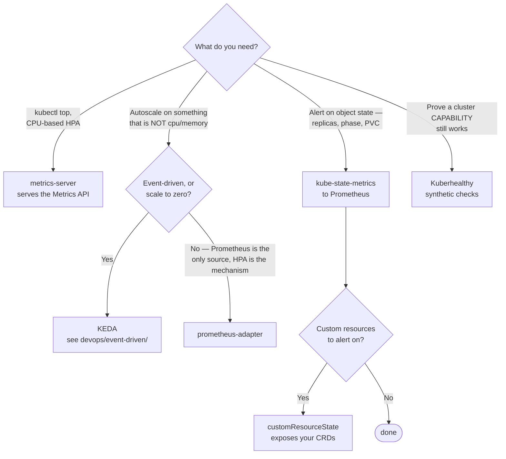

[← Metrics](../README.md)

# Metrics collectors

Producing metrics **about Kubernetes itself**, and serving them to the things that consume
them.

Tools covered: [`kube-state-metrics`](kube-state-metrics/) ·
[`metrics-server`](metrics-server/) · [`prometheus-adapter`](prometheus-adapter/) ·
[`kuberhealthy`](kuberhealthy/)

## Contents

1. [Four different jobs](#1-four-different-jobs)
2. [The distinction that confuses everyone](#2-the-distinction-that-confuses-everyone)
3. [Decision tree](#3-decision-tree)
4. [Autoscaling on custom metrics](#4-autoscaling-on-custom-metrics)
5. [Anti-patterns](#5-anti-patterns)
6. [Kuberhealthy is a different kind of thing](#6-kuberhealthy-is-a-different-kind-of-thing)
7. [How this applies to pikakube](#7-how-this-applies-to-pikakube)

---

## 1. Four different jobs

These get grouped together and do genuinely different things:

| Tool | Produces | Consumed by |
|---|---|---|
| **kube-state-metrics** | the **state** of Kubernetes objects — desired replicas, pod phase, PVC status | Prometheus |
| **metrics-server** | live **resource usage** — CPU and memory per pod and node | `kubectl top`, HPA |
| **prometheus-adapter** | exposes Prometheus queries **as** Kubernetes metrics APIs | HPA, for custom metrics |
| **kuberhealthy** | synthetic checks that produce pass/fail metrics | Prometheus |

## 2. The distinction that confuses everyone

**kube-state-metrics and metrics-server are not alternatives.**

- **metrics-server** answers *"how much CPU is this pod using right now?"* — a live value, not stored, feeding `kubectl top` and the HPA
- **kube-state-metrics** answers *"how many replicas does this Deployment want, and how many are ready?"* — object state, scraped and stored by Prometheus

One is resource usage, the other is object state. Both are usually needed, and neither
replaces the other.

A related trap: **cAdvisor**, built into the kubelet, is what actually provides per-container
resource metrics to Prometheus. metrics-server serves the same underlying data to the
Kubernetes API for autoscaling — different consumers, similar source.

## 3. Decision tree

The first two branches are not alternatives — **both are normally installed**, and each
answers a question the other cannot.

## 4. Autoscaling on custom metrics

The HPA reads from Kubernetes metrics APIs, not from Prometheus. That is why
[prometheus-adapter](prometheus-adapter/) exists — it translates PromQL results into the
custom and external metrics APIs so an HPA can scale on queue depth, request rate, or anything
else already in Prometheus.

The alternative is [KEDA](../../../devops/event-driven/keda/), which covers the same need with
a broader set of scalers and is usually the better answer for event-driven workloads.

## 5. Anti-patterns

| Anti-pattern | Why it is bad | What to do instead |
|---|---|---|
| Treating metrics-server as monitoring | it stores nothing and answers no question about the past | Prometheus for history, metrics-server for the HPA |
| Installing only one of metrics-server / kube-state-metrics | they cover different data; `kubectl top` or every state alert stops working | both, they do not overlap |
| kube-state-metrics with default labels on a large cluster | a series per object, and cluster size drives cardinality directly | configure the label allow-list |
| prometheus-adapter for event-driven scaling | no scale-to-zero, and one source only | [KEDA](../../../devops/event-driven/keda/) |
| Assuming CRD status is visible | operator and Crossplane status exists only in `kubectl` until something exports it | `customResourceState` |
| Passive metrics as proof a capability works | nothing tested PVC provisioning today, so nothing knows | Kuberhealthy |

## 6. Kuberhealthy is a different kind of thing

The others report on state that exists. Kuberhealthy **generates** it: it runs synthetic
checks — can a pod be scheduled, does DNS resolve, can a PVC be provisioned — and turns the
results into metrics.

That is the same reasoning as
[network/monitoring](../../../network/monitoring/README.md): passive metrics cannot see a
capability nobody exercised. If nothing has created a PVC today, nothing knows whether it
still works.

## 7. How this applies to pikakube

**kube-state-metrics** and **node-exporter** come with
[kube-prometheus-stack](../storage/prometheus/kube-prometheus-stack/) and are deployed.
metrics-server is not part of that chart — on Kind it needs `--kubelet-insecure-tls`, which is
acceptable locally and must not travel to a real cluster.

The one worth flagging as a genuine gap rather than a deliberate omission:
**`customResourceState`**. The repository runs Flux and maps Crossplane, and the status of a
`Kustomization` or a composite resource is currently visible only through `kubectl` — which
means nothing can alert on a reconciliation that has been failing quietly.

---

[← Metrics](../README.md)
