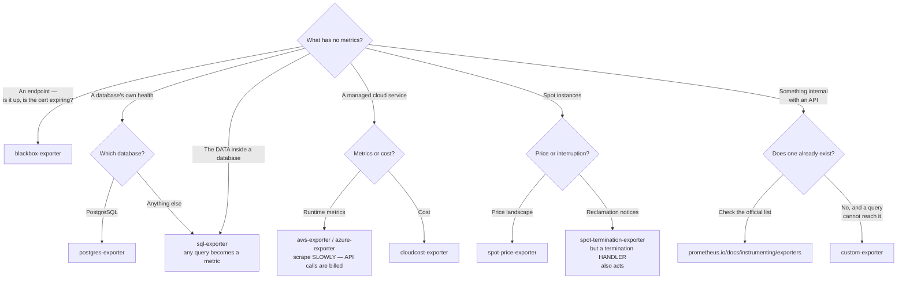

[← Metrics](../README.md)

# Exporters

Translating something that has no metrics into something Prometheus can scrape.

Reference: <https://prometheus.io/docs/instrumenting/exporters/>

Tools covered: [`blackbox-exporter`](blackbox-exporter/) ·
[`postgres-exporter`](postgres-exporter/) · [`sql-exporter`](sql-exporter/) ·
[`aws-exporter`](aws-exporter/) · [`azure-exporter`](azure-exporter/) ·
[`cloudcost-exporter`](cloudcost-exporter/) · [`spot-price-exporter`](spot-price-exporter/) ·
[`spot-termination-exporter`](spot-termination-exporter/) ·
[`custom-exporter`](custom-exporter/)

## Contents

1. [What an exporter is](#1-what-an-exporter-is)
2. [Four families here](#2-four-families-here)
3. [Decision tree](#3-decision-tree)
4. [The one for a data platform](#4-the-one-for-a-data-platform)
5. [Anti-patterns](#5-anti-patterns)
6. [How this applies to pikakube](#6-how-this-applies-to-pikakube)

---

## 1. What an exporter is

Prometheus scrapes HTTP endpoints that speak its format. Most things do not — a database, a
cloud billing API, a piece of network hardware, a legacy application nobody will modify.

An exporter is a small adapter: it queries the thing in the thing's own language and serves
the result as metrics. That is all.

The pattern matters because it means **anything with an API can become a metric**, and
therefore alertable, dashboardable and subject to an SLO — without touching the source.

## 2. Four families here

| Family | What they translate | Tools |
|---|---|---|
| **Probing** | reachability and response of an endpoint | [blackbox](blackbox-exporter/) |
| **Databases** | connection counts, replication lag, query results | [postgres](postgres-exporter/), [sql](sql-exporter/) |
| **Cloud APIs** | cloud provider metrics and billing into Prometheus | [aws](aws-exporter/), [azure](azure-exporter/), [cloudcost](cloudcost-exporter/) |
| **Spot instances** | price and termination notices | [spot-price](spot-price-exporter/), [spot-termination](spot-termination-exporter/) |

Two are worth singling out:

- **[blackbox-exporter](blackbox-exporter/)** is the only one that probes rather than reads. It is how "is this endpoint up, from outside" becomes a metric — the synthetic monitoring building block.
- **[sql-exporter](sql-exporter/)** turns **arbitrary queries** into metrics, which is the escape hatch for anything the specific exporters do not cover — including business metrics straight from the database.

## 3. Decision tree

The last branch is the one to resist. Between the official list, `sql-exporter` and
[kube-state-metrics' CRD support](../collector/kube-state-metrics/), very little genuinely
requires code you then have to maintain.

## 4. The one for a data platform

sql-exporter deserves the attention. Row counts, freshness, records failing validation, rows
processed per pipeline — all of it is a query, and a query can be a metric.

That is the cheapest possible route to **data quality alerting**: no new pipeline, no new
tool, just a query on a schedule feeding the alerting stack that already exists.

## 5. Anti-patterns

| Anti-pattern | Why it is bad | What to do instead |
|---|---|---|
| An exporter per database instance | series and processes multiply | one exporter with multiple targets, where supported |
| Expensive queries on a short interval | the exporter becomes load on the database it monitors | long intervals, cheap queries, and a timeout |
| Cloud exporters at high frequency | cloud APIs are rate-limited and often billed per call | scrape cloud metrics slowly |
| Unbounded labels from query results | a label per row identifier is a cardinality bomb | aggregate in the query |
| Writing a custom exporter first | one probably exists | check the [official list](https://prometheus.io/docs/instrumenting/exporters/) |

## 6. How this applies to pikakube

Nothing deployed. Two are worth calling out as the highest-value additions for a **data**
platform specifically, because neither requires a new system:

**[blackbox-exporter](blackbox-exporter/)** — `probe_ssl_earliest_cert_expiry` turns
certificate expiry into an alert. The repository documents
[certificates](../../../security/2-cluster/certificates/README.md) in depth, and this is the
one line that stops an expiry from ever being a surprise.

**[sql-exporter](sql-exporter/)** — freshness, completeness and rejected-record counts are
queries, and a query can be a metric. That is data quality alerting through the Prometheus and
Alertmanager already deployed, with no new pipeline and no new on-call surface. For this
repository it is the cheapest bridge between the platform and the data on it.

---

[← Metrics](../README.md)
