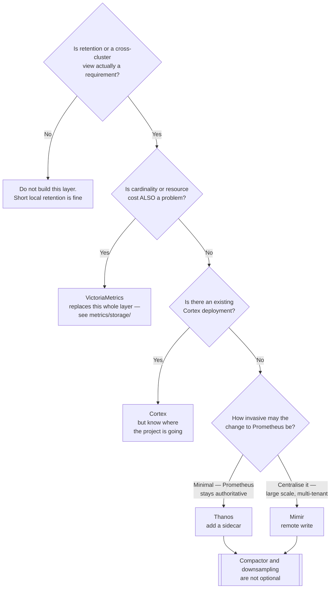

[← Metrics](../README.md)

# Long-term metrics storage

Keeping metrics for months or years, and querying across clusters.

Tools covered: [`thanos`](thanos/) · [`mimir`](mimir/) · [`cortex`](cortex/)

## Contents

1. [Why this layer exists at all](#1-why-this-layer-exists-at-all)
2. [How they all work](#2-how-they-all-work)
3. [The tools](#3-the-tools)
4. [Decision tree](#4-decision-tree)
5. [Anti-patterns](#5-anti-patterns)
6. [How this applies to pikakube](#6-how-this-applies-to-pikakube)

---

## 1. Why this layer exists at all

Prometheus is deliberately **not** a long-term store. It keeps a recent window on local disk,
and that design choice is what makes it simple and fast.

Three problems follow, and this folder solves all three:

| Problem | Consequence |
|---|---|
| **Retention** | "what did this look like during last quarter's peak?" is unanswerable |
| **Durability** | a lost node is lost metrics; local disk is not a backup |
| **Global view** | five clusters means five Prometheus instances and no query across them |

The third is often the real driver. Capacity planning, cost attribution and year-over-year
comparison all need one query surface, and federation does not provide it.

## 2. How they all work

The same shape in each case:

1. Prometheus writes blocks to **object storage** — a sidecar, or remote write
2. A **compactor** merges and downsamples them, so old data is cheap and fast to query
3. A **query layer** presents recent local data and historical object-storage data as one endpoint

Downsampling is the part that makes it economical: five-second resolution is pointless for
data from eight months ago, and reducing it to five minutes shrinks storage and speeds up long
queries dramatically.

## 3. The tools

| Tool | Model | Shines when | Detail |
|---|---|---|---|
| **Thanos** | sidecar next to each Prometheus, object storage behind | you already run Prometheus and want to extend it with minimal disruption | [→](thanos/) |
| **Mimir** | remote write into a horizontally scalable cluster | very large scale, multi-tenancy, and Grafana is the stack | [→](mimir/) |
| **Cortex** | remote write, the project Mimir forked from | you have an existing Cortex deployment | [→](cortex/) |

## 4. Decision tree

The first branch is the one people skip. This layer is several components to operate, and
"we might want history one day" is not yet a requirement.

## 5. Anti-patterns

| Anti-pattern | Why it is bad | What to do instead |
|---|---|---|
| Shipping every series to long-term storage | you pay to keep detail nobody will query | recording rules first, then ship the aggregates |
| No downsampling | long queries get slow and storage grows linearly | enable compaction and downsampling |
| No bucket lifecycle policy | "long-term" quietly becomes "forever" | set expiry on the bucket too |
| Adopting it before retention is a real problem | a distributed system to solve a question nobody asked | short local retention is fine until it is not |

## 6. How this applies to pikakube

Nothing deployed, and that is correct — a single ephemeral Kind cluster has neither a
retention requirement nor a cross-cluster view to build.

What the folder records is the decision that arrives the moment there is a second cluster or
a question about last quarter. The realistic path from where the repository is:

1. Prometheus is already running via kube-prometheus-stack → **Thanos** is the least invasive next step, because the sidecar changes nothing about it
2. Object storage on a local cluster means [MinIO](thanos/minio/) — one more stateful component to own
3. The **compactor must be a single instance per bucket**; two corrupt the data, and it is the mistake worth knowing before the first deployment rather than after

Worth stating plainly: if cardinality were the problem instead of retention, the right answer
would be to reconsider [VictoriaMetrics](../storage/victoria-metrics/) and skip this layer
altogether.

---

[← Metrics](../README.md)
