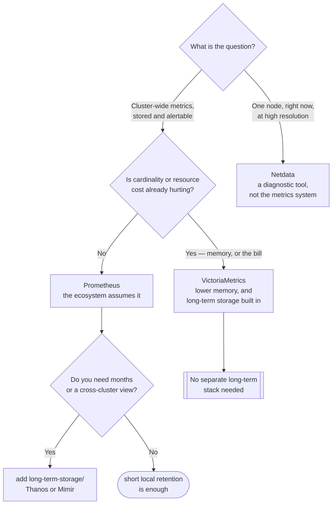

[← Metrics](../README.md)

# Metrics storage

Scraping, storing, evaluating rules, and answering queries.

Tools covered: [`prometheus`](prometheus/) · [`victoria-metrics`](victoria-metrics/) ·
[`netdata`](netdata/)

## Contents

1. [What this layer does](#1-what-this-layer-does)
2. [The tools](#2-the-tools)
3. [Prometheus or VictoriaMetrics](#3-prometheus-or-victoriametrics)
4. [Decision tree](#4-decision-tree)
5. [Anti-patterns](#5-anti-patterns)
6. [How this applies to pikakube](#6-how-this-applies-to-pikakube)

---

## 1. What this layer does

| Job | Detail |
|---|---|
| **Discover** | find scrape targets from the Kubernetes API |
| **Scrape** | pull `/metrics` on a schedule — the scrape doubles as a health check |
| **Store** | a local time-series database, optimised for recent data |
| **Evaluate** | recording rules to precompute, alerting rules to fire |
| **Query** | PromQL |

Note what is missing: **long retention**. These are designed around a recent window — days to
a few weeks. Months and years are [`long-term-storage/`](../long-term-storage/README.md), and
the separation is intentional rather than a limitation to work around.

## 2. The tools

| Tool | Notes | Detail |
|---|---|---|
| **Prometheus** | the standard; the ecosystem assumes it | [→](prometheus/) |
| **VictoriaMetrics** | PromQL-compatible, substantially lower memory and disk, and long-term storage in the same system | [→](victoria-metrics/) |
| **Netdata** | per-node real-time monitoring with automatic detection and a live UI | [→](netdata/) |

**Netdata is a different shape.** It is not a cluster-wide time-series database — it is
high-resolution per-node monitoring with its own interface. Useful for looking closely at one
machine right now; not a replacement for the other two.

## 3. Prometheus or VictoriaMetrics

The comparison worth having, since it is the only real choice here:

| | Prometheus | VictoriaMetrics |
|---|---|---|
| PromQL | native | compatible, with MetricsQL extensions |
| Memory at high cardinality | the failure mode | markedly better |
| Long-term storage | needs Thanos, Mimir or Cortex | built in |
| Ecosystem assumptions | everything assumes it | mostly compatible, occasionally not |
| Operational surface | one binary, plus a long-term stack | one system covering both |

VictoriaMetrics is technically the stronger option on resources and simplicity. Prometheus
retains the ecosystem, and that is not a small thing — it is what makes every community
dashboard and alert rule work without translation.

The honest guidance: **Prometheus unless cardinality or cost is already hurting.** Those are
the conditions under which the switch pays for the loss of default compatibility.

## 4. Decision tree

The branch worth noticing is the last one: choosing VictoriaMetrics removes the
[long-term storage](../long-term-storage/README.md) layer entirely. That is a legitimate
architectural decision, not a shortcut — one system instead of two.

## 5. Anti-patterns

| Anti-pattern | Why it is bad | What to do instead |
|---|---|---|
| Long local retention | memory and disk grow, queries slow, and it is still not durable | short window plus long-term storage |
| No persistent volume | a restart discards everything | PVC, or accept that the local window is disposable |
| One giant instance | it becomes a single point of failure and a cardinality bomb | shard by concern, or federate |
| Scraping everything at 15s | cost is per sample, and most metrics do not change that fast | tune per target |
| No recording rules | dashboards recompute the same aggregations on every refresh | precompute the common ones |

## 6. How this applies to pikakube

**Prometheus via [kube-prometheus-stack](prometheus/kube-prometheus-stack/)** is deployed —
the operator, Alertmanager, kube-state-metrics, node-exporter and Grafana in one release.

Two defaults from that chart are worth revisiting even here, because they are the ones that
bite on a real cluster and are invisible on a laptop:

| Default | Why it matters |
|---|---|
| Short local retention with no long-term storage | fine now; the first real question about last month has no answer |
| `serviceMonitorSelector` scoped to the release | a new `ServiceMonitor` looks correct and is silently never scraped |

VictoriaMetrics is mapped and not deployed, which is the right call: the switch pays for
itself when cardinality hurts, and on a single Kind cluster it never will.

---

[← Metrics](../README.md)
