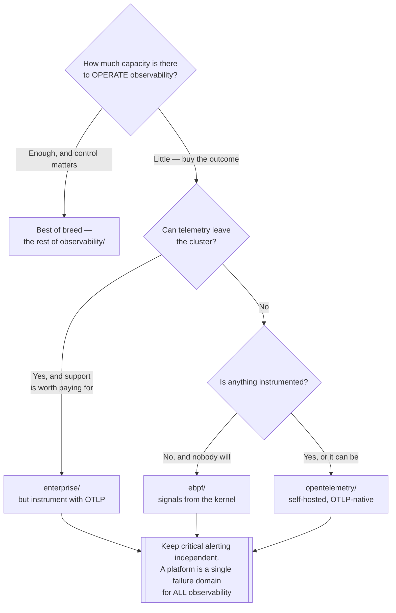

[← Observability](../README.md)

# Platforms

Tools that cover the **whole stack in one product**, instead of assembling it from a layer
per signal.

Subfolders: [`opentelemetry/`](opentelemetry/README.md) · [`ebpf/`](ebpf/README.md) ·
[`enterprise/`](enterprise/README.md)

## Contents

1. [The decision this folder represents](#1-the-decision-this-folder-represents)
2. [Three families](#2-three-families)
3. [What you give up, and what you get](#3-what-you-give-up-and-what-you-get)
4. [Decision tree](#4-decision-tree)
5. [Anti-patterns](#5-anti-patterns)
6. [How this applies to pikakube](#6-how-this-applies-to-pikakube)

---

## 1. The decision this folder represents

Everything else in `observability/` is **best of breed**: Prometheus for metrics, Loki for
logs, Tempo for traces, Pyroscope for profiles, Grafana on top. Each layer chosen, deployed,
upgraded and operated separately.

That is five or six systems with their own storage, scaling behaviour, retention settings and
failure modes — before anyone has looked at a dashboard.

A platform replaces the set with one product. The question is not which is better; it is
**how much of your team's time is available to operate observability**, and how much control
you need over where the data sits.

## 2. Three families

| Family | Approach | Folder |
|---|---|---|
| **OpenTelemetry-native** | ingest OTLP and store all signals in one backend, usually columnar | [`opentelemetry/`](opentelemetry/README.md) |
| **eBPF-first** | generate the signals themselves from the kernel, with **no instrumentation at all** | [`ebpf/`](ebpf/README.md) |
| **Enterprise SaaS** | commercial platforms, agent in your cluster and data in theirs | [`enterprise/`](enterprise/README.md) |

The distinction that matters most is between the first two:

- **OTLP-native** platforms still need your applications instrumented. They replace the *storage and query* layers, not the instrumentation work.
- **eBPF-first** platforms produce metrics, traces and a service map from the kernel, with nothing added to the application — at the cost of visibility stopping at the process boundary. They see that service A called service B and how long it took; they cannot see business context inside the call.

## 3. What you give up, and what you get

| | Best of breed | Platform |
|---|---|---|
| Components to operate | five or six | one |
| Control over storage and retention | full, per signal | whatever the product exposes |
| Portability | high — each layer replaceable | low; migrating means re-instrumenting or re-ingesting |
| Correlation between signals | you build it | built in, and usually better |
| Cost shape | infrastructure you run | licence or ingest volume |
| Failure mode | one signal degrades | everything degrades together |

The last row is worth pausing on. A platform is a single point of failure for **all**
observability, which is precisely what you need working during an incident.

Sending data to two places is a real strategy, not paranoia — critical alerting on
self-hosted Prometheus, everything else in the platform, is a common and defensible
arrangement.

## 4. Decision tree

## 5. Anti-patterns

| Anti-pattern | Why it is bad | What to do instead |
|---|---|---|
| Adopting a platform *and* keeping the stack it replaces | paying twice, and nobody knows which is authoritative | decide, and decommission |
| Choosing eBPF to avoid instrumentation entirely | it stops at the process boundary — no business context, no custom spans | eBPF for coverage, instrumentation where it matters |
| SaaS without checking what leaves the cluster | logs carry credentials and personal data | review, scrub, and confirm the data path |
| Assuming ingest-priced platforms scale linearly with comfort | log volume grows faster than budgets | model the cost at expected volume before committing |
| No fallback when the platform is down | observability is unavailable exactly during an incident | keep critical alerting independent |

## 6. How this applies to pikakube

Nothing here is deployed — the repository runs the best-of-breed path with Prometheus and
Grafana.

The folder exists to record that the **alternative was evaluated, not overlooked**. For a
small team, an OTLP-native platform is frequently the better engineering decision, and saying
so explicitly is more honest than a catalogue that only contains the components.

---

[← Observability](../README.md)
