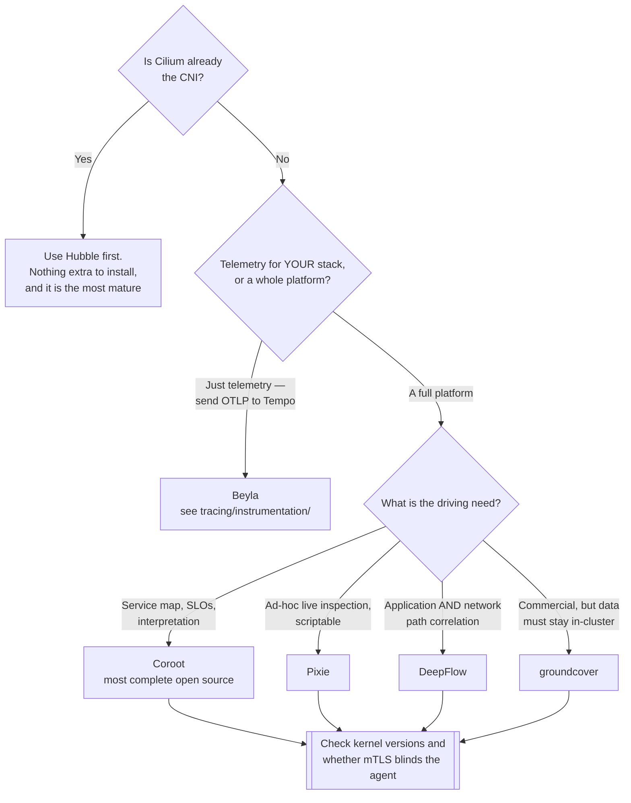

[← Platforms](../README.md)

# eBPF platforms

Observability generated from the **kernel**, with nothing added to the application.

Tools covered: [`coroot`](coroot/README.md) · [`pixie`](pixie/README.md) · [`deepflow`](deepflow/README.md) ·
[`groundcover`](groundcover/README.md) · [`anteon`](anteon/README.md)

## Contents

1. [The problem they solve](#1-the-problem-they-solve)
2. [The limit, stated plainly](#2-the-limit-stated-plainly)
3. [The tools](#3-the-tools)
4. [Decision tree](#4-decision-tree)
5. [Practical constraints](#5-practical-constraints)
6. [Anti-patterns](#6-anti-patterns)
7. [How this applies to pikakube](#7-how-this-applies-to-pikakube)

---

## 1. The problem they solve

Instrumentation is the expensive part of observability. Adding OpenTelemetry SDKs to every
service means touching every codebase, coordinating across teams, and never quite finishing —
there is always a service nobody owns.

eBPF sidesteps it. A kernel-level agent observes syscalls, sockets and protocol traffic, and
from that reconstructs:

- **a service map** — who calls whom, derived from actual traffic rather than a diagram
- **golden signals per service** — request rate, latency, error rate, with no code change
- **traces** across service boundaries, stitched from observed calls
- **resource attribution** down to the process

Deploy an agent, get a working picture of a system nobody instrumented. That is a genuinely
large step, especially for legacy services and third-party components.

## 2. The limit, stated plainly

**eBPF stops at the process boundary.** It sees that service A called service B over HTTP and
took 300ms. It cannot see:

- what happened *inside* the call — which function, which branch, which query plan
- **business context** — which customer, which tenant, which order
- custom spans and attributes your team decided were worth recording
- anything inside encrypted traffic it cannot decrypt

So it is coverage without depth. The honest posture is both: eBPF for breadth across
everything, instrumentation where depth actually matters. Treating eBPF as a reason to never
instrument is the mistake this promises to enable.

## 3. The tools

| Tool | Notes | Detail |
|---|---|---|
| **Coroot** | service map, SLOs and cost attribution from eBPF; the most complete open-source option here | [→](coroot/README.md) |
| **Pixie** | CNCF, scriptable with PxL, strong for ad-hoc live inspection | [→](pixie/README.md) |
| **DeepFlow** | deep network and application flow correlation | [→](deepflow/README.md) |
| **groundcover** | commercial, eBPF-based, data stays in your cluster | [→](groundcover/README.md) |
| **Anteon** | service map plus load testing — see its README before deploying | [→](anteon/README.md) |

## 4. Decision tree

The first branch matters most and is the one people skip: if Cilium is the CNI, a large part
of what these sell is already running.

## 5. Practical constraints

| Constraint | Why it matters |
|---|---|
| **Kernel version** | eBPF features vary; older kernels lose capability quietly |
| **Privileged agents** | these run with elevated privileges on every node — a real security consideration |
| **Overhead** | usually low, but it is per-node and worth measuring rather than assuming |
| **Encrypted traffic** | mTLS between services can blind the agent unless it can hook above the encryption |

## 6. Anti-patterns

| Anti-pattern | Why it is bad | What to do instead |
|---|---|---|
| Installing one when Cilium is already the CNI | Hubble covers much of it, better and with nothing added | check first |
| Treating eBPF as a reason never to instrument | it stops at the process boundary — no business context, ever | eBPF for breadth, SDKs for depth |
| Ignoring kernel versions | capability degrades silently on older kernels | verify across the fleet, not on one node |
| Deploying privileged agents without review | these run privileged on **every** node | a deliberate security decision |
| Assuming it sees mTLS traffic | encryption can blind the agent | confirm before relying on the service map |
| Adopting a platform and keeping the stack it replaces | paying twice, with no authoritative source | decide, then decommission |

## 7. How this applies to pikakube

Nothing deployed, and the reasoning is recorded rather than assumed: the repository runs the
best-of-breed path with Prometheus and Grafana.

Two things make this folder more relevant here than it looks:

- **[Cilium](../../../network/cni/cilium/README.md) is already documented in depth.** If it became the CNI, Hubble would cover a large share of what these platforms offer — which is exactly the first branch of the decision tree, and the reason to check before installing anything
- **[Beyla](../../tracing/instrumentation/auto-ebpf/beyla/README.md) is the lighter answer.** It emits standard OTLP into the existing stack instead of replacing it, which fits a repository that has already committed to Prometheus and Grafana

The platforms here are the right call for a team with no observability and no path to
instrumenting. That is not this repository's situation, and saying so is more useful than
listing them without a verdict.

---

[← Platforms](../README.md)
