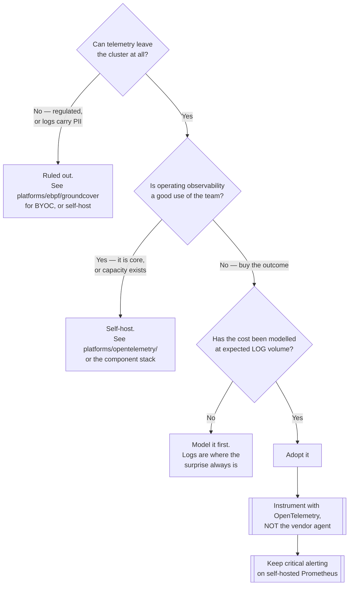

[← Platforms](../README.md)

# Enterprise platforms

Commercial observability — agent in your cluster, data in theirs.

Tools covered: [`datadog`](datadog/)

## Contents

1. [Why this folder exists in an open-source repository](#1-why-this-folder-exists-in-an-open-source-repository)
2. [What you are actually trading](#2-what-you-are-actually-trading)
3. [The mitigation worth knowing](#3-the-mitigation-worth-knowing)
4. [Decision tree](#4-decision-tree)
5. [Anti-patterns](#5-anti-patterns)
6. [How this applies to pikakube](#6-how-this-applies-to-pikakube)

---

## 1. Why this folder exists in an open-source repository

Because pretending it does not exist would be dishonest. A large share of real platforms run
Datadog, New Relic or Dynatrace, and the reasons are usually good ones:

- **nothing to operate.** No storage to scale, no retention to tune, no upgrade to plan
- **breadth on day one** — infrastructure, APM, logs, RUM, synthetics, security, all correlated
- **it is someone's job to keep it working**, with a contract behind it

The engineering case against is equally real, and both belong in the decision.

## 2. What you are actually trading

| Dimension | Consequence |
|---|---|
| **Cost shape** | priced by host, ingest volume and retention — it grows with success, and the surprise is usually logs |
| **Data location** | telemetry leaves the cluster. Logs carry credentials and personal data more often than teams expect |
| **Lock-in** | proprietary agents and query languages; migrating means re-instrumenting unless you standardised on OTLP |
| **Control** | retention, cardinality limits and sampling are the vendor's decisions, not yours |
| **Debuggability** | when the platform is wrong, you cannot look inside it |

## 3. The mitigation worth knowing

**Instrument with OpenTelemetry, not with the vendor's agent.**

Most commercial platforms accept OTLP. Emitting OTLP and routing it through the
[OpenTelemetry Collector](../../tracing/collector/opentelemetry/) means the instrumentation
in your code is vendor-neutral, and changing platform becomes a collector configuration change
rather than a fleet-wide rewrite.

This costs almost nothing at the start and is nearly impossible to retrofit later. It is the
single highest-leverage decision in this folder.

## 4. Decision tree

The last two boxes are not optional extras. They are what keeps the decision reversible and
keeps paging alive when the vendor is not.

## 5. Anti-patterns

| Anti-pattern | Why it is bad | What to do instead |
|---|---|---|
| Instrumenting with the vendor's agent | migration later means re-instrumenting the fleet | OpenTelemetry and OTLP |
| No cost model before adopting | ingest pricing grows with success, and logs are the surprise | model at expected volume |
| Sending logs without review | credentials and personal data leave the cluster | scrub at the collector |
| All alerting inside the platform | observability fails exactly when it is needed | keep critical paging self-hosted |
| Keeping the self-hosted stack "just in case" | paying twice, with no authoritative source | decide, then decommission |
| Assuming retention and cardinality are yours to set | they are the vendor's product decisions | check the limits before committing |

## 6. How this applies to pikakube

Not applicable — a laptop cluster, and the repository is explicitly an open-source catalogue.

It is mapped for one reason worth stating: **pretending commercial platforms do not exist
would make the catalogue dishonest**. A large share of real data platforms run Datadog, and the
reasons are usually good ones.

What transfers from here to a real decision is the hybrid pattern and the OTLP rule — both
cheap to adopt at the start, both close to impossible to retrofit.

---

[← Platforms](../README.md)
