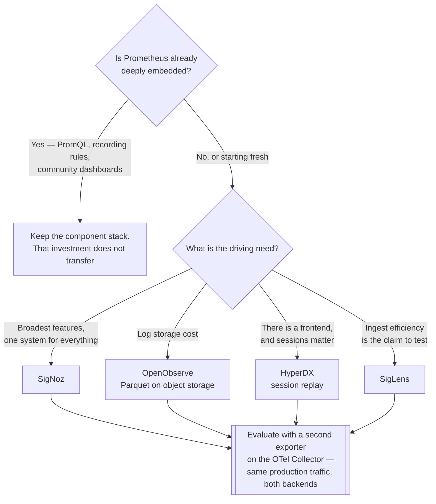

[← Platforms](../README.md)

# OpenTelemetry-native platforms

One backend for **all three signals**, fed by OTLP.

Tools covered: [`signoz`](signoz/README.md) · [`openobserve`](openobserve/README.md) ·
[`hyperdx`](hyperdx/README.md) · [`siglens`](siglens/README.md) · [`sumologic`](sumologic/)

## Contents

1. [The problem they solve](#1-the-problem-they-solve)
2. [Why OTLP is the enabling detail](#2-why-otlp-is-the-enabling-detail)
3. [The tools](#3-the-tools)
4. [Decision tree](#4-decision-tree)
5. [When this beats the component stack](#5-when-this-beats-the-component-stack)
6. [Anti-patterns](#6-anti-patterns)
7. [How this applies to pikakube](#7-how-this-applies-to-pikakube)

---

## 1. The problem they solve

The best-of-breed stack means Prometheus, Loki, Tempo and Grafana — four systems, four
storage layers, four sets of retention rules and scaling behaviour, and correlation between
signals that you wire up yourself.

These platforms accept **OTLP** and store metrics, logs and traces in one backend, usually
columnar (ClickHouse is the common choice). Correlation stops being an integration task: a
trace links to its logs because they are in the same store with the same identifiers.

## 2. Why OTLP is the enabling detail

Adopting one of these does not mean adopting a proprietary agent. Applications emit
OpenTelemetry, which is a vendor-neutral standard — so the instrumentation you write is not
tied to the backend you chose.

That changes the risk profile substantially. Migrating between OTLP-native platforms means
repointing a collector, not re-instrumenting a fleet. It is the closest thing to a reversible
decision in this space.

Consequently the [OpenTelemetry Collector](../../tracing/collector/opentelemetry/README.md) is the real
integration point, and is worth deploying **before** choosing a backend — it lets you route
the same telemetry to two destinations while evaluating.

## 3. The tools

| Tool | Notes | Detail |
|---|---|---|
| **SigNoz** | the most complete open-source option — metrics, logs, traces, dashboards and alerting on ClickHouse | [→](signoz/README.md) |
| **OpenObserve** | very efficient storage, strong on logs, small footprint | [→](openobserve/README.md) |
| **HyperDX** | trace and log correlation with session replay, on ClickHouse | [→](hyperdx/README.md) |
| **SigLens** | performance-focused, positioned on ingest cost | [→](siglens/README.md) |
| **Sumo Logic** | commercial SaaS; here for the collector and integration path | [→](sumologic/) |

## 4. Decision tree

That last step is the point of the whole folder: because ingestion is OTLP, comparing
platforms is a collector configuration change, not a migration.

## 5. When this beats the component stack

| Situation | Why |
|---|---|
| Small team, limited operational capacity | one system instead of four |
| Correlation between signals is the main pain | it is built in, not assembled |
| Starting fresh, with OTLP from day one | no migration cost to pay |
| Log volume is the cost driver | columnar storage is usually cheaper per GB than the alternatives |

## When it does not

| Situation | Why |
|---|---|
| Prometheus is deeply embedded | PromQL, recording rules, alerting rules and community dashboards are a large sunk investment |
| You need Grafana's ecosystem | the community dashboard library has no equivalent here |
| Long-term metric retention at scale | [Thanos](../../metrics/long-term-storage/thanos/README.md) and [Mimir](../../metrics/long-term-storage/mimir/README.md) are purpose-built for it |
| Independent failure domains matter | one backend means all signals fail together |

## 6. Anti-patterns

| Anti-pattern | Why it is bad | What to do instead |
|---|---|---|
| Adopting one and keeping the stack it replaces | two systems, two bills, no authoritative source | decide, then decommission |
| Instrumenting with a proprietary SDK | throws away the one property that makes this reversible | OTLP, always |
| Migrating without a parallel run | you discover the gaps after the old stack is gone | second exporter, compare on real traffic |
| Assuming PromQL and alert rules transfer | they do not, and that is usually the largest hidden cost | inventory the rules before deciding |
| One backend with no independent alerting | observability fails exactly during an incident | keep critical paging separate |

## 7. How this applies to pikakube

Not deployed — the repository runs the component stack, and that is a defensible choice for a
learning platform where each layer being visible is part of the point.

Recorded honestly: for a **small team with a real cluster**, an OTLP-native platform is
frequently the better engineering decision. One system instead of four, correlation built in
rather than assembled, and columnar storage that is cheaper per GB than the alternatives.

The reason the repository does not use one is pedagogical, not technical. Saying that plainly
is more useful than a catalogue that lists these without a verdict.

If it were ever evaluated here, the path is already in place:
[deploy the collector first](../../tracing/collector/opentelemetry/README.md), add a second exporter,
and compare on the same traffic.

---

[← Platforms](../README.md)
