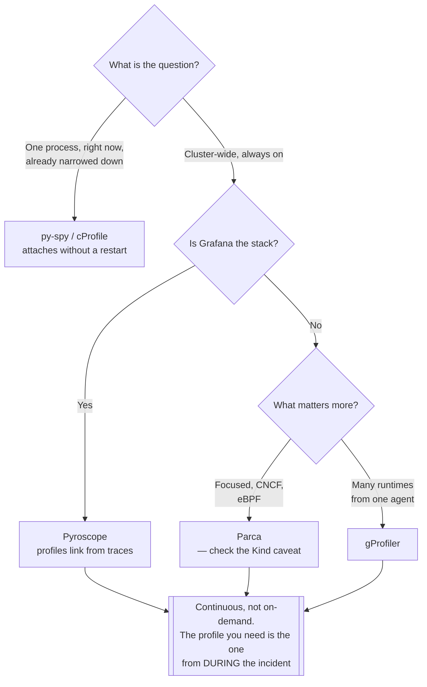

[← Observability](../README.md)

# Profiling

The fourth signal — which **line of code** is burning the CPU and the memory.

Tools covered: [`pyroscope`](pyroscope/) · [`parca`](parca/) · [`gprofiler`](gprofiler/)

## Contents

1. [Where traces stop and profiles begin](#1-where-traces-stop-and-profiles-begin)
2. [Continuous profiling](#2-continuous-profiling)
3. [The tools in this folder](#3-the-tools-in-this-folder)
4. [Language-level profilers](#4-language-level-profilers)
5. [Decision tree](#5-decision-tree)
6. [Anti-patterns](#6-anti-patterns)
7. [How this applies to pikakube](#7-how-this-applies-to-pikakube)

---

## 1. Where traces stop and profiles begin

A trace ends the investigation at **"this service took 800ms"**. It cannot say which function
inside it did.

That gap is where debugging usually turns into guesswork: add logs, deploy, wait, guess
again. Profiling answers it directly — a flame graph showing where CPU time and memory
allocation actually went, by function, in the running process.

| Signal | Answers | Ends at |
|---|---|---|
| Metrics | how often, how many, how fast | which service |
| Traces | where the time went across services | which service, and which call |
| **Profiles** | **which function inside that service** | the line |

For a data platform this is the difference between "the Spark job is slow" and "it spends 60%
of its time in serialisation".

## 2. Continuous profiling

Traditional profiling is something you enable temporarily, on one process, when a problem is
already suspected — which means it is never running when the problem happens.

**Continuous profiling** samples the whole cluster at low overhead, all the time, using eBPF
or language runtime hooks. Two consequences:

- the profile from **during the incident** already exists, rather than having to be reproduced
- regressions become comparable — this week's flame graph against last week's

Overhead is typically a few percent, which is what makes always-on viable.

## 3. The tools in this folder

| Tool | Role | Shines when | Do not use when | Detail |
|---|---|---|---|---|
| **Pyroscope** | continuous profiling, now part of Grafana | Grafana is the stack — profiles sit next to metrics, logs and traces, and link from them | you are not in the Grafana ecosystem | [→](pyroscope/) |
| **Parca** | eBPF continuous profiling, CNCF | you want a focused, standalone profiler with no wider platform attached | running on Kind — see its README | [→](parca/) |
| **gProfiler** | multi-language cluster-wide profiler | you need broad language coverage in one agent | you want deep integration with an existing stack | [→](gprofiler/) |

## 4. Language-level profilers

Cluster-wide continuous profiling and a language profiler answer different questions. When
the problem is already narrowed to one Python process, these are more direct:

| Tool | What it does |
|---|---|
| [`cProfile`](https://docs.python.org/3/library/profile.html) | the standard library profiler |
| [`py-spy`](https://github.com/benfred/py-spy) | sampling profiler that attaches to a **running** process — no code change, no restart |
| [`memory_profiler`](https://github.com/pythonprofilers/memory_profiler) | line-by-line memory usage |
| [`line_profiler`](https://github.com/pyutils/line_profiler) | line-by-line timing |

`py-spy` is the one worth remembering for a data platform: it attaches to a running Airflow
worker or Spark driver without restarting it, which matters when the problem only appears in
production.

## 5. Decision tree

## 6. Anti-patterns

| Anti-pattern | Why it is bad | What to do instead |
|---|---|---|
| Enabling profiling only after a problem appears | the incident is over, and reproducing it is the hard part | continuous profiling, always on |
| Optimising without a profile | the intuition about where time goes is usually wrong | measure first |
| Profiling a single pod and generalising | load distribution differs between replicas | profile across the fleet |
| Ignoring memory profiles | `OOMKilled` is a memory problem, and CPU flame graphs will not explain it | profile allocation too |

## 7. How this applies to pikakube

Nothing deployed. Both cluster-side options are mapped, and **Parca has a real, documented
failure on Kind** — recorded in its README, because the error message does not obviously say
"this is a Kind problem".

For a data platform this is the signal with the highest ratio of value to adoption: it is the
only one that answers "why is this job slow" without a redeploy.

---

[← Observability](../README.md)
