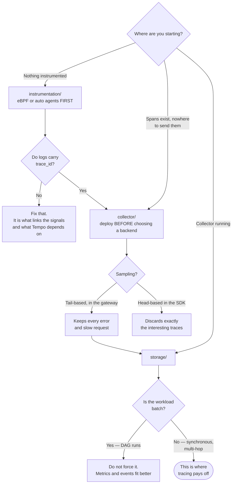

[← Observability](../README.md)

# Tracing

Following one request across every service it touched — and finding where the time went.

Subfolders: [`instrumentation/`](instrumentation/README.md) ·
[`collector/`](collector/README.md) · [`storage/`](storage/README.md)

## Contents

1. [The question only tracing answers](#1-the-question-only-tracing-answers)
2. [The three layers](#2-the-three-layers)
3. [OpenTelemetry is the decision](#3-opentelemetry-is-the-decision)
4. [Sampling](#4-sampling)
5. [Context propagation is the hard part](#5-context-propagation-is-the-hard-part)
6. [Decision tree](#6-decision-tree)
7. [Anti-patterns](#7-anti-patterns)
8. [How this applies to pikakube](#8-how-this-applies-to-pikakube)

---

## 1. The question only tracing answers

Metrics say the p99 is 3 seconds. Logs say each service looks fine. Both are true, and
neither explains anything.

A trace follows a **single request** through every service, database call and queue hop it
touched, with timing for each. The 3 seconds turns out to be 40ms of application work and
2.9s waiting on a query that nobody suspected.

| Signal | Answers |
|---|---|
| Metrics | how often, how many, how fast — in aggregate |
| Logs | what happened in one service |
| **Traces** | **where the time went, across services** |
| [Profiles](../profiling/README.md) | which function inside the slow service |

The value grows with the number of hops. In a monolith, tracing tells you little that a
profiler would not. In a data platform where a request crosses an API, a queue, a worker and
three databases, it is the only thing that can identify the guilty hop.

## 2. The three layers

The subfolders follow the pipeline, and confusing them is the usual source of "we installed
Tempo and there are no traces":

| Layer | Job | Folder |
|---|---|---|
| **Instrumentation** | produce spans — in the application, or from eBPF | [`instrumentation/`](instrumentation/README.md) |
| **Collector** | receive, batch, sample, enrich and export | [`collector/`](collector/README.md) |
| **Storage** | store and query traces | [`storage/`](storage/README.md) |

Storage is the easy part and the one people start with. **Instrumentation is where the work
is** — no backend produces traces on its own.

## 3. OpenTelemetry is the decision

The single most consequential choice here, and it is not which backend to use.

OpenTelemetry is the CNCF standard for producing and transporting telemetry: one set of SDKs,
one wire protocol (**OTLP**), one semantic convention for what fields mean. Every backend in
[`storage/`](storage/README.md) accepts it, and so do the commercial platforms.

The consequence is that **instrumentation stops being a bet on a vendor**. Changing from
Tempo to Jaeger, or to SigNoz, or to a commercial platform, becomes a collector configuration
change instead of re-instrumenting every service.

Instrumenting with a vendor's proprietary SDK saves nothing today and is nearly impossible to
undo later. This is the one decision in this folder worth being firm about.

## 4. Sampling

Tracing every request is usually unaffordable. Two strategies, and the difference matters:

| | Head-based | Tail-based |
|---|---|---|
| Decision made | at the start of the request | after the trace completes |
| Can keep all errors and slow requests? | **no** — it decided before knowing | **yes** |
| Cost | trivial | the collector must buffer complete traces |
| Where | in the SDK | in the [collector](collector/README.md) |

Head-based sampling at 1% is simple and discards 99% of the traces — including the interesting
ones, because the decision precedes any knowledge of the outcome.

Tail-based sampling keeps every error and every slow request and discards the boring
successes, which is what you actually want. It costs memory in the collector and is worth it.

## 5. Context propagation is the hard part

A trace only exists if the trace context travels with the request. HTTP calls between
instrumented services generally handle it automatically.

Where it breaks, reliably:

- **queues and asynchronous work** — Kafka, RabbitMQ, Celery. The context has to be put into the message and read back out
- **batch and scheduled jobs** — an Airflow DAG is not one request, and forcing it into a trace usually produces something misleading
- **any service that is not instrumented** — the chain stops there, and everything downstream becomes a separate trace

The result is the common disappointment: traces that end at the boundary you most wanted to
see past. Worth planning for rather than discovering.

## 6. Decision tree

## 7. Anti-patterns

| Anti-pattern | Why it is bad | What to do instead |
|---|---|---|
| Deploying a backend before instrumenting | there is nothing to store | start with instrumentation |
| A proprietary SDK | locks the instrumentation to the vendor | OpenTelemetry and OTLP |
| Head-based sampling at a low rate | discards precisely the traces worth keeping | tail-based, in the collector |
| No `trace_id` in logs | traces and logs stay separate universes | log it, and [link them](../logs/README.md#4-structured-logging) |
| Tracing everything at 100% in production | storage cost and application overhead | sample deliberately |
| Forcing batch jobs into traces | a DAG run is not a request; the model does not fit | metrics and logs for batch |
| Spans without useful attributes | you learn which service, not which case | add tenant, endpoint, and the identifiers you filter by |

## 8. How this applies to pikakube

Nothing here is deployed. The folder maps all three layers, kept separate so the choices stay
independent.

For a data platform the honest assessment: tracing pays off on the **synchronous, multi-hop**
paths — an API in front of Trino, a service calling several stores. It pays off much less on
scheduled batch pipelines, where the unit of work is a DAG run rather than a request, and
metrics plus logs describe it better.

Worth mapping, worth adopting selectively, and not the first signal to reach for here.

---

[← Observability](../README.md)
