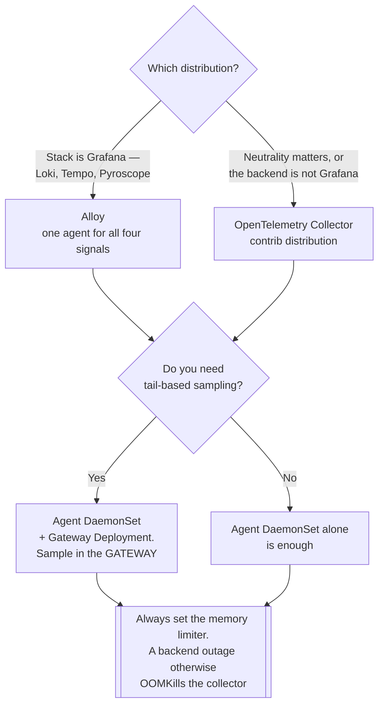

[← Tracing](../README.md)

# Collectors

Receiving telemetry, doing something useful to it, and forwarding it on.

Tools covered: [`opentelemetry/`](opentelemetry/README.md) · [`alloy/`](alloy/README.md)

## Contents

1. [Why a collector, rather than sending straight to the backend](#1-why-a-collector-rather-than-sending-straight-to-the-backend)
2. [Deployment shapes](#2-deployment-shapes)
3. [The tools](#3-the-tools)
4. [Decision tree](#4-decision-tree)
5. [Anti-patterns](#5-anti-patterns)
6. [How this applies to pikakube](#6-how-this-applies-to-pikakube)

---

## 1. Why a collector, rather than sending straight to the backend

Applications can export directly to a backend. Almost nobody should:

| Reason | What it means |
|---|---|
| **Decoupling** | applications point at one endpoint forever; changing backend is a collector config change |
| **Tail-based sampling** | the only place a complete trace exists before storage, so the only place to keep all errors and drop boring successes |
| **Enrichment** | attach cluster, region and Kubernetes metadata once, centrally, instead of in every SDK |
| **Redaction** | strip credentials and personal data before they reach storage |
| **Buffering** | survive the backend being briefly unavailable without losing data |
| **Fan-out** | send the same telemetry to two destinations — which is how you evaluate a new backend without committing |

The decoupling point is the one that matters most in practice. It is what turns "migrate the
observability backend" from a fleet-wide code change into a configuration change.

## 2. Deployment shapes

| Shape | Where it runs | Use |
|---|---|---|
| **Agent** | DaemonSet, one per node | collect local telemetry, attach node context, forward |
| **Gateway** | Deployment, a few replicas | the expensive work — tail-based sampling, transformation, routing |
| **Sidecar** | in the pod | rare; when isolation per workload is genuinely required |

**Agent plus gateway** is the standard arrangement, and tail-based sampling forces it: the
sampler must see every span of a trace, which only works when all spans reach the same
instance.

## 3. The tools

| Tool | Notes | Detail |
|---|---|---|
| **OpenTelemetry Collector** | the vendor-neutral standard; receivers, processors and exporters for effectively everything | [→](opentelemetry/README.md) |
| **Grafana Alloy** | Grafana's distribution — an OTel Collector with extra components and its own configuration language | [→](alloy/README.md) |

Alloy is a superset rather than an alternative: it is built on the OTel Collector, with
Prometheus scraping, Loki collection and eBPF profiling added. Choose it when the stack is
Grafana; choose the upstream collector when neutrality matters.

## 4. Decision tree

Tail-based sampling is what forces the two-tier shape: the sampler must see **every span of a
trace**, and on a DaemonSet those spans land on different nodes.

## 5. Anti-patterns

| Anti-pattern | Why it is bad | What to do instead |
|---|---|---|
| Applications exporting directly to the backend | every backend change is a fleet-wide code change | point them at a collector |
| Head-based sampling in the SDK | discards errors before knowing they were errors | tail-based, in the gateway |
| Tail-based sampling on the agent | spans of one trace land on different nodes and the sampler sees fragments | sample in the gateway |
| No memory limiter | a backend outage backs up and the collector is OOMKilled | configure the memory limiter and queue |
| Not monitoring the collector | telemetry stops and the thing that would tell you is the thing that stopped | alert on its own metrics |

## 6. How this applies to pikakube

Nothing deployed, and this is the component worth deploying **before** choosing any backend.

The reason is specific: with a collector in front, evaluating [SigNoz](../../platforms/opentelemetry/signoz/README.md),
Tempo or a commercial platform means **adding an exporter** and comparing them on the same
production telemetry. Without one, every comparison is a migration.

For this repository, [Alloy](alloy/README.md) is the natural pick — Grafana is already the UI, and one
agent covers metrics, logs, traces and eBPF profiling instead of four. The upstream collector
would be the choice if neutrality mattered more than convenience.

---

[← Tracing](../README.md)
