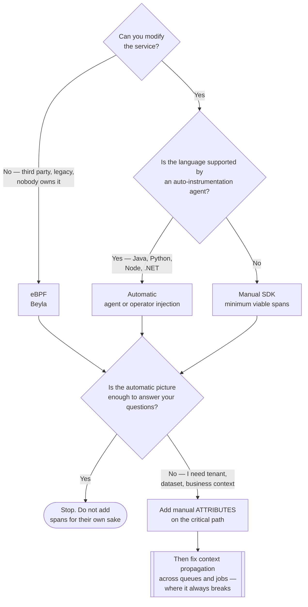

[← Tracing](../README.md)

# Instrumentation

Producing the telemetry in the first place — the layer where the actual work is.

Subfolders: [`opentelemetry/`](opentelemetry/README.md) · [`manual/`](manual/README.md) ·
[`auto-ebpf/`](auto-ebpf/README.md)

## Contents

1. [Why this is the hard part](#1-why-this-is-the-hard-part)
2. [Three approaches](#2-three-approaches)
3. [Decision tree](#3-decision-tree)
4. [What each layer cannot do](#4-what-each-layer-cannot-do)
5. [Anti-patterns](#5-anti-patterns)
6. [How this applies to pikakube](#6-how-this-applies-to-pikakube)

---

## 1. Why this is the hard part

Backends are easy to deploy. Instrumentation touches every codebase, needs agreement from
every team, and is never quite finished — there is always a service nobody owns.

That asymmetry is why tracing projects stall: the storage is running, the dashboards exist,
and 40% of services emit nothing, so every trace ends at a boundary.

## 2. Three approaches

| Approach | How | Depth | Effort |
|---|---|---|---|
| **Automatic** | an agent or SDK hook instruments known libraries — HTTP servers, clients, database drivers | service-to-service calls, no business context | low — often a flag or an init |
| **Manual** | the developer creates spans and attributes explicitly | whatever you decide, including business context | high, per service |
| **eBPF** | the kernel observes traffic and reconstructs spans | service-to-service only, stops at the process boundary | none — nothing changes in the app |

They are complementary rather than competing, and the sensible order is the reverse of how
people usually approach it:

1. **eBPF or automatic** first, for coverage across everything including the services nobody will modify
2. **Manual** afterwards, only where the automatic picture is not enough — the critical path, the business-relevant attributes

Starting with manual instrumentation means months of work before the first useful trace.

## 3. Decision tree

Read the order carefully: coverage first, depth second. The usual failure is starting at
manual instrumentation, which means months of work before the first useful trace.

## 4. What each layer cannot do

| | Blind to |
|---|---|
| eBPF | anything inside the process; encrypted traffic it cannot hook above; business identifiers |
| Automatic | code paths that are not a known library call; custom logic |
| Manual | whatever nobody remembered to instrument |

## The part that is not optional

**Context propagation.** Automatic instrumentation handles HTTP well and asynchronous work
badly. Queues, schedulers and background jobs need the trace context carried in the message
explicitly, or the chain breaks exactly where the interesting latency lives.

See [`../README.md`](../README.md#5-context-propagation-is-the-hard-part).

## Also here: logs and metrics

OpenTelemetry is not only tracing. The [`manual/`](manual/README.md) folder covers all three signals,
because the SDKs emit metrics and logs over the same protocol — which is the point of adopting
OTLP rather than a tracing-specific SDK.

The practical benefit is that a log written through the SDK carries the **`trace_id`
automatically**, which is what links the signals together without anyone having to remember.

## 5. Anti-patterns

| Anti-pattern | Why it is bad | What to do instead |
|---|---|---|
| Starting with manual instrumentation | months of work before the first useful trace | eBPF or automatic for coverage, manual afterwards |
| A vendor's proprietary SDK | the instrumentation becomes a bet on the backend | OpenTelemetry and OTLP |
| Treating eBPF as a reason never to instrument | it stops at the process boundary — no business context, ever | a floor, not a ceiling |
| Adding spans rather than attributes | 200 spans per request is harder to read than 12, and costs more | fewer spans, better attributes |
| Ignoring context propagation in queues | the trace ends exactly where the interesting latency starts | carry the context in the message |
| Forcing batch jobs into traces | a DAG run is not a request | metrics and logs for batch |

## 6. How this applies to pikakube

Nothing deployed, and this is the layer that would have to come **first** if tracing were
adopted — before any backend.

The realistic sequence for this repository:

1. **[Beyla](auto-ebpf/beyla/README.md)** for immediate coverage, emitting standard OTLP so nothing is locked in
2. **`trace_id` in structured logs**, which is what makes [Tempo](../storage/tempo/README.md) usable at all
3. **Manual attributes** only on paths where tenant or dataset context changes the answer

The honest caveat stays the same: on scheduled batch pipelines the model fits badly, and the
effort is better spent on metrics and [events](../../events/README.md).

---

[← Tracing](../README.md)
