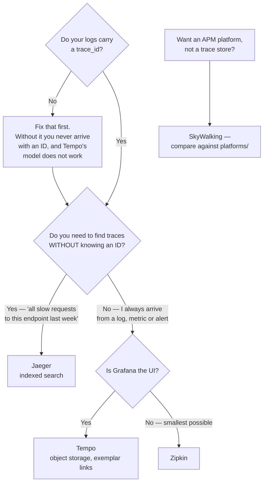

[← Tracing](../README.md)

# Trace storage

Where traces land, and how they are queried.

Tools covered: [`tempo`](tempo/) · [`jaeger`](jaeger/) · [`zipkin`](zipkin/) ·
[`skywalking`](skywalking/)

## Contents

1. [The easy layer](#1-the-easy-layer)
2. [The one real distinction: index or not](#2-the-one-real-distinction-index-or-not)
3. [The tools](#3-the-tools)
4. [Decision tree](#4-decision-tree)
5. [Anti-patterns](#5-anti-patterns)
6. [How this applies to pikakube](#6-how-this-applies-to-pikakube)

---

## 1. The easy layer

Worth saying plainly: **this is the least important decision in the tracing stack.**

All of these accept OTLP, all store spans, all let you look up a trace. Because
instrumentation is OpenTelemetry, swapping between them is a collector configuration change.

The work is in [`instrumentation/`](../instrumentation/README.md). Choosing a backend first
is how tracing projects end up with a running Tempo and no traces in it.

## 2. The one real distinction: index or not

| | Index everything | Index almost nothing |
|---|---|---|
| Tools | Jaeger, SkyWalking, Zipkin | Tempo |
| Find a trace by | service, operation, tags, duration — search | **trace ID**, then TraceQL over the matching window |
| Storage cost | higher; the index grows with span volume | very low — object storage, minimal index |
| Best when | you explore traces without knowing which one | you arrive from a log, a metric or an alert that already carries the ID |

This mirrors the same trade in [log storage](../../logs/storage/README.md), and the reasoning
is the same: in practice you almost always **arrive with context**. A log line with a
`trace_id`, an exemplar on a latency graph, an alert — each hands you the identifier.

That is why Tempo's design works despite sounding limiting, and why it is the default in a
Grafana stack.

## 3. The tools

| Tool | Notes | Detail |
|---|---|---|
| **Tempo** | object storage, minimal index, TraceQL, Grafana-native | [→](tempo/) |
| **Jaeger** | CNCF, mature, full search UI; the reference implementation for many | [→](jaeger/) |
| **Zipkin** | the original; simple, small, still perfectly serviceable | [→](zipkin/) |
| **SkyWalking** | APM platform rather than a trace store — traces, metrics, topology and alerting in one | [→](skywalking/) |

**SkyWalking is the odd one.** It is closer to the tools in
[`platforms/`](../../platforms/README.md) than to a trace backend, and it is worth evaluating
against those rather than against Tempo and Jaeger.

## 4. Decision tree

The first question is the one that decides everything, and it is not about the backend. Tempo
is cheap **because** it assumes you arrive with an identifier. Deploy it without `trace_id` in
logs and you get a store you cannot navigate.

## 5. Anti-patterns

| Anti-pattern | Why it is bad | What to do instead |
|---|---|---|
| Choosing storage before instrumenting | the hard part is upstream, and the backend sits empty | instrument first |
| No `trace_id` in logs | Tempo's model depends on arriving with an ID, and you never have one | log it |
| Storing 100% of traces indefinitely | cost grows with traffic and nobody reads old traces | tail-based sampling and short retention |
| Treating SkyWalking as a drop-in for Tempo | it is a platform with different assumptions | compare it against platforms |

## 6. How this applies to pikakube

Nothing deployed, and this is deliberately the **last** thing to deploy rather than the first.

The order that matters for this repository:

1. **`trace_id` in structured logs** — nothing here works without it
2. **[Instrumentation](../instrumentation/README.md)** — Beyla for coverage, SDKs on the critical path
3. **[Collector](../collector/README.md)** — with tail-based sampling, so errors survive
4. **Then** a backend, which would be Tempo, because Grafana is already the UI

Doing it in reverse is the common failure: a running Tempo with nothing in it, and the
conclusion that tracing "did not work".

For a data platform, worth repeating the honest limit from
[`../README.md`](../README.md#7-how-this-applies-to-pikakube): traces pay off on synchronous
multi-hop paths, and much less on scheduled batch pipelines where the unit of work is a DAG
run rather than a request.

---

[← Tracing](../README.md)
