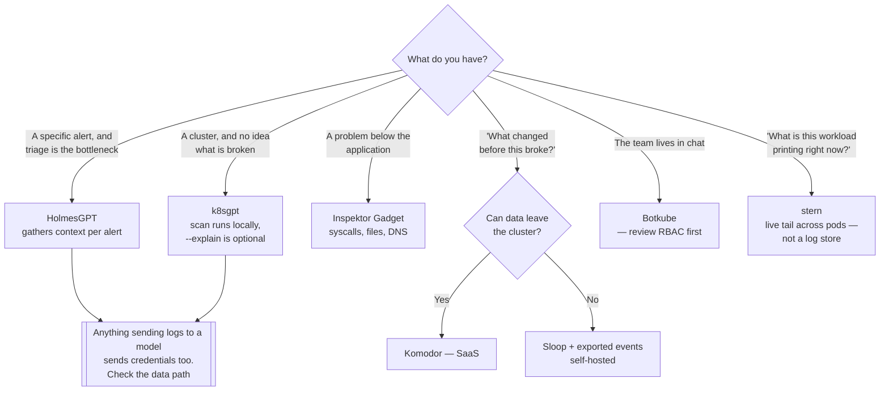

[← Observability](../README.md)

# Troubleshooting

Turning signals into a diagnosis — including letting a machine narrow it down first.

Tools covered: [`k8sgpt`](k8sgpt/README.md) · [`holmesgpt`](holmesgpt/README.md) ·
[`inspektor-gadget`](inspektor-gadget/README.md) · [`botkube`](botkube/README.md) · [`komodor`](komodor/README.md) ·
[`stern`](stern/README.md)

## Contents

1. [The gap this fills](#1-the-gap-this-fills)
2. [Three different approaches](#2-three-different-approaches)
3. [The tools in this folder](#3-the-tools-in-this-folder)
4. [On AI-assisted diagnosis](#4-on-ai-assisted-diagnosis)
5. [Decision tree](#5-decision-tree)
6. [Anti-patterns](#6-anti-patterns)
7. [How this applies to pikakube](#7-how-this-applies-to-pikakube)

---

## 1. The gap this fills

The rest of this folder produces signals. None of it says **what is wrong**.

A responder gets an alert and then does the same work every time: check the pod, read the
events, pull the logs, compare against what changed, form a hypothesis. Most of that is
mechanical, and most incidents are one of a small set of recurring causes — a bad image
reference, a missing secret, an exhausted resource limit, a failed probe.

These tools automate the mechanical part.

## 2. Three different approaches

| Approach | What it does | Tools |
|---|---|---|
| **Rule-based scanning** | checks the cluster against known failure patterns and reports what looks broken | [k8sgpt](k8sgpt/README.md) |
| **AI-assisted investigation** | takes an alert, gathers context across sources, and proposes a cause | [HolmesGPT](holmesgpt/README.md), and [Aurora](../incident-management/aurora/README.md) from the incident side |
| **Deep runtime inspection** | eBPF tooling that observes syscalls, file and network activity live | [Inspektor Gadget](inspektor-gadget/README.md) |

Plus two that change **where** the work happens rather than what it is:
[Botkube](botkube/README.md) brings the cluster into chat, and [Komodor](komodor/README.md) reconstructs change
timelines.

And one that does none of the above and is used in almost every incident anyway:
[stern](stern/README.md) tails logs from many pods at once. It diagnoses nothing — it just
puts the output in front of you, which is usually the step before a diagnosis.

## 3. The tools in this folder

| Tool | Role | Shines when | Do not use when | Detail |
|---|---|---|---|---|
| **k8sgpt** | scans for known problems, optionally explaining them with an LLM | you want an immediate list of what is broken and why, with no setup | you need deep runtime inspection | [→](k8sgpt/README.md) |
| **HolmesGPT** | AI investigation that gathers context and proposes root cause | alerts arrive and triage is the bottleneck | you cannot send cluster data to a model | [→](holmesgpt/README.md) |
| **Inspektor Gadget** | eBPF inspection — syscalls, file, network, DNS, per pod | the problem is below the application and `kubectl` cannot see it | ordinary application-level debugging | [→](inspektor-gadget/README.md) |
| **Botkube** | cluster interaction and notifications from chat | the team lives in Slack and you want triage without a terminal | you want the diagnosis itself, not access to run commands | [→](botkube/README.md) |
| **Komodor** | change and event timeline, SaaS | "what changed before this broke" is the recurring question | data cannot leave the cluster | [→](komodor/README.md) |
| **stern** | tails logs from many pods and containers at once, CLI | the answer is in the logs of a multi-replica workload, right now | you need history, search or retention — that is [`logs/`](../logs/README.md) | [→](stern/README.md) |

## 4. On AI-assisted diagnosis

Worth being clear-eyed, since three tools here lean on it.

**Where it genuinely helps:** the boring recurring cases. `ImagePullBackOff` from a typo, a
missing ConfigMap, a probe pointed at the wrong port. It finds these instantly and correctly,
and that is most incidents by count.

**Where it does not:** anything novel, distributed or subtle. It will still produce a
confident answer, and a plausible wrong hypothesis costs more than no hypothesis, because
people follow it.

**The constraint that decides adoption:** these tools send cluster state — object names,
logs, events — to a model. Logs contain credentials, connection strings and personal data
more often than anyone expects. Check where the data goes and whether a local model is an
option before deploying one.

## 5. Decision tree

## 6. Anti-patterns

| Anti-pattern | Why it is bad | What to do instead |
|---|---|---|
| Trusting an AI diagnosis without verification | confident and wrong is worse than silent | treat it as a hypothesis, then check |
| Sending logs to an external model without review | credentials and personal data leak through logs routinely | scrub, scope, or run locally |
| Chat-based `kubectl` without RBAC review | the bot's permissions become everyone's permissions | least privilege, and audit it |
| Reaching for eBPF inspection first | most problems are events, config or resources | scan first, inspect after |
| Automating triage instead of fixing recurring causes | the same incident is diagnosed faster forever | fix the class of problem |
| Treating a live tail as the logging strategy | stern reads from the kubelet — deleted pods and rotated logs are gone | ship logs to [`logs/storage/`](../logs/storage/README.md); tail for the incident, query for the post-mortem |

## 7. How this applies to pikakube

Nothing deployed. **k8sgpt** is the one with usage recorded — see its README — and is the most
practical starting point: a scan needs no LLM at all, and the explanations are optional on
top.

The honest framing for the repository: this folder automates the first ten minutes. It does
not replace the method in
[`network/troubleshooting/`](../../network/troubleshooting/README.md), which is about knowing
which layer to check in which order.

---

[← Observability](../README.md)
