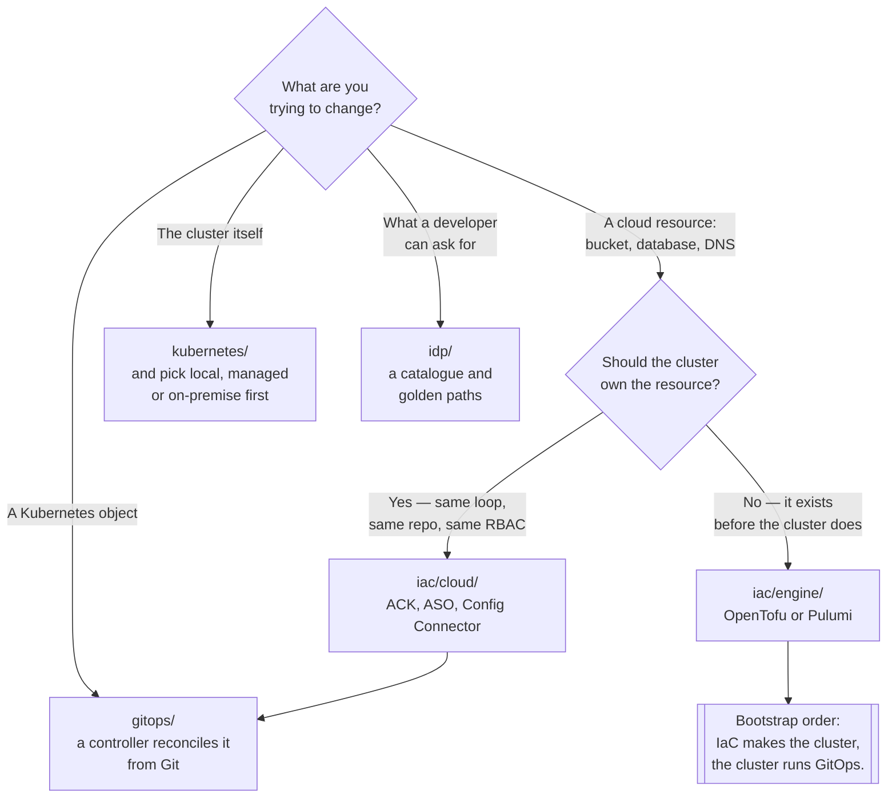

[← infrastructure/](../)

# Platform engineering

The layer that turns a Kubernetes cluster into something other people can use without asking you first.

Tools covered: [`gitops/`](gitops/README.md) · [`iac/`](iac/README.md) · [`idp/`](idp/README.md) · [`kubernetes/`](kubernetes/README.md)

## Contents

1. [What belongs here](#1-what-belongs-here)
2. [The map](#2-the-map)
3. [The two directions of "declarative"](#3-the-two-directions-of-declarative)
4. [Decision tree](#4-decision-tree)
5. [Where the boundaries are](#5-where-the-boundaries-are)
6. [Anti-patterns](#6-anti-patterns)
7. [How this applies to pikakube](#7-how-this-applies-to-pikakube)

---

## 1. What belongs here

Platform engineering is the part of the stack that has **no end user of its own**. Nothing in this
folder serves traffic. Everything in it exists so that the things that do serve traffic can be
created, changed and destroyed without a human running commands by hand.

Three questions define the discipline, and each one owns a subfolder:

| Question | Folder |
|---|---|
| How does what is in Git become what is in the cluster? | [`gitops/`](gitops/README.md) |
| How does infrastructure outside the cluster get created? | [`iac/`](iac/README.md) |
| How does a developer request something without opening a ticket? | [`idp/`](idp/README.md) |
| What is the cluster itself, and how is it run? | [`kubernetes/`](kubernetes/README.md) |

## 2. The map

| Folder | The question it answers |
|---|---|
| [`gitops/`](gitops/README.md) | the reconciliation loop — Flux, Argo CD, Fleet, and the patterns around them |
| [`iac/`](iac/README.md) | provisioning what Kubernetes cannot provision itself — cloud resources, engines, linting |
| [`idp/`](idp/README.md) | the developer-facing surface: catalogues, self-service, golden paths |
| [`kubernetes/`](kubernetes/README.md) | the cluster: local, managed and on-premise, plus everything that runs alongside it |

The order is not alphabetical by accident — it is roughly the order in which the pieces become
load-bearing. A cluster with no GitOps is a cluster nobody can reason about. An IDP on top of a
platform with no reconciliation loop is a button that produces drift.

## 3. The two directions of "declarative"

Both `gitops/` and `iac/` claim to be declarative, and they are, but they point in opposite
directions. Getting this wrong produces a platform where two systems fight over the same resource.

| | **GitOps** | **Infrastructure as Code** |
|---|---|---|
| Source of truth | a Git repository | a state file, or the cluster |
| Who applies it | a controller **inside** the cluster, continuously | a human or a pipeline, **on demand** |
| Drift | corrected automatically | detected at the next `plan`, if someone runs one |
| Scope | Kubernetes objects | anything with an API — VPCs, DNS, buckets, and clusters |
| Failure mode | a reconciliation loop that will not converge | a state file that no longer matches reality |

The two meet in one specific place: **who creates the cluster that runs the GitOps controller**.
That is a bootstrap problem and it is genuinely awkward — IaC creates the cluster, the cluster runs
the controller, the controller manages everything else including, sometimes, more IaC.

The [`iac/cloud/`](iac/cloud/README.md) controllers are the attempt to collapse this: express cloud
resources as Kubernetes CRDs so a single reconciliation loop covers both sides. It works, and it
moves the bootstrap problem rather than removing it.

## 4. Decision tree

## 5. Where the boundaries are

| Concern | Where |
|---|---|
| Building and testing the artefact | `devops/cicd/` — a different loop, running before this one |
| Rendering manifests: Helm, Kustomize, KCL | `devops/templating/` — GitOps consumes the output |
| Canary and blue/green rollouts | [`site-reliability-engineering/progressive-delivery/`](../site-reliability-engineering/progressive-delivery/README.md) |
| Promotion between environments | [`site-reliability-engineering/lifecycle-orchestration/`](../site-reliability-engineering/lifecycle-orchestration/README.md) |
| Keeping chart and image versions current | [`site-reliability-engineering/tools-update/`](../site-reliability-engineering/tools-update/README.md) |
| Secrets that the GitOps repo must not contain | `security/` |

The `devops/cicd/` boundary is the one worth stating explicitly, because it is where most teams
blur the line: **CI builds an artefact and writes a version somewhere. CD is a controller noticing
and converging.** A pipeline that ends in `kubectl apply` has collapsed the two, and the result is a
cluster whose state depends on which pipeline ran last.

## 6. Anti-patterns

| Anti-pattern | Why it is bad | What to do instead |
|---|---|---|
| `kubectl apply` from a CI job | the cluster's state is whatever the last pipeline did; nothing reconciles | commit the change, let a controller apply it |
| Terraform managing Kubernetes objects | two reconcilers on one resource, and the state file is always stale | IaC to the cluster boundary, GitOps inside it |
| An IDP before a reconciliation loop | a self-service button that creates drift faster than it can be cleaned up | GitOps first, then the portal on top |
| Cluster bootstrap done by hand | the one thing that cannot be rebuilt is the thing everything depends on | scripted or IaC-provisioned, and written down |
| Manifests hand-written per environment | environments diverge quietly until one of them breaks | a templating tool, one source, per-environment values |
| Secrets committed to the GitOps repo | the repo is the one artefact everyone has a copy of | a secrets controller; the repo holds a reference |
| One giant repo, one giant reconciler | one bad commit stops every reconciliation on the cluster | split by team or by concern, with separate sources |

## 7. How this applies to pikakube

**Flux is the platform's reconciliation loop, and it is not a preference here — it is recorded as a
conclusion.** [`gitops/argocd/`](gitops/argocd/README.md) carries a direct comparison written after
using both, and it comes down against Argo CD on component architecture, on secrets handling, and on
the absence of a `HelmRepository` equivalent. That note is worth more than any feature matrix.

The Flux installation itself is managed by
[`flux-operator`](gitops/flux/flux-operator/README.md) rather than by `flux bootstrap`, with a
`FluxInstance` pinning the distribution, the component list and the sync source — which makes the
bootstrap step declarative rather than a command someone once ran.

[`iac/`](iac/README.md) is mostly a survey. The one thing with manifests checked in is
[Azure Service Operator](iac/cloud/azure-service-operator/README.md); the engines
([OpenTofu](iac/engine/opentofu/README.md), [Pulumi](iac/engine/pulumi/README.md)) are evaluated,
and the Pulumi evaluation is blunt about what it found.

[`kubernetes/`](kubernetes/README.md) is the largest folder in the repository by a wide margin, and
[`idp/`](idp/README.md) is the smallest — which is an accurate picture of where the effort has gone
and where the gap is.

---

[← infrastructure/](../)
