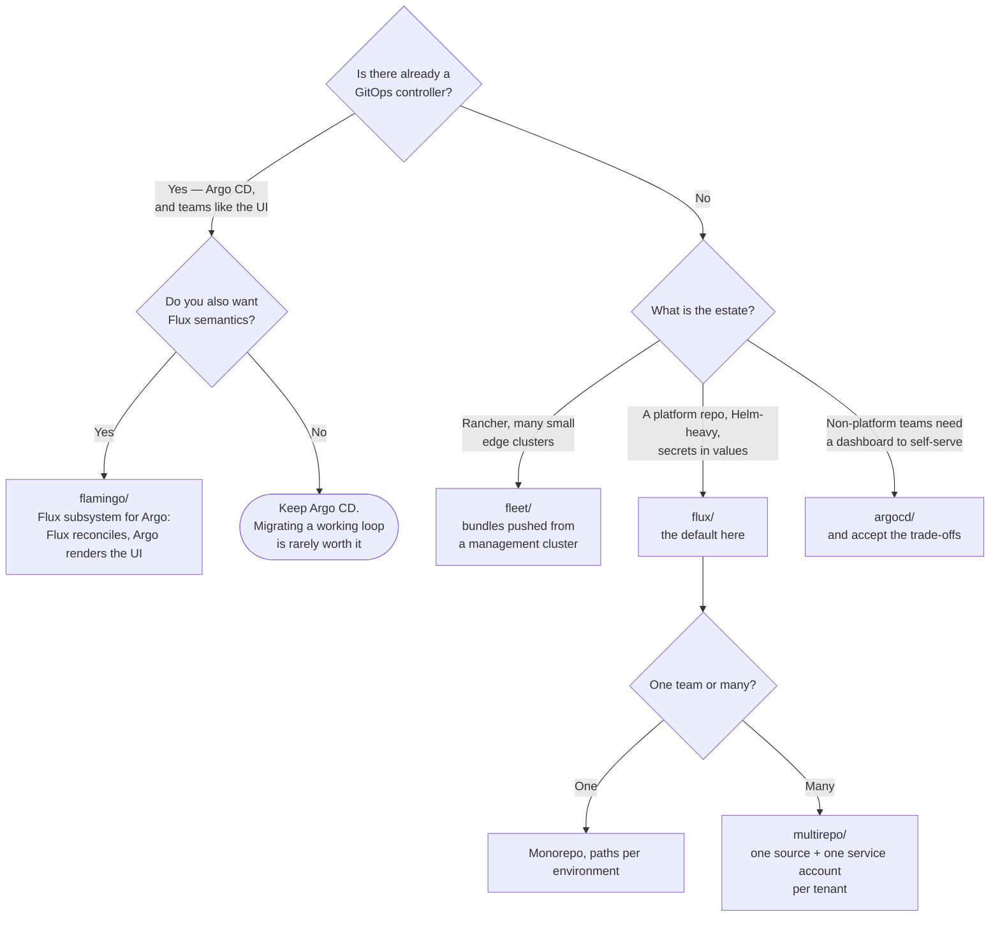

[← Platform engineering](../README.md)

# GitOps

A controller in the cluster, a repository outside it, and a loop between them that never stops.

Tools covered: [`argocd/`](argocd/README.md) · [`flux/`](flux/README.md) · [`fleet/`](fleet/README.md) · [`flamingo/`](flamingo/README.md) · [`multirepo/`](multirepo/README.md)

## Contents

1. [What GitOps actually claims](#1-what-gitops-actually-claims)
2. [Pull beats push, and why](#2-pull-beats-push-and-why)
3. [Flux or Argo CD](#3-flux-or-argo-cd)
4. [Repository layout: mono, multi, app-of-apps](#4-repository-layout-mono-multi-app-of-apps)
5. [The three things GitOps does not solve](#5-the-three-things-gitops-does-not-solve)
6. [Decision tree](#6-decision-tree)
7. [Anti-patterns](#7-anti-patterns)
8. [Notes](#8-notes)
9. [How this applies to pikakube](#9-how-this-applies-to-pikakube)

---

## 1. What GitOps actually claims

The OpenGitOps project reduces it to four principles, and they are worth reading literally because
most "we do GitOps" setups fail at least one:

| Principle | What it rules out |
|---|---|
| **Declarative** | imperative steps, scripts that mutate the cluster |
| **Versioned and immutable** | a source of truth that can be edited without a commit |
| **Pulled automatically** | a human deciding when the cluster catches up |
| **Continuously reconciled** | applying once and hoping nothing changed |

The fourth is the one that separates GitOps from "CD with a Git trigger". A pipeline that applies
on merge satisfies the first three and none of the value: nothing notices when somebody edits a
Deployment by hand at 2am, and nothing puts it back.

Reconciliation means the desired state is asserted **on a timer**, forever. Drift is not detected
and reported — it is overwritten.

## 2. Pull beats push, and why

| | **Push** (pipeline applies) | **Pull** (controller reconciles) |
|---|---|---|
| Credentials | the CI system holds cluster admin | the cluster holds read access to a repo |
| Network | CI must reach the API server | the cluster reaches out; no inbound path needed |
| Drift | invisible until the next deploy | corrected on the next interval |
| Private clusters | needs a tunnel or a runner inside | works unchanged |
| Blast radius of a leaked token | every cluster the pipeline can reach | one repository, read-only |

The credential argument is the decisive one. In a push model, the CI system is the most privileged
component in the estate and it is also the one most exposed to third-party actions and pull requests
from strangers. In a pull model the cluster needs no inbound access at all.

## 3. Flux or Argo CD

The two real options. This repository has used both, and the comparison in
[`argocd/`](argocd/README.md) is the primary source — this table is the summary.

| | **Flux** | **Argo CD** |
|---|---|---|
| Shape | a set of controllers, one per concern | one application, with a UI at its centre |
| Sources | `GitRepository`, `OCIRepository`, `HelmRepository`, `Bucket` — separate objects | repository credentials configured on the server |
| Helm | `HelmRepository` + `HelmRelease`, chart source is a first-class object | inline chart reference per Application |
| Secrets in values | reference a `Secret` from the `HelmRelease` | awkward; usually a plugin or a separate tool |
| UI | none built in — see [`flux-ui/`](flux/flux-ui/README.md) | the reason many people pick it |
| Multi-tenancy | namespaces, service accounts, per-source RBAC | Projects and RBAC on the server |
| Self-healing | the only mode there is | a flag you can turn off |

Two structural differences matter more than the feature list:

- **Component architecture.** Flux splits source fetching, Kustomize rendering, Helm releasing and
  notification into separate controllers with separate CRDs. Each does one thing and can be
  disabled. Argo CD is one system that does all of it, and the seam between "where the chart comes
  from" and "what is deployed" does not exist as an object you can point at.
- **Self-healing as an option.** Argo CD's `selfHeal: true` is a per-Application setting. A
  reconciliation loop that can be switched off per application is a reconciliation loop you cannot
  reason about globally.

Argo CD's advantages are real: the UI is genuinely good, the ecosystem around it (Rollouts,
Workflows, Events) is larger, and non-platform teams find it easier to approach. If a dashboard is
the requirement, that is a legitimate reason to choose it.

## 4. Repository layout: mono, multi, app-of-apps

Three shapes, and the choice is about **who can break whose deployment**.

| Shape | How | Cost |
|---|---|---|
| **Monorepo** | one repo, one source, paths per environment | one bad commit stalls every reconciliation |
| **Multi-repo** | one source object per team or per concern | more objects, more credentials, real isolation |
| **App-of-apps** | one Argo `Application` whose contents are more `Application`s | a single root; convenient and a single point of failure |

The app-of-apps pattern is Argo CD's answer to bootstrapping: one Application points at a directory
of Applications, and everything else follows from it. Flux gets the same effect by having a root
`Kustomization` that creates more `Kustomization` objects, which is the same idea without a name.

[`multirepo/`](multirepo/README.md) documents the multi-repo shape with the piece people forget:
**a service account per tenant**, so a `Kustomization` for one team cannot apply objects on behalf
of another.

## 5. The three things GitOps does not solve

Worth being explicit, because each one gets attributed to GitOps and then reported as a
disappointment:

- **Secrets.** The repository is the artefact everyone has a copy of. GitOps needs a secrets
  controller alongside it; it does not provide one.
- **Promotion between environments.** Reconciliation converges one target to one source. Deciding
  that `dev` is good enough for `staging` is a separate concern —
  see [`lifecycle-orchestration/`](../../site-reliability-engineering/lifecycle-orchestration/README.md).
- **Release strategy.** A reconciler applies the desired state; it does not shift 5% of traffic and
  watch the error rate. That is
  [`progressive-delivery/`](../../site-reliability-engineering/progressive-delivery/README.md).

A fourth, quieter one: **GitOps does not decide what version to deploy.** Something has to write a
new tag into the repository, whether that is a CI job, an image-automation controller, or a
dependency bot.

## 6. Decision tree

## 7. Anti-patterns

| Anti-pattern | Why it is bad | What to do instead |
|---|---|---|
| `kubectl apply` alongside a reconciler | the controller reverts it, or worse, does not | commit it |
| Reconciliation disabled "temporarily" | the cluster and the repo diverge silently, and nobody remembers | suspend explicitly, with a reason, and resume |
| Secrets in the GitOps repository | Git history is forever and widely cloned | a secrets controller; commit only a reference |
| One repo, one root reconciler, everything | one broken manifest stops unrelated deployments | split sources; separate `Kustomization` per concern |
| CI pushing to the cluster *and* a controller pulling | two writers, non-deterministic result | pick pull, and let CI only write to the repo |
| Image tag `latest` | nothing changes in Git, so nothing reconciles, but the cluster drifts | pinned digests or tags, updated by a commit |
| No notifications on reconciliation failure | a failing `HelmRelease` is invisible until someone looks | [`flux/notification/`](flux/notification/README.md) or the equivalent |
| Cluster-wide RBAC for every tenant's reconciler | any team can apply anything anywhere | a service account per source, scoped |

## 8. Notes

The original note for this folder was four links and no commentary. Each one is a reference source
rather than a tool, which is why they sit at the discipline level:

- <https://github.com/open-gitops/project> — the CNCF working group that owns the term. Useful
  because it is the only place where "GitOps" has an agreed definition rather than a vendor's one.
- <https://github.com/open-gitops/documents> — the actual principles and glossary from that group.
  This is the source of the four principles in section 1.
- <https://github.com/argoproj/gitops-engine> — the reconciliation library extracted from Argo CD:
  diffing, syncing, health assessment. Worth knowing it exists because it is what you would build
  on if you ever needed a custom reconciler, and because it shows how much of Argo CD is
  reusable machinery versus product.
- <https://github.com/cloudogu/gitops-patterns> — a catalogue of repository layouts and promotion
  patterns. This is the practical counterpart to the principles: it answers "how many repositories"
  rather than "what is GitOps".

---

## 9. How this applies to pikakube

**Flux runs this platform.** That is a recorded decision, not a default — see
[`argocd/`](argocd/README.md), which is the most opinionated document in this folder and was written
after using both. Its conclusions: Flux's component-per-function architecture distributes better,
passing secrets through `HelmRelease` values is better, Argo CD has no `HelmRepository` equivalent,
and per-Application `selfHeal` is a strange thing to make optional.

What is actually deployed here:

| Folder | State |
|---|---|
| [`flux/flux-operator/`](flux/flux-operator/README.md) | how Flux itself is installed and pinned — a `FluxInstance`, not `flux bootstrap` |
| [`flux/notification/`](flux/notification/README.md) | Telegram alerts on Kustomization events |
| [`flux/flux-ui/`](flux/flux-ui/README.md) | both dashboards evaluated; Capacitor found redundant against the CLI |
| [`flux/tf-controller/`](flux/tf-controller/README.md) | Terraform reconciled by Flux — the IaC bridge |
| [`multirepo/`](multirepo/README.md) | the per-tenant source + service account pattern, with a recorded Kustomize gotcha |
| [`argocd/`](argocd/README.md) | deployed and evaluated; the notes are the deliverable |
| [`fleet/`](fleet/README.md) · [`flamingo/`](flamingo/README.md) | mapped, manifests present, not the platform's path |

The gap: nothing in this folder addresses **promotion**. Every environment reconciles from its own
path, and moving a version from one to the next is currently a commit somebody makes. Kargo, in
[`lifecycle-orchestration/`](../../site-reliability-engineering/lifecycle-orchestration/README.md),
is the piece that would close it.

---

[← Platform engineering](../README.md)
