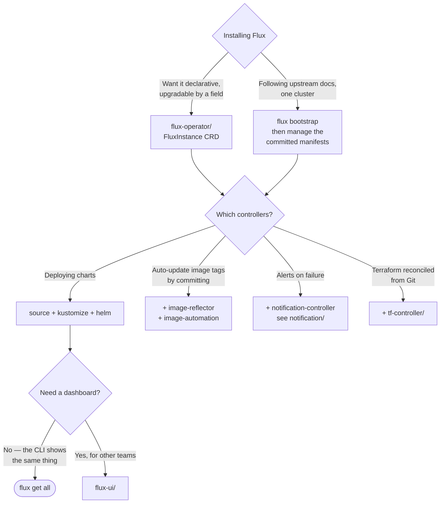

[← GitOps](../README.md)

# Flux

Six controllers, one CRD each, and no dashboard — the reconciliation engine this platform runs on.

Tools covered: [`flux-operator/`](flux-operator/README.md) · [`flux-ui/`](flux-ui/README.md) · [`notification/`](notification/README.md) · [`tf-controller/`](tf-controller/README.md)

## Contents

1. [The controllers, and why they are separate](#1-the-controllers-and-why-they-are-separate)
2. [Sources and consumers](#2-sources-and-consumers)
3. [Installing Flux: bootstrap or operator](#3-installing-flux-bootstrap-or-operator)
4. [Working with it day to day](#4-working-with-it-day-to-day)
5. [Decision tree](#5-decision-tree)
6. [Anti-patterns](#6-anti-patterns)
7. [Notes](#7-notes)
8. [How this applies to pikakube](#8-how-this-applies-to-pikakube)

---

## 1. The controllers, and why they are separate

Flux is not one program. It is a set of controllers that share a namespace and nothing else:

| Controller | Owns | Optional |
|---|---|---|
| source-controller | `GitRepository`, `OCIRepository`, `HelmRepository`, `Bucket` | no — everything reads from it |
| kustomize-controller | `Kustomization` | rarely |
| helm-controller | `HelmRelease` | if you deploy no charts |
| notification-controller | `Provider`, `Alert`, `Receiver` | **yes** |
| image-reflector-controller | `ImageRepository`, `ImagePolicy` | **yes** |
| image-automation-controller | `ImageUpdateAutomation` | **yes** |

This is the structural argument recorded in [`argocd/`](../argocd/README.md): components distributed
by function. The practical consequences are concrete rather than aesthetic.

- **You can leave things out.** The checked-in `FluxInstance` omits notification-controller and
  includes the two image controllers. That is a supported configuration, not a hack.
- **Failure is attributable.** A chart that will not install is helm-controller. A repository that
  will not fetch is source-controller. There is no shared process where "it is slow" could mean
  either.
- **Every step is an object with a status.** `kubectl get helmrepositories` tells you whether the
  chart index is reachable, independently of whether anything is deployed from it.

## 2. Sources and consumers

The split that defines Flux's model: **fetching is separate from applying.**

```
GitRepository ─┐
OCIRepository ─┼─→ Kustomization  → applies manifests
HelmRepository ┘   HelmRelease    → installs a chart
Bucket        ─┘
```

A source has an interval, credentials, a verification policy and a status. Many consumers can
reference the same source. This is what Argo CD has no equivalent of, and the reason is visible
here: in Flux, "where the chart comes from" is an object you can query, patch and monitor; in Argo CD
it is a field inside each Application and a credential on the server.

Two capabilities fall out of this that are worth knowing:

- **`valuesFrom` on a `HelmRelease`** pulls chart values from a `Secret` or `ConfigMap`, so a
  credential a chart needs never has to appear in Git. This is the second recorded advantage over
  Argo CD.
- **`dependsOn`** orders reconciliation between `Kustomization`s or `HelmRelease`s — CRDs before the
  operator, cert-manager before anything that wants a certificate. Ordering is declared, not implied
  by filenames.

## 3. Installing Flux: bootstrap or operator

Two paths, and the difference matters more than it first appears.

| | **`flux bootstrap`** | **[flux-operator](flux-operator/README.md)** |
|---|---|---|
| What it is | a CLI command that commits manifests to your repo | an operator reconciling a `FluxInstance` CRD |
| Upgrades | re-run the command with a newer CLI | change a field |
| Component list | flags at bootstrap time, edited in Git afterwards | a list in the spec |
| Who installed it | whoever ran the command | a controller |
| Cluster-specific patches | kustomize overlays you maintain | `spec.kustomize.patches` |

`flux bootstrap` is the documented path and it works. Its weakness is that the most important
installation in the cluster is the one performed imperatively, and its version is whatever version
of the CLI the last person had.

The operator turns that into a declarative object. It is what this repository uses.

## 4. Working with it day to day

Flux has no UI, and the recorded position — see [`flux-ui/`](flux-ui/README.md) — is that the CLI is
sufficient. The commands that matter are the ones that answer "what is stuck":

```sh
flux get all                       # everything, all kinds
flux get kustomizations -A
flux get sources git -A
flux get sources chart -A
flux get sources oci -A
flux get helmreleases -A           # or: flux get hr -A
flux get image all
```

Each has a `kubectl` equivalent because every one of them is a CRD — `kubectl get hr -A`,
`kubectl get kustomizations.kustomize.toolkit.fluxcd.io -n flux-system -w`. That is worth
remembering when the CLI is not installed on the machine you are debugging from.

Forcing and pausing:

```sh
flux reconcile hr <helmrelease> -n <namespace>   # do it now, do not wait for the interval
flux suspend hr <helmrelease>                    # stop reconciling — drift will not be corrected
flux resume hr <helmrelease>
```

**`suspend` is the only correct way to stop reconciliation.** Editing the resource by hand does not
work, because that is precisely what the controller undoes. It is also the thing most often left on
by accident: a suspended `HelmRelease` looks healthy and is not being managed.

## 5. Decision tree



## 6. Anti-patterns

| Anti-pattern | Why it is bad | What to do instead |
|---|---|---|
| Editing a managed resource with `kubectl edit` | the controller reverts it at the next interval | commit it, or `flux suspend` first |
| Leaving a `HelmRelease` suspended | it reads as healthy and is not managed | resume, or delete it and say so in Git |
| CRDs and the operator in one `Kustomization` | apply order is not guaranteed; the operator starts before its CRDs exist | separate them, joined by `dependsOn` |
| Secrets pasted into `HelmRelease` values | Git is the wrong place for them, and `valuesFrom` exists | a `Secret`, referenced by `valuesFrom` |
| Chart version unpinned | the desired state in Git no longer describes what is deployed | pin the version; update by commit |
| notification-controller omitted and never revisited | reconciliation failures are silent | enable it — see [`notification/`](notification/README.md) |
| One `Kustomization` for the whole cluster | one broken manifest blocks everything behind it | split by concern, with `dependsOn` where order matters |
| Upgrading Flux by re-running an old CLI | the CLI version is the installed version | pin it in the install command, or use the operator |

## 7. Notes

Project links from the original note:

- <https://github.com/fluxcd/flux2> — the distribution: CLI, controllers, CRDs.
- <https://github.com/fluxcd/helm-controller> — singled out from the six, which reflects where the
  work is on a Helm-heavy platform. It is the controller that turns a `HelmRelease` into an actual
  Helm action, and the one whose status messages you end up reading most.

### Installing the CLI

<https://fluxcd.io/flux/cmd/#install-using-bash>

```sh
curl -s https://fluxcd.io/install.sh | sudo FLUX_VERSION=2.4.0 bash
flux --version
```

The recorded version is **2.4.0**, and pinning `FLUX_VERSION` rather than taking the latest is the
point of writing it down: with `flux bootstrap`, the CLI version determines the controller versions
that get committed, so an unpinned install script is an unpinned cluster upgrade. The same script
handles updates — re-run it with a different version.

### The bootstrap command that was used

```sh
flux bootstrap github \
  --owner=andreyolv \
  --repository=big-data-platform-on-k8s \
  --branch=main \
  --path=./clusters/dev \
  --components-extra=image-reflector-controller,image-automation-controller \
  --read-write-key \
  --personal
```

Preserved as recorded, against an earlier repository name. Three flags carry the decisions:

- `--path=./clusters/dev` — the per-cluster directory convention. Each cluster reconciles its own
  path, which is what makes one repository serve several clusters.
- `--components-extra` — the two image controllers are **not** installed by default. Without them
  there is no image automation, and this is the flag people miss and then conclude the feature does
  not work.
- `--read-write-key` — the deploy key gets write access, because bootstrap commits the Flux
  manifests back to the repository and image automation later commits tag updates. A read-only key
  is enough for reconciliation and not enough for either of those.

The same layout is now expressed declaratively in the `FluxInstance` — see
[`flux-operator/`](flux-operator/README.md), whose `sync` block points at `clusters/dev` in this
repository.

### Reaching source-controller directly

```sh
kubectl port-forward svc/source-controller 8080:80 -n flux-system
```

source-controller serves the artefacts it has fetched over HTTP — the tarballs the other controllers
consume. Port-forwarding it lets you download exactly what a `Kustomization` is being given, which
is the fastest way to settle "is the problem the source or the apply". If the artefact contains what
you expect, the fault is downstream.

### Mirroring what the cluster pulls: `flux-mirror`

<https://github.com/fluxcd/flux-mirror>

Every source in [§2](#2-sources-and-consumers) is a pull **from somewhere else**: chart registries,
`ghcr.io`, Docker Hub, upstream Git. That is fine until one of four things is true — the cluster has
no internet egress, the upstream registry rate-limits or disappears, an auditor asks what the cluster
would install today, or a Helm repository is served over plain HTTP and you would rather it were not.

`flux-mirror` is a CLI from the Flux project for exactly that gap: declarative configuration listing
sources and destinations, and it synchronises **container images, OCI artefacts and Helm charts —
converting HTTP/S chart repositories into OCI** — into a registry you control. It handles
multi-architecture manifest lists and OCI 1.1 referrers, so signatures, SBOMs and attestations travel
with the image rather than being lost in the copy. Operations are idempotent with drift detection,
and it distinguishes *missing* from *mutated*, which is the distinction that matters when the
question is whether a tag moved underneath you. Apache-2.0. It runs as a CLI, in a workflow, or as a
`CronJob` in the cluster.

The reason it belongs in this folder rather than in a registry one: **it feeds the mirror that backs
`OCIRepository` and `HelmRepository`**, so the change on the Flux side is one URL per source. The
reconciliation model does not change; only where it pulls from does.

Worth being clear about what it does and does not buy. It gives you availability and provenance
control — the cluster no longer depends on someone else's uptime, and what it may install is
enumerable. It does **not** give you verification: mirroring copies whatever is upstream, including
a compromised artefact, and the signature check is still
[`security/0-governance/supply-chain/`](../../../security/0-governance/supply-chain/README.md)'s job.
Nor does it remove pinning as a discipline — a mirror with floating tags is the same problem in a
registry you pay for.

For this repository it is a *later* concern, and the honest sequencing is worth stating: with a Kind
cluster and public sources, the current arrangement is fine. The point at which this becomes real is
an air-gapped or egress-restricted environment, or the first time an upstream chart repository is
unavailable during an incident — which is exactly when nobody wants to be learning a new tool.

### Recorded discussions

- <https://github.com/fluxcd/flux2/discussions/1599> — a long-running upstream discussion thread
  kept as a reference. Discussions rather than issues are where Flux's design questions get argued
  out, which is why it is bookmarked here alongside the commands.
- <https://github.com/fluxcd/flux2/discussions/5572> — **the upgrade procedure for Flux v2.7+**.
  This is the important one. Flux upgrades are not always a version bump: v2.7 changed enough that
  upstream published a procedure for it. Read this before moving a cluster across that boundary,
  and note that it is another argument for the operator, which turns the procedure into a field
  change.

## 8. How this applies to pikakube

Flux **is** this platform's reconciliation loop, and the reasoning is recorded in
[`argocd/`](../argocd/README.md) rather than assumed.

The installation is managed by [`flux-operator/`](flux-operator/README.md): a `FluxInstance`
pinning distribution `2.x` from `ghcr.io/fluxcd`, listing four controllers explicitly
(source, kustomize, helm, and both image controllers — **notification-controller is commented out**),
syncing `clusters/dev` from this repository via a GitHub App, and patching every Flux Deployment
onto the `system` node pool with matching tolerations.

That commented-out notification-controller is a live gap: [`notification/`](notification/README.md)
contains a configured Telegram `Provider` and `Alert`, and the controller that would act on them is
not installed. The alerting is written and inert.

[`flux-ui/`](flux-ui/README.md) records that both dashboards were tried and neither was kept, with
the reason stated. [`tf-controller/`](tf-controller/README.md) is the bridge to
[`iac/`](../../iac/README.md) — Terraform reconciled by Flux — and carries the most important
warning in this folder about the project's status.

---

[← GitOps](../README.md)
