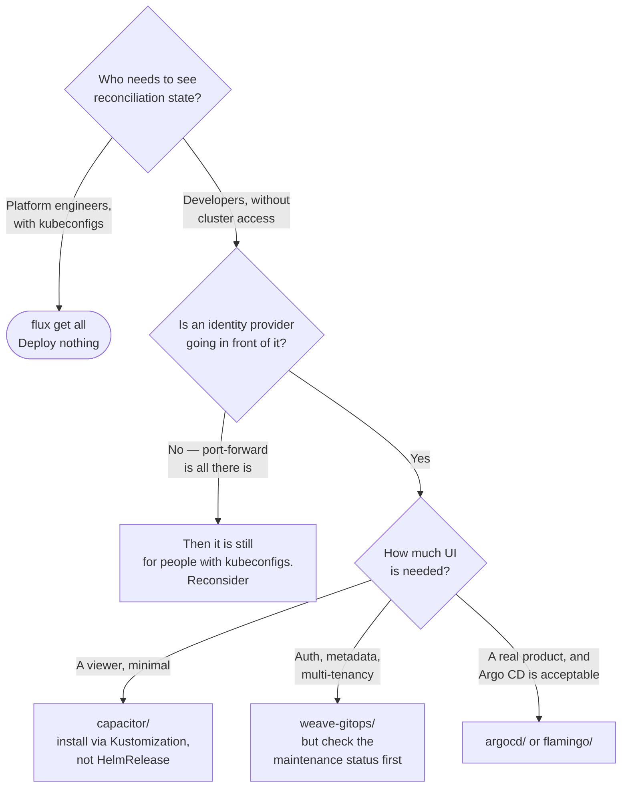

[← Flux](../README.md)

# Flux UIs

Flux ships no dashboard on purpose — these are the two attempts to add one, and neither was kept.

Tools covered: [`capacitor/`](capacitor/README.md) · [`weave-gitops/`](weave-gitops/README.md)

## Contents

1. [Why Flux has no UI](#1-why-flux-has-no-ui)
2. [What a UI would have to add](#2-what-a-ui-would-have-to-add)
3. [The two options](#3-the-two-options)
4. [The access problem](#4-the-access-problem)
5. [Decision tree](#5-decision-tree)
6. [Anti-patterns](#6-anti-patterns)
7. [How this applies to pikakube](#7-how-this-applies-to-pikakube)

---

## 1. Why Flux has no UI

Every Flux concept is a CRD with a status. `GitRepository`, `Kustomization`, `HelmRelease`,
`ImagePolicy` — each one has conditions, a last-applied revision and an error message, readable with
`kubectl` or with `flux get`. A dashboard over that is a **renderer**, not a source of information.

That is the design position, and it is defensible: the API server already is the interface, and
anything built on top has to be deployed, exposed, authenticated and upgraded to show data that was
already available.

It is also the reason people pick [Argo CD](../../argocd/README.md) instead. The comparison recorded
in this repository is clear that Argo CD's UI is its strongest feature — see
[`argocd/`](../../argocd/README.md).

## 2. What a UI would have to add

A dashboard is worth deploying only if it does something the CLI cannot. The honest list is short:

| Capability | CLI equivalent | Does a UI win? |
|---|---|---|
| Reconciliation status | `flux get all` | no |
| Why something failed | `kubectl describe` on the object | no |
| Force a reconcile | `flux reconcile` | only if the person has no CLI |
| Suspend / resume | `flux suspend` / `resume` | same |
| **Access without kubeconfig** | — | **yes** |
| Resource tree / dependency view | assembled by hand | **yes**, marginally |
| Live logs beside status | two terminals | marginally |

The only row that is unambiguous is the access one. **A Flux dashboard is for people who should not
have a kubeconfig.** If everyone looking at it is a platform engineer with cluster access, it is a
second way to see what they can already see — which is the conclusion recorded in
[`capacitor/`](capacitor/README.md).

## 3. The two options

| | [Capacitor](capacitor/README.md) | [Weave GitOps](weave-gitops/README.md) |
|---|---|---|
| Origin | Gimlet | Weaveworks — the company that created Flux |
| Scope | Flux objects, logs, events | Flux objects, plus auth, metadata, multi-tenancy |
| Auth | none of its own | admin user or **OIDC** |
| Install | Kustomization from an OCI artefact | Helm chart |
| Weight | small | a product |
| Recorded verdict | "fairly useless" against the CLI | deployed, with open issues noted |

Capacitor is a viewer. Weave GitOps was built as a product with an enterprise tier above it, which is
why it has the OIDC and multi-tenancy features — and why its future is tied to a company that no
longer exists.

## 4. The access problem

Both are reached the same way in this repository: a port-forward. That is fine for evaluation and
useless for the purpose that justifies deploying them at all — **a port-forward requires a
kubeconfig**, which is exactly what the target audience does not have.

Making a Flux dashboard genuinely useful means an ingress, TLS, and an identity provider in front of
it. At that point the deployment is no longer small, and the question becomes whether the platform
would rather run [Argo CD](../../argocd/README.md), which does that work as part of the product, or
[Flamingo](../../flamingo/README.md), which puts Argo CD's UI over Flux's controllers.

That is the real decision this folder documents. It is not "which dashboard" — it is "is a dashboard
worth an authentication story".

## 5. Decision tree

## 6. Anti-patterns

| Anti-pattern | Why it is bad | What to do instead |
|---|---|---|
| Deploying a dashboard for people who have `kubectl` | it shows what `flux get all` already shows | nothing; use the CLI |
| A dashboard reached only by port-forward | the audience that needs it cannot use it | ingress plus OIDC, or do not deploy it |
| An admin password hash committed to Git | it is a credential, and Git history is permanent | OIDC, or a `Secret` referenced by `valuesFrom` |
| Installing Capacitor as a `HelmRelease` | the packaged chart fails to load — see [`capacitor/`](capacitor/README.md) | `Kustomization` over the OCI artefact |
| Treating a UI as the source of truth | the repository is; the UI is a rendering of the controller's opinion of it | fix Git, watch it converge |
| Adopting an unmaintained dashboard for a long-lived platform | it becomes an unpatched, cluster-privileged web service | check the project's status first |

## 7. How this applies to pikakube

**Neither is in use, and both were actually tried** — which makes this folder a record of a decision
rather than a catalogue.

[Capacitor](capacitor/README.md) carries the sharper note: everything on the dashboard was visible
from the CLI without effort, so it was judged not worth keeping. It also records a real installation
defect — the Helm packaging fails, and the documented path is a `Kustomization` over the OCI
artefact, which is what is checked in with the `HelmRelease` commented out.

[Weave GitOps](weave-gitops/README.md) is checked in as a working `HelmRelease` at `4.0.36` with
metrics enabled, and it has the credential problem noted above: the admin password hash is in the
values file, in Git.

The platform's actual answer to "how do I see what Flux is doing" is `flux get all`, and the gap
that would change that is not a dashboard — it is that the
[`notification/`](../notification/README.md) controller is not installed, so nothing tells anyone
when reconciliation fails. Alerting closes that gap at a fraction of the cost of a UI.

---

[← Flux](../README.md)
