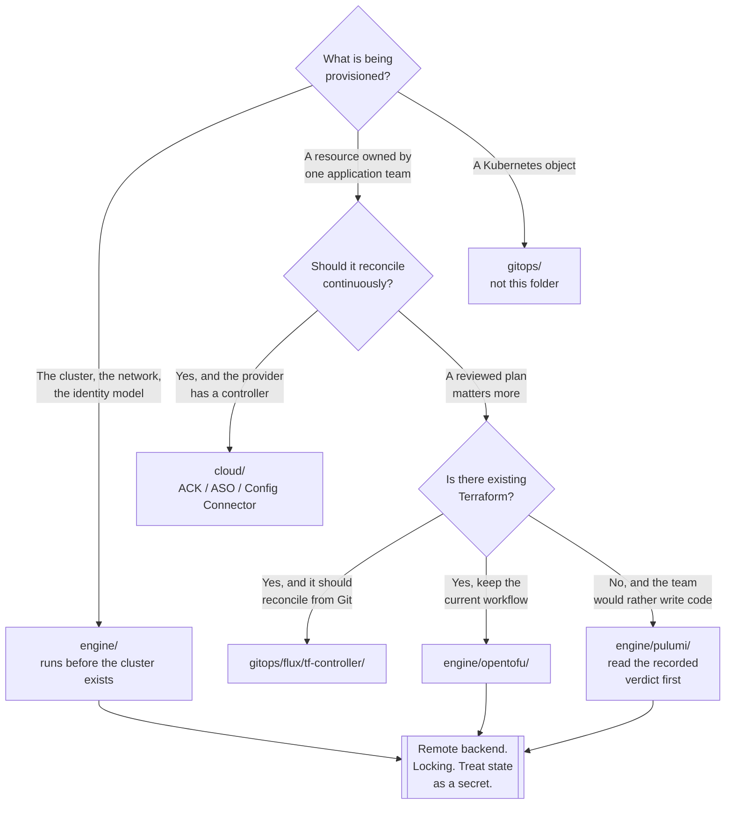

[← Platform engineering](../README.md)

# Infrastructure as Code

Provisioning the things Kubernetes cannot provision for itself — including the cluster it runs on.

Tools covered: [`cloud/`](cloud/README.md) · [`engine/`](engine/README.md) ·
[`lint/`](lint/README.md) · [`docs/`](docs/README.md)

## Contents

1. [Why this exists next to GitOps](#1-why-this-exists-next-to-gitops)
2. [Two ways to reconcile a cloud resource](#2-two-ways-to-reconcile-a-cloud-resource)
3. [State is the whole problem](#3-state-is-the-whole-problem)
4. [Where the boundary goes](#4-where-the-boundary-goes)
5. [Decision tree](#5-decision-tree)
6. [Anti-patterns](#6-anti-patterns)
7. [How this applies to pikakube](#7-how-this-applies-to-pikakube)

---

## 1. Why this exists next to GitOps

[`gitops/`](../gitops/README.md) reconciles Kubernetes objects. It cannot create the VPC the cluster
sits in, the managed database beside it, the DNS zone in front of it, or the cluster itself. Those
have their own APIs, and something has to call them.

The awkward part is the ordering, and it is genuinely circular:

```
IaC creates the cluster
  → the cluster runs the GitOps controller
    → the controller manages everything, sometimes including more IaC
```

Whatever creates the first cluster cannot be reconciled by that cluster. That is the **bootstrap
problem**, it does not have a clean solution, and every option in this folder is a different way of
deciding how much of the estate sits on the far side of it.

## 2. Two ways to reconcile a cloud resource

Once a cluster exists, there is a real choice about where cloud resources are declared.

| | **[`engine/`](engine/README.md)** — OpenTofu, Pulumi | **[`cloud/`](cloud/README.md)** — ACK, ASO, Config Connector |
|---|---|---|
| Written as | HCL or a programming language | Kubernetes CRDs |
| Applied by | a person or a pipeline, on demand | a controller in the cluster, continuously |
| State | a state file, stored somewhere and locked | the cluster's etcd and the provider's API |
| Drift | found at the next `plan`, if one is run | corrected on the reconcile interval |
| Credentials | wherever the runner is | a service account or workload identity in the cluster |
| Reviewable plan | **yes** — `plan` before `apply` | mostly not; it applies |
| Coverage | broad, multi-cloud, mature | per-provider, and incomplete |

The trade is plan-and-review against continuous reconciliation. Terraform's `plan` is the reason
people trust it with production; a CRD controller that applies on a timer gives up that gate in
exchange for drift correction and for cloud resources living in the same repository, RBAC and
reconciliation loop as everything else.

A third option sits between them: [`tf-controller`](../gitops/flux/tf-controller/README.md) runs
Terraform *as* a Flux resource, keeping HCL and adding reconciliation — with `approvePlan` deciding
whether the review gate survives.

## 3. State is the whole problem

Everything difficult about the `engine/` half reduces to state.

| Failure | What it looks like |
|---|---|
| State lost | Terraform believes nothing exists and tries to create it all again |
| State stale | `plan` shows changes that were already made by hand |
| No locking | two concurrent applies, and a state file describing neither result |
| Secrets in state | credentials in plaintext in whatever bucket holds it |
| State as the source of truth | the code no longer describes reality, and nobody knows which is right |

Three rules follow, and they are not optional:

- **Remote backend with locking**, from the first commit. A local `terraform.tfstate` is a
  single-person, single-machine arrangement that will outlive both.
- **Treat the state file as a secret.** Resource attributes — including generated passwords — are
  stored in it verbatim.
- **Never edit infrastructure by hand once it is managed.** The next `plan` will either revert it or
  fail confusingly, and which one is not predictable.

The `cloud/` controllers avoid this entirely: there is no state file, because the desired state is a
Kubernetes object and the actual state is read back from the provider on every reconcile.

## 4. Where the boundary goes

The recurring question is how much belongs to IaC and how much to the cluster. A defensible split:

| Layer | Owner |
|---|---|
| Network, identity, the cluster itself, shared data stores | `engine/` — it exists before the cluster does |
| Cluster add-ons, controllers, workloads | [`gitops/`](../gitops/README.md) |
| Application-owned cloud resources: a queue, a bucket, a database for one service | `cloud/` — the team declares it beside their Deployment |

The failure to avoid is **Terraform managing Kubernetes objects**. It is possible, the provider
exists, and it puts a state file in front of resources that a controller in the cluster is also
reconciling. Two writers, and the state file is stale between applies. Draw the line at the cluster
API and do not cross it from this side.

## 5. Decision tree



## 6. Anti-patterns

| Anti-pattern | Why it is bad | What to do instead |
|---|---|---|
| Local state file | one machine, no locking, and it will be lost | remote backend with locking, from day one |
| State file not treated as secret | passwords and keys sit in it in plaintext | encrypted storage, access restricted like a credential |
| Terraform managing Kubernetes objects | two reconcilers, and the state file is stale between runs | stop at the cluster API; GitOps inside it |
| Manual changes to managed resources | the next `plan` reverts or fails, unpredictably | change the code |
| `apply` without reading the `plan` | the review gate is the only thing standing between you and a deleted database | read it, and require it in review |
| One state file for the whole estate | every change locks everything; blast radius is total | split by lifecycle and by team |
| Cloud admin credentials in CI | the most exposed system holds the most powerful key | short-lived credentials, or workload identity in-cluster |
| Provider versions unpinned | a plan that was clean yesterday destroys something today | pin providers and modules |
| No linting | the failure surfaces as a failed apply against a real account | [`lint/`](lint/README.md), in CI |
| Module inputs and outputs documented by hand | wrong on the first new variable, and nothing checks it | generate them — [`docs/`](docs/README.md) |

## 7. How this applies to pikakube

This folder is **mostly a survey**, and it is honest about that. One thing here has working
manifests: [Azure Service Operator](cloud/azure-service-operator/README.md) — a `HelmRelease` at
1.12.0 with a `dependsOn` on cert-manager and a sample `ResourceGroup`. Everything else is a link, a
command and in two cases a verdict.

The verdicts are the value:

- [Pulumi](engine/pulumi/README.md) — **"terrible documentation"**, and on the Kubernetes provider,
  **"why would anyone want to use this?"**
- [OpenTofu](engine/opentofu/README.md) — recorded without complaint, which given the tone of the
  rest of this folder is meaningful.

The live bridge to the cluster is elsewhere:
[`gitops/flux/tf-controller/`](../gitops/flux/tf-controller/README.md) has manifests, an Azure
credentials template and a `Terraform` resource — with an empty `main.tf` and a stale path, so it is
scaffolding rather than a running system.

The gap: **nothing here provisions the cluster.** The `FluxInstance` patches Flux onto an
`agentpool: system` node pool, which means a managed cluster exists and was created by something not
recorded in this repository. That is the one piece of the bootstrap that is undocumented, and it is
the piece that would matter most in a rebuild.

---

[← Platform engineering](../README.md)
