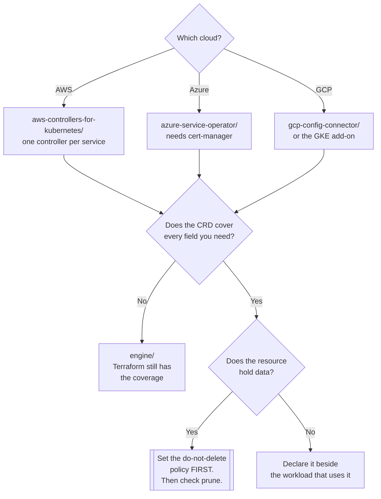

[← Infrastructure as Code](../README.md)

# Cloud control planes

Cloud resources as Kubernetes objects — one reconciliation loop instead of two.

Tools covered: [`aws-controllers-for-kubernetes/`](aws-controllers-for-kubernetes/README.md) · [`azure-service-operator/`](azure-service-operator/README.md) · [`gcp-config-connector/`](gcp-config-connector/README.md)

## Contents

1. [The idea, and what it buys](#1-the-idea-and-what-it-buys)
2. [What you give up](#2-what-you-give-up)
3. [The three implementations](#3-the-three-implementations)
4. [Deletion, and the field that prevents disasters](#4-deletion-and-the-field-that-prevents-disasters)
5. [Decision tree](#5-decision-tree)
6. [Anti-patterns](#6-anti-patterns)
7. [How this applies to pikakube](#7-how-this-applies-to-pikakube)

---

## 1. The idea, and what it buys

Each of the three major clouds ships an operator that maps its API onto Kubernetes CRDs. An S3
bucket, an Azure resource group or a Cloud SQL instance becomes a namespaced object that a controller
reconciles against the provider on an interval.

What follows from that is more interesting than the mapping itself:

| Consequence | Why it matters |
|---|---|
| **No state file** | desired state is in etcd, actual state is read from the provider. The whole class of problems in [`iac/`](../README.md) section 3 disappears |
| **Continuous reconciliation** | a bucket policy changed in the console is put back, not merely reported at the next `plan` |
| **One GitOps loop** | the queue and the Deployment that reads it live in the same repository, reconciled by the same controller |
| **Kubernetes RBAC applies** | a team's permission to create a database is a `Role`, not a separate cloud IAM exercise |
| **Values flow directly** | connection details land in a `Secret` the application already mounts |

That last row is the one that wins arguments. In a Terraform-plus-GitOps world, the endpoint of a
database created by Terraform reaches the workload through a manual copy, a pipeline step or a data
source lookup. Here the operator writes a `Secret` into the namespace and the Deployment references
it — the seam is gone.

## 2. What you give up

The costs are real and they are not evenly distributed.

- **Coverage is incomplete and uneven.** All three lag their provider's API. A resource that exists
  in the cloud may have no CRD, or a CRD missing the field you need. This is the single most common
  reason projects abandon the approach, and it must be checked per resource before committing.
- **No `plan`.** Applying a CRD applies it. There is no reviewed diff between "I changed a field" and
  "the change happened in production" — which for a database is a meaningful loss.
- **The cluster becomes privileged.** The controller holds credentials capable of creating and
  deleting cloud infrastructure. Compromising the cluster now costs more than the cluster.
- **The bootstrap problem is unmoved.** The cluster running the controller cannot have been created
  by it. Something else — [`engine/`](../engine/README.md) — still makes the first one.
- **Deleting a namespace deletes cloud resources.** Kubernetes garbage collection does not know that
  one of these objects was a production database. See section 4.

## 3. The three implementations

| | [ACK](aws-controllers-for-kubernetes/README.md) | [ASO](azure-service-operator/README.md) | [Config Connector](gcp-config-connector/README.md) |
|---|---|---|---|
| Cloud | AWS | Azure | Google Cloud |
| Vendor | AWS | Microsoft | Google |
| Packaging | **one controller per service** — a chart each | **one operator**, CRDs for many services | one operator; also available as a GKE add-on |
| Identity | IRSA / Pod Identity | workload identity or a service principal | Workload Identity |
| Notable dependency | — | **cert-manager**, for the admission webhooks | — |

The packaging difference is the one that shapes day-to-day work. ACK's per-service split means
installing S3 support and RDS support separately, each with its own release, version and IAM role —
finer-grained permissions, and more objects to keep current. ASO and Config Connector install once
and bring a large CRD surface with them, which is simpler to operate and coarser to restrict.

All three authenticate best through the cloud's workload-identity mechanism rather than a static
credential. A long-lived secret in the cluster with cloud-admin rights is the version of this pattern
that turns a cluster compromise into an account compromise.

## 4. Deletion, and the field that prevents disasters

This is the failure mode unique to the approach, and it deserves its own section because it does not
exist in Terraform.

A cloud resource represented as a Kubernetes object is subject to Kubernetes lifecycle rules. Delete
the namespace, delete the object, or let a GitOps controller **prune** something that vanished from
Git, and the controller does what it was built to do: it deletes the database.

Every one of these operators has a way to break that link — an annotation or policy meaning
*stop managing this, do not delete it* (ASO calls it a reclaim policy; ACK and Config Connector have
equivalents under different names). Set it on anything holding data, before the first incident rather
than after.

Two further guards worth having in place:

- `prune` behaviour on the reconciling `Kustomization` understood, not assumed
- stateful cloud resources in namespaces that no automated process deletes

## 5. Decision tree

## 6. Anti-patterns

| Anti-pattern | Why it is bad | What to do instead |
|---|---|---|
| A production database as a CRD with default deletion policy | a namespace delete removes it, and Kubernetes will not ask | set the reclaim/deletion-policy annotation first |
| Static cloud credentials in the cluster | a cluster compromise becomes an account compromise | workload identity — IRSA, Azure workload identity, GKE Workload Identity |
| Adopting it before checking coverage | discovered mid-migration, when a required field has no CRD | verify the exact resources and fields first |
| Cluster-admin-equivalent cloud role for the controller | it can create and destroy anything in the account | scope to the resource types and scopes actually used |
| Mixing this and Terraform on one resource | two reconcilers, and one of them has a stale state file | one owner per resource, written down |
| Assuming `plan`-like review exists | applying the CRD *is* the apply | review at the pull request, since there is no second gate |
| Installing ASO without cert-manager | webhooks never become ready and the failure is opaque | `dependsOn` cert-manager, as the checked-in release does |

## 7. How this applies to pikakube

**Azure is the one with substance.** [ASO](azure-service-operator/README.md) has a `HelmRelease` at
1.12.0, a `HelmRepository`, a namespace, a sample `ResourceGroup` and a credentials `Secret`
template — and, notably, a `dependsOn` cert-manager that shows the webhook dependency was hit and
handled rather than read about.

That fits the rest of the platform: the `FluxInstance` in
[`flux-operator/`](../../gitops/flux/flux-operator/README.md) patches onto an `agentpool` node pool,
and the [tf-controller](../../gitops/flux/tf-controller/README.md) example carries `ARM_*`
credentials. The cluster is Azure-flavoured throughout.

[ACK](aws-controllers-for-kubernetes/README.md) and
[Config Connector](gcp-config-connector/README.md) are two links each — the project and its install
guide. Mapped so the option is known, not evaluated.

Nothing here is actually managing a cloud resource today. The sample `ResourceGroup` is the
project's own example and the credentials Secret is empty. Before that changes, the deletion policy
in section 4 is the thing to settle, because the first real resource created this way is also the
first one a namespace delete can take with it.

---

[← Infrastructure as Code](../README.md)
