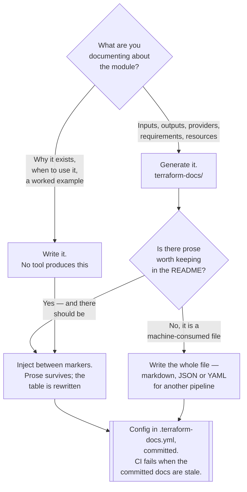

[← Infrastructure as Code](../README.md)

# IaC documentation

Generating a module's documentation from the module, so the two cannot disagree.

Tools covered: [`terraform-docs/`](terraform-docs/README.md)

## Contents

1. [Why a hand-written module README drifts](#1-why-a-hand-written-module-readme-drifts)
2. [What can be generated, and what cannot](#2-what-can-be-generated-and-what-cannot)
   - [The interface is in the code](#the-interface-is-in-the-code)
   - [The intent is not](#the-intent-is-not)
3. [Where the generated block lives](#3-where-the-generated-block-lives)
   - [Injection between markers](#injection-between-markers)
   - [Making it a guarantee rather than a habit](#making-it-a-guarantee-rather-than-a-habit)
4. [Decision tree](#4-decision-tree)
5. [Anti-patterns](#5-anti-patterns)
6. [How this applies to pikakube](#6-how-this-applies-to-pikakube)

---

## 1. Why a hand-written module README drifts

This repository already makes the general argument in
[`infrastructure/docs/`](../../../docs/README.md): **anything hand-maintained that describes a
machine-readable source will diverge from it, and nothing will notice.**

A Terraform module is the cleanest possible instance of that. Its inputs, outputs, providers,
version requirements and resources are all *declared*, in HCL, in a form a parser can read. A README
that lists them by hand is a second copy of information that already exists — worse than the first
copy, because it has no compiler, no `validate`, and no test.

The failure is not gradual. It happens on the **first new variable**:

| The change | The consequence |
|---|---|
| A variable is added | it is undocumented; consumers find it by reading the source |
| A variable's default changes | the table now states a value the module does not use |
| A variable is renamed | the table describes an input that no longer exists |
| An output is removed | someone writes code against a documented output that is gone |
| A provider constraint is bumped | the requirements table quietly becomes fiction |

Every one of those is a normal pull request that nobody would think to reject for the README. That
is the point: **the process cannot catch it, so the process is not the fix.** Generation is.

## 2. What can be generated, and what cannot

### The interface is in the code

Everything mechanical about a module is derivable from the `.tf` files:

| Section | Derived from |
|---|---|
| Inputs | `variable` blocks — name, type, default, description, whether it is required |
| Outputs | `output` blocks — name and description |
| Providers | the providers the module actually configures or inherits |
| Requirements | `required_version` and `required_providers` |
| Resources | the resources and data sources the module declares |
| Modules | nested module calls and their sources |

None of this needs a human. Regenerating it is deterministic, so it is either correct or the
generator ran against a different commit.

### The intent is not

What generation cannot produce is the part people actually read the README for:

- **why the module exists** — what problem it was factored out to solve
- **when to use it, and when not to** — the cases it was not designed for
- **how it composes** — what it expects to already exist, and what it leaves to the caller
- **an example** that shows the three inputs that matter out of the twenty that exist
- **the non-obvious constraints** — the one field that cannot be changed without a replacement

So the correct shape is not "generated documentation". It is **a human-written document with a
generated table inside it**. The prose is the value; the table is the part that would have rotted.

## 3. Where the generated block lives

### Injection between markers

The naive implementation writes a file and overwrites it, which forces the choice between prose and
freshness. The better one is **injection**: the generator writes only between marker comments in an
existing README, leaving everything around them untouched.

That single mechanic is what makes the capability usable, because it dissolves the trade-off. The
"why" sits above the markers and is written once; the interface sits between them and is rewritten
on every run.

### Making it a guarantee rather than a habit

Running a generator locally is a habit, and habits are skipped under deadline. The step that turns
it into a property of the repository is a **CI check that regenerates the documentation and fails
when the committed version differs**.

| Where it runs | What it gives you |
|---|---|
| Locally, by hand | nothing durable — it is remembered or it is not |
| **Pre-commit hook** | the file is usually already correct by the time it is pushed |
| **CI, failing on a diff** | **the guarantee** — stale documentation cannot reach the default branch |

The hook and the CI check are not alternatives. The hook exists so the CI check is rarely the first
time anyone finds out.

## 4. Decision tree

## 5. Anti-patterns

| Anti-pattern | Why it is bad | What to do instead |
|---|---|---|
| Hand-written inputs and outputs tables | wrong on the first new variable, and nothing checks it | generate them |
| Generating over the whole README | the prose that explains *why* is destroyed on every run | inject between markers |
| Generating only when someone remembers | the docs are correct on the day the tool was run, and no other day | pre-commit hook plus a CI check |
| A CI job that regenerates and commits | the pull request no longer shows what the author actually wrote, and review is on a moving file | fail the build instead; let the author regenerate |
| Empty `description` fields on variables | the generated table is a list of names and types that explains nothing | descriptions are the input to the generator, so write them |
| Configuration passed as CLI flags in CI only | local runs produce a different file than CI, so the check fails for no real reason | commit `.terraform-docs.yml` |
| Treating the generated table as the documentation | it describes the interface, never the intent | keep the prose; the table sits inside it |

## 6. How this applies to pikakube

Nothing here, for the same reason [`lint/`](../lint/README.md) has nothing to lint:
[`engine/`](../engine/README.md) contains no HCL, and the only `.tf` file in this repository is the
empty `tf-codes/main.tf` under
[tf-controller](../../gitops/flux/tf-controller/README.md). There is no module, so there is no
module documentation.

This is recorded as the tool to reach for at the moment the first shared module appears — which is
the right moment, because the cost of adopting it is a config file and a CI step, and the cost of
adopting it later is a set of README tables everyone has already learned not to trust.

The wider point is one this repository makes elsewhere and is worth restating here in its narrowest
form: [`infrastructure/docs/`](../../../docs/README.md) argues that documentation should be
generated wherever a machine-readable source exists. A Terraform module is that source. There is no
version of "we will keep the table updated" that survives contact with a second contributor.

---

[← Infrastructure as Code](../README.md)
