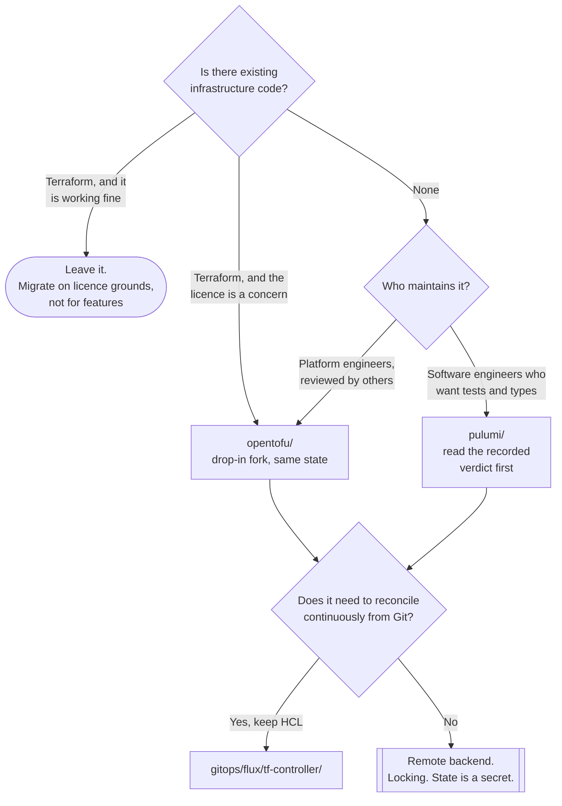

[← Infrastructure as Code](../README.md)

# IaC engines

The thing that runs before the cluster exists — and the choice between a configuration language and a programming one.

Tools covered: [`opentofu/`](opentofu/README.md) · [`pulumi/`](pulumi/README.md)

## Contents

1. [What an engine is for](#1-what-an-engine-is-for)
2. [HCL or a real language](#2-hcl-or-a-real-language)
3. [Terraform, OpenTofu, and why the fork happened](#3-terraform-opentofu-and-why-the-fork-happened)
4. [What is actually the same in both](#4-what-is-actually-the-same-in-both)
5. [Decision tree](#5-decision-tree)
6. [Anti-patterns](#6-anti-patterns)
7. [How this applies to pikakube](#7-how-this-applies-to-pikakube)

---

## 1. What an engine is for

An engine is what you use for the layer **below** the cluster: the network, the identity model, the
managed control plane, the shared data stores. Those exist before there is a cluster to run a
controller in, which is why [`cloud/`](../cloud/README.md) cannot cover them and why this folder does
not disappear once cloud control planes are adopted.

It applies on demand rather than continuously. That is the trade described in
[`iac/`](../README.md) section 2: you get a reviewed `plan` and you give up drift correction.

## 2. HCL or a real language

This is the actual decision in this folder, and it is not the one most comparisons make it out to be.

| | **HCL** (OpenTofu, Terraform) | **A programming language** (Pulumi) |
|---|---|---|
| Written in | a configuration DSL | Python, TypeScript, Go, C# |
| Loops and conditionals | `count`, `for_each`, ternaries | the language's own |
| Abstraction | modules | functions, classes, packages |
| Testing | limited, and mostly external | the language's test framework |
| Tooling | IDE support, formatters, linters | the whole ecosystem |
| Reviewability | **anyone can read it** | depends on what the author did |
| Failure mode | verbose, repetitive | **infrastructure with abstractions nobody can follow** |
| Ecosystem | very large; most examples online are HCL | smaller, and thinner outside the main providers |

The argument for Pulumi is genuine: loops, types, unit tests and reuse are all better in a language
designed for them, and expressing "one bucket per region in this list, unless it is production" in
HCL is unpleasant.

The argument against is also genuine, and it is about **what infrastructure code is for**. HCL is
constrained, and the constraint means a reviewer can read a module and know what it will produce.
A Pulumi program can build resources dynamically across several layers of class hierarchy, and
reviewing it means reading a program rather than a description. Infrastructure changes tend to be
reviewed by people who did not write them, often under time pressure, often at the worst moment —
and legibility is worth more there than expressiveness.

Neither position is wrong. The recorded experience in [`pulumi/`](pulumi/README.md) is negative, and
it is specific: the complaint is documentation, not the idea.

## 3. Terraform, OpenTofu, and why the fork happened

Terraform is not in this folder, and its absence is a decision.

In 2023 HashiCorp relicensed Terraform from the Mozilla Public License to the Business Source
License. BSL is not open source: it restricts use that competes with the licensor. Terraform remained
free for ordinary use, and the licence became a legal question rather than a settled one.

**OpenTofu** is the fork of the last MPL version, donated to the Linux Foundation. It is
drop-in compatible in the ways that matter — same HCL, same state format, same provider protocol,
same registry ecosystem — and has since added features of its own, notably state encryption and
early variable evaluation.

For a repository whose whole premise is open tooling, choosing the fork needs no further
justification. For an organisation with an existing Terraform estate, the migration is mostly
mechanical, and the reason to do it is licensing rather than capability.

## 4. What is actually the same in both

Whichever engine is chosen, the operational rules from [`iac/`](../README.md) section 3 do not
change, because they are properties of the model rather than of the tool:

- state lives in a **remote backend with locking**, from the first commit
- the state file is a **secret**; resource attributes including generated passwords are in it
- providers and modules are **pinned**
- state is **split** by lifecycle and by team, so one change does not lock everything
- the `plan` is **read**, not skipped, and reviewed by someone other than its author

Pulumi's state lives in a backend service or an object store rather than in a `.tfstate` file, and
every one of those rules still applies to it.

## 5. Decision tree

## 6. Anti-patterns

| Anti-pattern | Why it is bad | What to do instead |
|---|---|---|
| Choosing Pulumi for the loops | the loops were never the expensive part; reviewing is | choose it for testing and typing, or not at all |
| Deep abstraction in infrastructure code | a reviewer cannot tell what will be created | keep it flat enough to read |
| Migrating Terraform to OpenTofu for features | the value is the licence; the features are incremental | migrate on licence grounds, deliberately |
| Both engines in one estate | two state models, two toolchains, two sets of expertise | pick one |
| Provider versions unpinned | yesterday's clean plan destroys something today | pin, and update deliberately |
| `apply` from a laptop | no audit trail, and no lock if two people do it | a pipeline, or [tf-controller](../../gitops/flux/tf-controller/README.md) |
| No linting before apply | the failure surfaces against a real cloud account | [`lint/`](../lint/README.md) in CI |

## 7. How this applies to pikakube

Two engines evaluated, and the notes are short and clear about what was found.

[**OpenTofu**](opentofu/README.md) — the project and its GitHub Action, recorded without complaint.
In a folder where the other entry attracted two dismissals, silence is a mild endorsement.

[**Pulumi**](pulumi/README.md) — installed, a virtualenv set up, both the AWS and Kubernetes
providers tried, and two verdicts recorded: **"terrible documentation"**, and on the Kubernetes
provider, **"why would anyone want to use this?"** The second is the more interesting of the two and
it is argued in [`pulumi/kubernetes/`](pulumi/kubernetes/README.md).

Neither is provisioning anything. The engine layer of this platform is undocumented — the cluster
exists, the `FluxInstance` targets its node pools, and nothing in this repository says how it was
created. That is the real gap in [`iac/`](../README.md), and it is the layer that matters most in a
rebuild.

---

[← Infrastructure as Code](../README.md)
