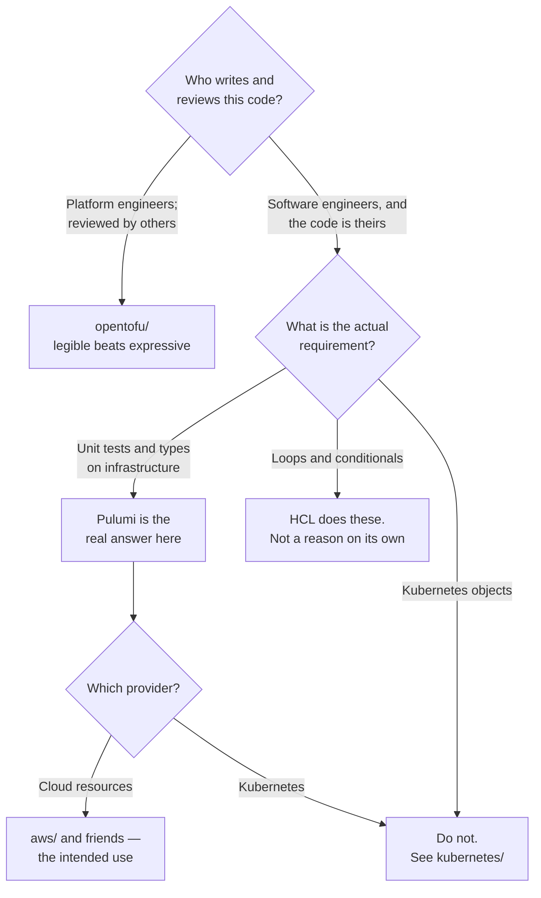

[← IaC engines](../README.md)

# Pulumi

Infrastructure written in a real programming language — evaluated here, and the verdict was not kind.

Tools covered: [`aws/`](aws/README.md) · [`kubernetes/`](kubernetes/README.md)

## Contents

1. [What Pulumi actually is](#1-what-pulumi-actually-is)
2. [The model: stacks, resources, outputs](#2-the-model-stacks-resources-outputs)
3. [Where it wins](#3-where-it-wins)
4. [Where it loses](#4-where-it-loses)
5. [Decision tree](#5-decision-tree)
6. [Anti-patterns](#6-anti-patterns)
7. [Notes](#7-notes)
8. [How this applies to pikakube](#8-how-this-applies-to-pikakube)

---

## 1. What Pulumi actually is

Pulumi is an IaC engine whose declaration language is a general-purpose programming language —
Python, TypeScript, Go or C#. You do not write a description of the desired state; you write a
program that, when executed, **constructs** the desired state as a graph of objects. The engine then
diffs that graph against recorded state and applies the difference.

That distinction is the source of everything good and everything difficult about it. Loops,
conditionals, functions, classes, packages, types and unit tests are the language's, not the tool's.
So is the ability to write infrastructure code that nobody can follow.

Under the hood it uses the same provider ecosystem as Terraform for much of its coverage, so the
resources and their fields will look familiar. What is different is the layer above.

## 2. The model: stacks, resources, outputs

Three concepts, and they map onto Terraform closely enough that the mapping is worth stating:

| Pulumi | Terraform equivalent | Note |
|---|---|---|
| Project | a root module | a directory with `Pulumi.yaml` |
| **Stack** | a workspace | an instance of the project: `dev`, `prod` |
| Resource | resource | constructed by calling a class |
| **Output** | a value that is not known until apply | the part that surprises people |
| Config | variables | per-stack, with encrypted secrets built in |

`Output` is the concept to understand before writing anything real. A resource attribute is not a
value at program-construction time — it is a promise of a value that exists after apply. It cannot be
printed, concatenated with a string, or branched on directly; it has to be passed through `apply`
callbacks. This is the single most common source of confusion for people arriving from Terraform,
where interpolation hides the same asynchrony.

Encrypted config is a genuine advantage worth naming: Pulumi encrypts secret config values by
default, which is more than a `.tfvars` file does.

## 3. Where it wins

- **Testing.** Infrastructure code can have unit tests in the language's own framework, running
  without touching a cloud account. HCL has no real equivalent.
- **Typing.** A typo in a resource argument is a type error at author time rather than a plan error.
- **Abstraction that composes.** A component resource is a class. Sharing it is publishing a package,
  with the versioning and dependency machinery that already exists for code.
- **Complex logic.** Anything conditional or derived — resources per entry in a computed list, shapes
  that vary by environment — is ordinary code instead of `for_each` gymnastics.
- **One language across the stack.** For a team already writing Python or TypeScript, there is no
  second language to learn.

## 4. Where it loses

- **Reviewability.** This is the important one. A reviewer reading HCL knows what will be created.
  A reviewer reading a program has to execute it mentally, through whatever abstractions the author
  built. Infrastructure changes are reviewed by people who did not write them, often in a hurry.
- **Documentation.** The recorded verdict below is blunt about it, and the complaint is structural
  rather than incidental: the API surface is generated per language per provider, so examples are
  thin and inconsistent exactly where they are most needed.
- **Ecosystem depth.** Most infrastructure examples on the internet are HCL. The answer to a specific
  problem usually exists as Terraform and has to be translated.
- **The state service.** The default backend is Pulumi's hosted service. Self-hosting on object
  storage is supported, and it is a decision to make deliberately rather than discover.
- **A language runtime in the loop.** Applying infrastructure now depends on a working Python
  environment with the right packages. See the virtualenv dance in the notes.

## 5. Decision tree



## 6. Anti-patterns

| Anti-pattern | Why it is bad | What to do instead |
|---|---|---|
| Choosing it for loops and conditionals | HCL has both; this is not the differentiator | choose it for tests and types, or not at all |
| Deep class hierarchies over resources | nobody can tell what a change will create | keep it flat enough to read in review |
| Kubernetes manifests as Pulumi code | a program that produces YAML, applied outside the cluster's reconciliation loop | [`gitops/`](../../../gitops/README.md) |
| The hosted state service by default | infrastructure state in a third party nobody decided on | choose the backend explicitly |
| `pulumi up` from a laptop | no audit trail, no lock, and it depends on a local virtualenv | CI, with pinned dependencies |
| Dependencies unpinned | the SDK version becomes part of the plan and nothing records it | pin the provider packages |
| Mixing it with an HCL estate | two state models and two toolchains for one estate | pick one engine |

## 7. Notes

### The verdict

> **"Terrible documentation."**

That is the whole recorded opinion on Pulumi itself, and it is worth taking seriously because it is
the complaint most likely to matter in practice. Pulumi's reference documentation is generated per
language per provider, so a resource has a page in Python, TypeScript, Go and C# — and the examples
are frequently in one of the others. Working out how to express something specific tends to mean
finding the Terraform answer and translating it, which is a poor experience for a tool whose pitch is
developer ergonomics.

A related verdict, sharper, is recorded against the Kubernetes provider — see
[`kubernetes/`](kubernetes/README.md).

### Project and installation

- <https://github.com/pulumi/pulumi> — the project.
- <https://www.pulumi.com/docs/iac/download-install/> — CLI installation. The CLI is required
  regardless of language; the SDK is not enough on its own.

The recorded Python setup:

```sh
python3 -m venv venv
source venv/bin/activate
deactivate
```

```sh
pip install pulumi
```

The virtualenv is not incidental. Pulumi executes your program with a language runtime, so the
environment is part of the infrastructure toolchain: `pulumi up` behaves differently depending on
which packages are installed and at which versions. That is fine when the environment is pinned in
CI and unmanageable when it is a developer's shell with a virtualenv that may or may not be
activated.

The `deactivate` line being recorded alongside the others is a small, honest detail — it is the
command people forget, and running `pulumi up` outside the virtualenv fails in a way that does not
mention virtualenvs.

## 8. How this applies to pikakube

Pulumi was **installed and tried, not adopted**. The evidence is two provider folders, each with a
one-line `pip install`, a minimal example program, and in one case a dismissal:

- [`aws/`](aws/README.md) — an S3 bucket in four lines. The intended use case, minimally exercised.
- [`kubernetes/`](kubernetes/README.md) — an nginx Deployment, and **"why would anyone want to use
  this?"**

Nothing here provisions anything. The platform's engine layer is empty, and between the two options
in [`engine/`](../README.md) the recorded evidence points at [OpenTofu](../opentofu/README.md) — not
because it was praised, but because it was the one that produced no complaints.

---

[← IaC engines](../README.md)
