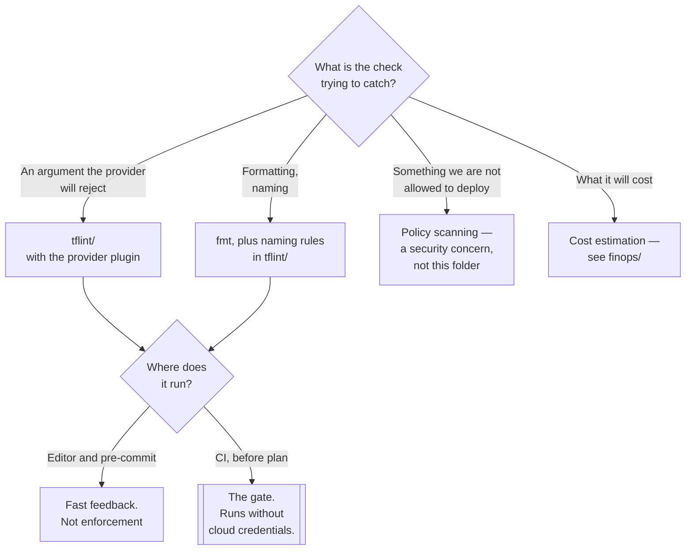

[← Infrastructure as Code](../README.md)

# IaC linting

Catching the mistake before it reaches a cloud account with a credit card attached.

Tools covered: [`tflint/`](tflint/README.md)

## Contents

1. [Why `validate` is not enough](#1-why-validate-is-not-enough)
2. [Four kinds of check, and they are different jobs](#2-four-kinds-of-check-and-they-are-different-jobs)
3. [Where it runs](#3-where-it-runs)
4. [Decision tree](#4-decision-tree)
5. [Anti-patterns](#5-anti-patterns)
6. [How this applies to pikakube](#6-how-this-applies-to-pikakube)

---

## 1. Why `validate` is not enough

`terraform validate` and `tofu validate` check that the configuration is syntactically correct and
internally consistent. They do not contact a provider, so they will happily accept an instance type
that does not exist, a region that is misspelled, or an argument that was removed two provider
versions ago.

`plan` catches those — by calling the cloud API, which means credentials, network access, and a
round trip. It is the wrong feedback loop for a typo, and on a pull request from a fork it may not be
available at all.

A linter sits between them: **provider-aware checks without provider credentials**. It knows the
valid values because it embeds the provider's schema, so a wrong instance type is a lint error in a
second rather than a plan failure in a minute or an apply failure in production.

## 2. Four kinds of check, and they are different jobs

These get bundled under "linting" and they answer different questions. Confusing them leads to
expecting one tool to do all four.

| Kind | Question | Example |
|---|---|---|
| **Style** | is it formatted and named consistently? | `fmt`, naming conventions |
| **Correctness** | will the provider accept this? | an invalid instance type, a deprecated argument |
| **Security / policy** | should we be allowed to do this? | a public bucket, an unencrypted volume, a `0.0.0.0/0` rule |
| **Cost** | what will this change cost? | a diff in monthly spend |

[TFLint](tflint/README.md) covers the first two well and touches the third through rules and plugins.
The security and policy category is a separate discipline with its own tooling — Checkov, Trivy,
tfsec, Conftest/OPA — and in this repository that belongs under `security/`, not here.

The distinction that matters operationally: **correctness checks block on being wrong; policy checks
block on being disallowed.** The first is uncontroversial and can fail a build from day one. The
second is a negotiation with the teams affected, and turning it on all at once produces a backlog
nobody clears.

## 3. Where it runs

Three places, and all three are worth having:

| Where | Feedback | Enforcement |
|---|---|---|
| Editor | instant | none |
| **Pre-commit hook** | seconds | easy to skip, and that is fine |
| **CI, on the pull request** | a minute | **this is the one that counts** |

Only the CI run is enforcement, because it is the only one that cannot be bypassed by a hurried
developer. The other two exist so that the CI run is rarely the first time anyone sees the problem.

The ordering in a pipeline is worth getting right, cheapest first:

```
fmt → validate → lint → policy scan → plan → review → apply
```

Everything before `plan` runs without cloud credentials. That is the property to preserve: a pull
request from an untrusted branch can be checked thoroughly without ever handing it a key.

## 4. Decision tree



## 5. Anti-patterns

| Anti-pattern | Why it is bad | What to do instead |
|---|---|---|
| Relying on `plan` to catch mistakes | needs credentials, is slow, and is unavailable on fork PRs | lint first, without credentials |
| Linting only in pre-commit | trivially skipped, so it is not a gate | CI on the pull request |
| Enabling every rule at once | hundreds of findings, so the whole thing gets disabled | start with correctness, add rules deliberately |
| No provider plugin configured | only generic rules run, and the useful checks are the provider-aware ones | install and pin the plugin |
| Treating a linter as a security scanner | it is not, and believing otherwise leaves the gap unnoticed | a policy scanner as well |
| Findings that never fail the build | advisory warnings become invisible within a week | fail on the rules you mean, allow the rest explicitly |
| Linter version unpinned in CI | new rules appear and unrelated pull requests start failing | pin it, upgrade on purpose |

## 6. How this applies to pikakube

This folder holds exactly one entry, [TFLint](tflint/README.md), recorded as a link with no
commentary — and nothing to lint, because
[`engine/`](../engine/README.md) contains no HCL and
[`tf-controller/tf-codes/main.tf`](../../gitops/flux/tf-controller/README.md) is an empty file.

So this is a placeholder for a step that would matter once the engine layer exists. The point at
which it stops being optional is the first `Terraform` resource with `approvePlan: auto` — see
[tf-controller](../../gitops/flux/tf-controller/README.md) — because at that moment there is no
human between a bad commit and an apply against a real subscription. A linter in CI is the only gate
left.

The category not represented here at all is **policy scanning**: nothing in this repository checks
infrastructure code for public storage, unencrypted volumes or open security groups. That belongs
under `security/`, and it is a gap worth naming here because the tooling in this folder does not
cover it and is sometimes assumed to.

---

[← Infrastructure as Code](../README.md)
