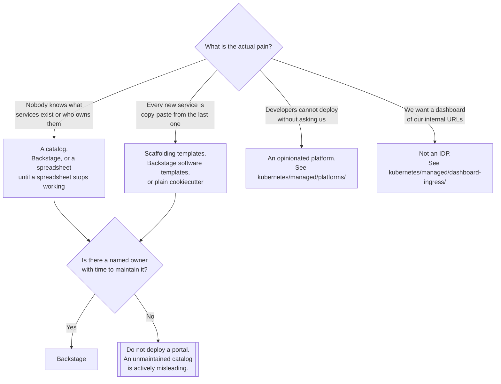

[← Platform engineering](../README.md)

# Internal developer platform

The portal developers actually open — and the reason most of them end up abandoned.

Tools covered: [`backstage-chart`](backstage-chart/README.md) · [`openchoreo`](openchoreo/README.md)

## Contents

1. [What an IDP is, and what it is not](#1-what-an-idp-is-and-what-it-is-not)
2. [Portal or platform](#2-portal-or-platform)
3. [The maintenance cost nobody budgets for](#3-the-maintenance-cost-nobody-budgets-for)
4. [Decision tree](#4-decision-tree)
5. [Anti-patterns](#5-anti-patterns)
6. [How this applies to pikakube](#6-how-this-applies-to-pikakube)

---

## 1. What an IDP is, and what it is not

An internal developer platform is the layer a developer touches instead of touching Kubernetes.
It answers three questions and nothing else:

| Question | What answers it |
|---|---|
| What exists, and who owns it? | a **software catalog** |
| How do I create a new one? | **templates** / scaffolding |
| Where is the documentation? | **docs-as-code**, rendered next to the catalog entry |

Everything else — deployment, secrets, databases, ingress — is done by the systems documented
elsewhere in this repository. The IDP is a *front door*, not a replacement for
[`kubernetes/`](../kubernetes/README.md) or the GitOps layer.

The failure that follows from misunderstanding this: a team builds a portal, then discovers the
portal has to be told about every system it fronts, and nobody has the appetite to keep that
wiring current.

## 2. Portal or platform

Two different products get called the same thing:

| | **Portal** | **Opinionated platform** |
|---|---|---|
| Example | Backstage | OpenChoreo, and the tools in [`kubernetes/managed/platforms/`](../kubernetes/managed/platforms/README.md) |
| What it gives you | catalog, templates, docs, plugins | an abstraction over deploys, environments, promotion |
| What it assumes | you already have a platform | it **is** the platform |
| Cost | writing and maintaining plugins | accepting somebody else's model |

A portal is a thin layer you fill in yourself. An opinionated platform hands you a working model
in exchange for doing things its way. Neither is wrong; picking a portal and then expecting
platform behaviour out of it is.

## 3. The maintenance cost nobody budgets for

Backstage is a TypeScript application you own. That sentence carries most of the cost:

- it is **not** configured, it is **developed** — plugins are npm packages compiled into your build
- every upgrade is an application upgrade, with the dependency churn that implies
- the catalog is only as accurate as the `catalog-info.yaml` files teams remember to write
- an out-of-date catalog is worse than no catalog, because people stop trusting it

The realistic minimum staffing is one person who owns it. Below that, the portal decays into a
stale directory and the organisation quietly routes around it.

## 4. Decision tree

## 5. Anti-patterns

| Anti-pattern | Why it is bad | What to do instead |
|---|---|---|
| Deploying Backstage with no owner | it is an application, not a service you install once | assign an owner or do not deploy it |
| Treating the portal as the platform | it fronts systems; it does not run them | build the platform first, front it second |
| Catalog entries created by the platform team | they go stale the moment a team changes something | teams own their `catalog-info.yaml` |
| Custom plugins before the catalog is populated | effort spent on a portal nobody has a reason to open | catalog and ownership first |
| An IDP to hide a broken deployment pipeline | the abstraction leaks on the first failure | fix the pipeline, then abstract it |
| Choosing an opinionated platform for one team | its model becomes organisational law | scope the decision to who has to live with it |

## 6. How this applies to pikakube

This is the **thinnest area of the repository**, and honestly so.

[`backstage-chart/`](backstage-chart/README.md) is a Flux `HelmRelease` pinned to chart version
`1.9.2` with an **empty `values:` block** — the chart is wired up, nothing is configured. That is
the right amount of work for something not in use: the deployment path is proven, and no time has
gone into a catalog that has no consumers.

[`openchoreo/`](openchoreo/README.md) is a bookmark — a GitHub link and nothing more. Recorded as
"worth looking at", not as evaluated.

The honest position: pikakube is a **platform inventory**, and an IDP fronts a platform that has
users. There are no users yet, so there is no catalog to keep honest. Deploying Backstage properly
here would produce an empty portal and a recurring upgrade obligation.

---

[← Platform engineering](../README.md)
