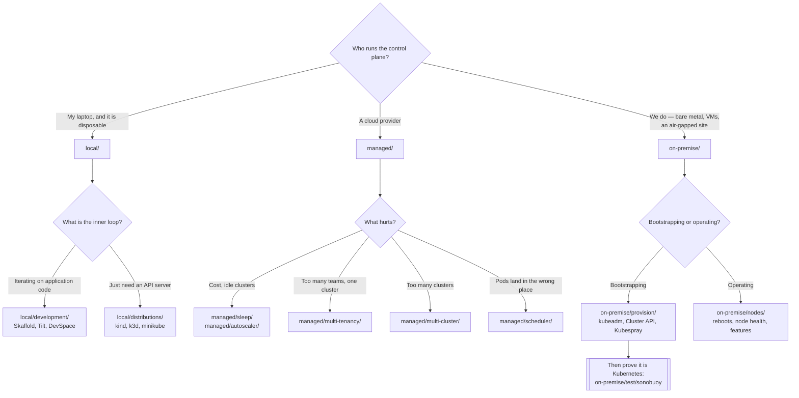

[← Platform engineering](../README.md)

# Kubernetes

The cluster itself — where it runs, who operates the control plane, and what that decides for you.

Sections covered: [`local/`](local/README.md) — laptops and throwaway clusters ·
[`managed/`](managed/README.md) — someone else runs the control plane ·
[`on-premise/`](on-premise/README.md) — you run the control plane

## Contents

1. [The split that organises this folder](#1-the-split-that-organises-this-folder)
2. [What changes when you own the control plane](#2-what-changes-when-you-own-the-control-plane)
3. [Local is not a small production cluster](#3-local-is-not-a-small-production-cluster)
4. [Decision tree](#4-decision-tree)
5. [Anti-patterns](#5-anti-patterns)
6. [How this applies to pikakube](#6-how-this-applies-to-pikakube)

---

## 1. The split that organises this folder

Three folders, one axis: **who is responsible for the control plane.**

| Folder | Control plane | Nodes | What you spend time on |
|---|---|---|---|
| [`local/`](local/README.md) | a container or a VM on your machine | one, usually | inner loop, reproducing bugs, learning |
| [`managed/`](managed/README.md) | EKS, AKS, GKE — the provider's problem | yours | everything **on top of** the cluster |
| [`on-premise/`](on-premise/README.md) | **yours** — etcd, certificates, upgrades | yours | keeping the cluster alive |

This is not a maturity ladder. A team can live in `managed/` forever and never need a single tool
from `on-premise/`. The folders answer different questions, and mixing them is how people end up
running `kubeadm` upgrade procedures against a cluster the cloud provider upgrades for them.

The bulk of the tooling sits in [`managed/`](managed/README.md), and that is honest: once someone
else runs etcd, the interesting problems are scheduling, tenancy, dashboards and cost — not
bootstrap.

## 2. What changes when you own the control plane

Moving from managed to self-managed adds a specific, non-negotiable list of obligations:

| Obligation | What it means in practice |
|---|---|
| **etcd** | backups you have tested restoring, disk latency you monitor, an odd number of members |
| **Certificates** | they expire, usually one year in, usually at the worst time |
| **Upgrades** | control plane before kubelets, one minor version at a time, in order |
| **Node lifecycle** | draining, rebooting, patching — see [`on-premise/nodes/`](on-premise/nodes/README.md) |
| **Conformance** | proving the thing you built is actually Kubernetes — see [`on-premise/test/`](on-premise/test/README.md) |

None of it is hard. All of it is continuous, and it is the part people underestimate when they
compare the invoice for a managed control plane to zero.

The reverse is worth stating too: managed clusters take away the control plane and **do not** take
away node sizing, autoscaling behaviour, upgrade windows or the scheduler's decisions. Those live
in [`managed/`](managed/README.md) and they are where the real operational surface is.

## 3. Local is not a small production cluster

[`local/`](local/README.md) exists to give a developer a real API server, and it succeeds at that.
What it does not give:

- realistic node topology — kind will not let you name nodes or set their capacity
- a cloud load balancer, unless you bolt one on
- storage classes that behave like the production ones
- resource pressure of any kind, which is where most production bugs actually come from

Which makes local clusters excellent for testing **manifests and controllers**, and useless for
testing **capacity, scheduling and failure**. Confusing the two produces a green local run followed
by a broken deploy, and it is the single most common way this folder gets misused.

## 4. Decision tree

## 5. Anti-patterns

| Anti-pattern | Why it is bad | What to do instead |
|---|---|---|
| Self-managing because managed "costs too much" | the control plane fee is cheaper than the engineer who now owns etcd | price the people, not the invoice |
| Testing capacity behaviour on kind | no realistic node capacity, no resource pressure | a real cluster, or [`kwok`](on-premise/nodes/kwok/README.md) for scale simulation |
| A cluster per team by default | multiplies upgrade, monitoring and cost surface | [`multi-tenancy/`](managed/multi-tenancy/README.md) first, more clusters when it genuinely fails |
| Skipping conformance on a hand-built cluster | you find out it is not really Kubernetes when a controller misbehaves | [`sonobuoy`](on-premise/test/sonobuoy/README.md) |
| Untested etcd backups | a backup you have never restored is a belief, not a backup | restore into a scratch cluster, on a schedule |
| Upgrading kubelets ahead of the control plane | unsupported skew direction; things break subtly | control plane first, always |
| Installing a platform to avoid learning Kubernetes | the abstraction leaks during the first incident | learn the primitives; then abstract if it still helps |

## 6. How this applies to pikakube

The centre of gravity here is [`managed/`](managed/README.md) — sixteen capability folders, most
with working Flux `HelmRelease` manifests. That reflects the way the repository is actually used:
a cluster exists, and the questions are about what to run **on** it.

[`local/`](local/README.md) is the second most developed area, and the notes there are the most
opinionated in the folder — recorded upstream issues about kind's inability to set node names and
capacity, a WSL configuration described bluntly as not working, the Devbox and Nix setup that is
genuinely in daily use.

[`on-premise/`](on-premise/README.md) is mapped rather than run. Cluster API is marked as "very
cool for on-prem" and left there; `kubeadm`, Kubespray and Kubean are bookmarks. That is the right
weight for a repository whose clusters are local and cloud-managed.

Two cross-cutting notes worth carrying up here from the leaves: **Capsule broke a cluster** — a
webhook failure that made namespace operations fail cluster-wide — and **Forecastle reads the
wrong ingress host**, a bug filed upstream. Both are recorded where they belong, in
[`multi-tenancy/capsule/`](managed/multi-tenancy/capsule/README.md) and
[`dashboard-ingress/forecastle/`](managed/dashboard-ingress/forecastle/README.md), and both are the
kind of finding that only comes from actually installing the thing.

---

[← Platform engineering](../README.md)
